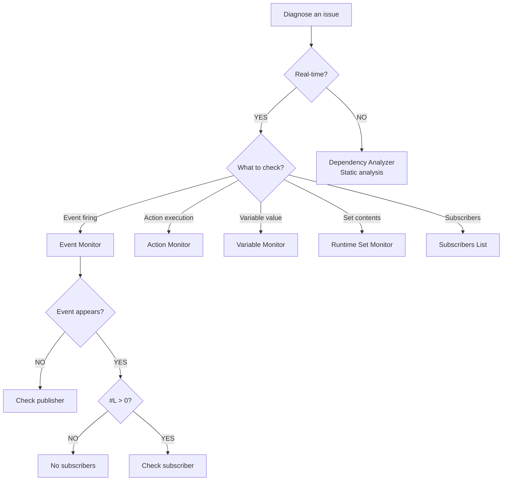

# Debugging

---

## Purpose

This section explains how to debug event flow and diagnose issues in Reactive SO. You will learn to use the built-in debugging tools and troubleshoot common problems.

---

## Available tools

Reactive SO provides the following debugging tools.

| Tool | Purpose |
|------|---------|
| [Event Monitor](monitor) | Real-time event tracking with caller information |
| [Action Monitor](monitor) | Real-time tracking of action executions |
| [Variable Monitor](monitor) | Real-time variable state monitoring |
| [Runtime Set Monitor](monitor) | Real-time runtime set monitoring |
| [Asset Browser](asset-browser) | Browse, search, and manage all Reactive SO assets |
| [RES Table View](res-table-view) | View, edit, and save ReactiveEntitySet data in table format |
| [Dependency Analyzer](dependency-analyzer) | Static analysis for scenes and prefabs |
| Manual Trigger | Test events and actions from Inspector without code |
| Subscribers List | View active subscribers during Play Mode |

---

## Tool selection guide

| Question | Tool |
|----------|------|
| Is my event firing? | Event Monitor (Monitor Window) |
| Did my action execute? | Action Monitor (Monitor Window) |
| What's the current variable value? | Variable Monitor (Monitor Window) |
| What objects are in my runtime set? | Runtime Set Monitor (Monitor Window) |
| Who's subscribed to this event? | Subscribers List |
| Where is this asset used? | Dependency Analyzer |
| Can I test without playing? | Manual Trigger |
| Which code raised this event? | Event Monitor (Monitor Window - Caller column) |
| Do I have memory leaks? | Subscribers List (scene transitions) |
| Are all assets assigned? | Dependency Analyzer |
| What value was passed with event? | Event Monitor (Monitor Window - Value column) |

---

## Common debugging scenarios

### Event not firing

**Problem**
Button click does not trigger expected behavior.

**Steps**

1. Open Event Monitor (Window > Reactive SO > Monitor)
2. Ensure "Show In Event Log" is enabled on the event channel
3. Click the button in your game
4. Check if the event appears in the log

**Diagnosis**

- Event appears: Problem is in subscriber. Check Subscribers List.
- Event does not appear: Problem is in publisher. Check event channel assignment and `RaiseEvent()` call.

### Action not executing

**Problem**
A quest reward or effect defined in an Action does not trigger.

**Steps**

1. Open Action Monitor (Window > Reactive SO > Monitor)
2. Ensure "Show In Monitor" is enabled on the action asset
3. Trigger the logic in your game
4. Check if the action execution appears in the log

**Diagnosis**

- Action appears: Check the action's C# implementation for logic errors.
- Action does not appear: Check the code calling `Execute()` and verify the asset is assigned.

### Event fires but nothing happens

**Problem**
Event appears in Event Monitor but expected behavior does not occur.

**Steps**

1. Check #L column in Event Monitor (listener count)
2. If #L = 0, nobody subscribed
3. Select the event channel and check Subscribers List
4. Verify expected MonoBehaviours are listed

**Diagnosis**

- Subscriber exists: Check subscriber method logic
- Subscriber missing: Check `OnEnable`/`OnDisable` subscription code
- Wrong subscriber: Check event channel assignment

---

## Debug settings

Each asset has debug options in the Inspector.

### Show In Monitor / Event Log

When enabled, activities appear in the Monitor Window during Play Mode.

### Show In Console

When enabled, activities output to Unity Console. Use for traditional Debug.Log-style debugging.

---

## References

- [Troubleshooting]({{ '/en/troubleshooting' | relative_url }}) - Common issues