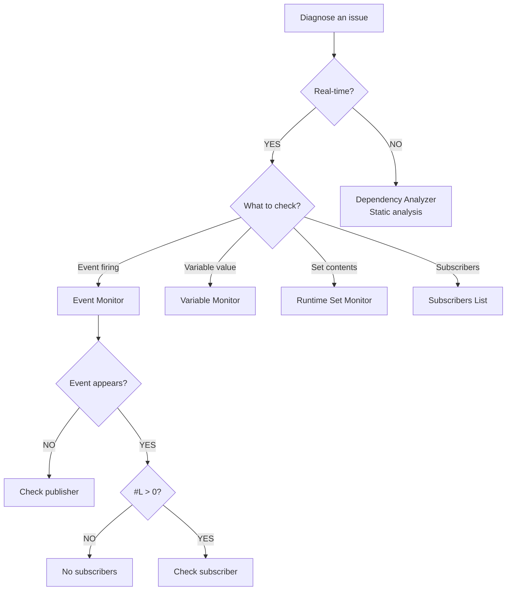

# Debugging

---

## Purpose

This section explains how to debug event flow and diagnose issues in Reactive SO. You will learn to use the built-in debugging tools and troubleshoot common problems.

---

## Available tools

Reactive SO provides the following debugging tools.

| Tool | Purpose |
|------|---------|
| [Event Monitor](monitor) | Real-time event tracking with caller information |
| [Variable Monitor](monitor) | Real-time variable state monitoring |
| [Runtime Set Monitor](monitor) | Real-time runtime set monitoring |
| [Asset Browser](asset-browser) | Browse, search, and manage all Reactive SO assets |
| [Dependency Analyzer](dependency-analyzer) | Static analysis for scenes and prefabs |
| Manual Trigger | Test events from Inspector without code |
| Subscribers List | View active subscribers during Play Mode |

---

## Tool selection guide



| Question | Tool |
|----------|------|
| Is my event firing? | Event Monitor (Monitor Window) |
| What's the current variable value? | Variable Monitor (Monitor Window) |
| What objects are in my runtime set? | Runtime Set Monitor (Monitor Window) |
| Who's subscribed to this event? | Subscribers List |
| Where is this event channel used? | Dependency Analyzer |
| Can I test without playing? | Manual Trigger |
| Which code raised this event? | Event Monitor (Monitor Window - Caller column) |
| Do I have memory leaks? | Subscribers List (scene transitions) |
| Are all event channels assigned? | Dependency Analyzer |
| What value was passed with event? | Event Monitor (Monitor Window - Value column) |

---

## Common debugging scenarios

### Event not firing

**Problem**: Button click does not trigger expected behavior.

**Steps**:

1. Open Event Monitor (Window > Reactive SO > Monitor)
2. Ensure "Show In Event Log" is enabled on the event channel
3. Click the button in your game
4. Check if the event appears in the log

**Diagnosis**:

- Event appears: Problem is in subscriber. Check Subscribers List.
- Event does not appear: Problem is in publisher. Check event channel assignment and `RaiseEvent()` call.

### Event fires but nothing happens

**Problem**: Event appears in Event Monitor but expected behavior does not occur.

**Steps**:

1. Check #L column in Event Monitor (listener count)
2. If #L = 0, nobody subscribed
3. Select the event channel and check Subscribers List
4. Verify expected MonoBehaviours are listed

**Diagnosis**:

- Subscriber exists: Check subscriber method logic
- Subscriber missing: Check `OnEnable`/`OnDisable` subscription code
- Wrong subscriber: Check event channel assignment

### Event fires multiple times

**Problem**: Sound plays twice or UI updates multiple times.

**Steps**:

1. Open Event Monitor
2. Trigger the event once
3. Count entries in the log
4. Check Caller column for duplicate sources

**Diagnosis**:

```text
Time | Event Name    | Caller
0.5s | OnPlayerDeath | EnemyAI.cs:Attack:142
0.5s | OnPlayerDeath | FallDetector.cs:OnTriggerEnter:28
```

Two scripts raising the same event. Review game logic.

### Memory leak after scene transitions

**Problem**: Growing memory usage after multiple scene loads.

**Steps**:

1. Enter Play Mode in Scene 1
2. Check Subscribers List for event channel
3. Load Scene 2
4. Return to Scene 1
5. Check Subscribers List again

**Diagnosis**:

```text
Expected:
  UIManager.HandleEvent
  PlayerController.HandleEvent

Memory Leak:
  UIManager.HandleEvent (destroyed)  <- Leak
  PlayerController.HandleEvent (destroyed)  <- Leak
  UIManager.HandleEvent
  PlayerController.HandleEvent
```

**Fix**: Add unsubscription in `OnDisable`:

```csharp
private void OnDisable()
{
    eventChannel.OnEventRaised -= HandleEvent;
}
```

### Finding all usages before refactoring

**Problem**: Need to rename or delete event channel, unsure where it's used.

**Steps**:

1. Open Dependency Analyzer (Window > Reactive SO > Dependency Analyzer)
2. Click "Scan Project"
3. Search for the event channel name
4. Expand to see all usage locations

**Result**:

```text
OnPlayerDeath (VoidEventChannelSO) - 5 usage(s)
  MainScene.unity > Player.PlayerController
  MainScene.unity > UICanvas.UIManager
  BossScene.unity > Boss.BossAI
  PlayerPrefab.prefab > Player.HealthComponent
  GameOverUI.prefab > GameOverPanel.GameOverController
```

### Detecting unassigned fields

**Problem**: Runtime NullReferenceException from unassigned event channel.

**Steps**:

1. Open Dependency Analyzer
2. Click "Scan Project"
3. Check Summary line for unassigned fields count
4. Review unassigned fields section

**Result**:

```text
Summary: 20 Event Channels, 1 unused, 3 unassigned fields

Unassigned Event Channel Fields:
  MainScene.unity > Player.PlayerController.onPlayerDeath
  EnemyPrefab.prefab > Enemy.EnemyAI.onSpawn
```

Click to jump to each location and fix.

---

## Debug settings

Each event channel has debug options in the Inspector.

### Show In Event Log

When enabled, events appear in Event Monitor during Play Mode. Enabled by default for new channels.

### Show In Console

When enabled, events output to Unity Console. Disabled by default. Use for traditional Debug.Log-style debugging.

<!-- TODO: Add screenshot of Event Channel Inspector showing Debug settings section -->

---

## Workflow for new features

### Development

1. Create event channel
2. Enable "Show In Event Log"
3. Implement publisher with `RaiseEvent()`
4. Use Manual Trigger to test
5. Implement subscribers
6. Verify with Subscribers List

### Testing

1. Keep Event Monitor open
2. Play through feature
3. Verify events fire at correct times
4. Check for memory leaks via Subscribers List

### Pre-release

1. Run Dependency Analyzer
2. Fix unassigned fields
3. Disable "Show In Event Log" for production

---

## Having issues?

See [Troubleshooting]({{ '/en/troubleshooting' | relative_url }}) for common issues and solutions.
