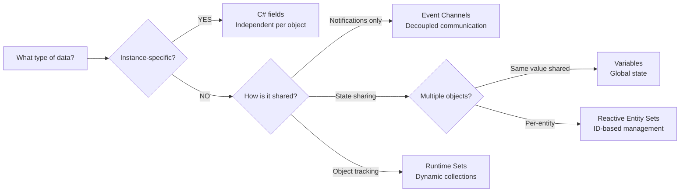

# Architecture patterns

---

## Purpose

This guide helps you choose the right Reactive SO tool for each situation. You will learn when to use Event Channels, Variables, Runtime Sets, and Reactive Entity Sets, and when standard C# fields are the better choice.

---

## The four tools

Reactive SO provides four complementary tools:

| Tool | Purpose | Best For |
|------|---------|----------|
| **Event Channels** | Global notifications | Fire-and-forget messages, decoupled communication |
| **Variables** | Shared state | Global values, cross-scene persistence |
| **Runtime Sets** | Object collections | Tracking active objects, replacing singletons |
| **Reactive Entity Sets** | Per-entity state | ID-based lookup, entity state management |

---

## The Instance vs Global rule

This is the most important decision when using Reactive SO:

> **Instance data** (unique per object) → Use C# fields
> **Global data** (shared across objects) → Use ScriptableObject

### Why this matters

ScriptableObjects are **shared resources**. All scripts referencing the same asset share the same data.

```csharp
// BAD: All spawned enemies share the same health!
public class Enemy : MonoBehaviour
{
    [SerializeField] private IntVariableSO health;  // Shared!

    void TakeDamage(int damage)
    {
        health.Value -= damage;  // Affects ALL enemies
    }
}
```

```csharp
// GOOD: Each enemy has independent health
public class Enemy : MonoBehaviour
{
    private int health = 100;  // Instance-specific

    void TakeDamage(int damage)
    {
        health -= damage;  // Only affects this enemy
    }
}
```

### Decision tree

Use this flowchart to choose the right tool for your situation:



---

## When to use each tool

### Event Channels

Use for **global notifications** that decouple systems:

```csharp
// Perfect: Game-wide notifications
[SerializeField] VoidEventChannelSO onPlayerDied;
[SerializeField] VoidEventChannelSO onLevelCompleted;
[SerializeField] IntEventChannelSO onScoreChanged;

// Perfect: Cross-system communication
[SerializeField] GameObjectEventChannelSO onEnemySpawned;
[SerializeField] StringEventChannelSO onAudioRequest;
```

Do NOT use for instance-specific events:

```csharp
// BAD: All enemies react to the same death event
public class Enemy : MonoBehaviour
{
    [SerializeField] private VoidEventChannelSO onDeath;

    private void OnEnable() => onDeath.OnEventRaised += Die;

    public void TakeDamage(int damage)
    {
        if (health <= 0)
            onDeath.RaiseEvent();  // ALL enemies die!
    }
}
```

### Variables

Use for **global state** that multiple systems read:

```csharp
// Perfect: Global game state
[SerializeField] IntVariableSO playerScore;
[SerializeField] BoolVariableSO isPaused;
[SerializeField] FloatVariableSO masterVolume;

// Perfect: Designer-configurable values
[SerializeField] FloatVariableSO enemySpawnRate;
[SerializeField] IntVariableSO maxEnemies;
```

Do NOT use for per-instance state:

```csharp
// BAD: Individual enemy health
[SerializeField] IntVariableSO health;  // All enemies share this!

// GOOD: Use C# field instead
private int health = 100;
```

### Runtime Sets

Use to **track active objects** without singletons:

```csharp
// Perfect: Dynamic object management
[SerializeField] GameObjectRuntimeSetSO enemies;
[SerializeField] GameObjectRuntimeSetSO pickups;
[SerializeField] TransformRuntimeSetSO waypoints;

// Objects register themselves
private void OnEnable() => enemies?.Add(gameObject);
private void OnDisable() => enemies?.Remove(gameObject);
```

### Reactive Entity Sets

Use for **per-entity state** with ID-based lookup:

```csharp
// Perfect: Per-entity data storage
[SerializeField] EnemyEntitySetSO entitySet;

// Each entity has independent state
entitySet.Register(this, new EnemyState { Health = 100 });
entitySet.UpdateData(this, state => {
    state.Health -= damage;
    return state;
});
```

---

## Common patterns

### Pattern 1: Dynamic enemy spawning

Combine instance fields with global events:

```csharp
public class Enemy : MonoBehaviour
{
    // Instance-specific state
    [SerializeField] private int maxHealth = 100;
    private int currentHealth;

    // Global events for cross-system notification
    [SerializeField] private IntEventChannelSO onAnyEnemyDamaged;
    [SerializeField] private VoidEventChannelSO onAnyEnemyDied;

    private void Start() => currentHealth = maxHealth;

    public void TakeDamage(int damage)
    {
        currentHealth -= damage;
        onAnyEnemyDamaged?.RaiseEvent(currentHealth);

        if (currentHealth <= 0)
        {
            onAnyEnemyDied?.RaiseEvent();
            Destroy(gameObject);
        }
    }
}
```

### Pattern 2: Global score system

Use Variables for truly shared state:

```csharp
public class ScoreManager : MonoBehaviour
{
    [SerializeField] private IntVariableSO score;

    private void OnEnable() => score.ResetToInitial();

    public void AddPoints(int points)
    {
        score.Value += points;  // Automatically fires OnValueChanged
    }
}

public class ScoreDisplay : MonoBehaviour
{
    [SerializeField] private IntVariableSO score;
    [SerializeField] private Text scoreText;

    private void Update()
    {
        scoreText.text = $"Score: {score.Value}";
    }
}
```

### Pattern 3: Enemy management with Runtime Sets

Replace singleton managers:

```csharp
public class EnemySpawner : MonoBehaviour
{
    [SerializeField] private GameObject enemyPrefab;
    [SerializeField] private GameObjectRuntimeSetSO activeEnemies;
    [SerializeField] private VoidEventChannelSO onWaveComplete;

    private void Update()
    {
        // No FindObjectsOfType needed
        if (activeEnemies.Count == 0)
            onWaveComplete?.RaiseEvent();
    }
}

public class Enemy : MonoBehaviour
{
    [SerializeField] private GameObjectRuntimeSetSO activeEnemies;

    private void OnEnable() => activeEnemies?.Add(gameObject);
    private void OnDisable() => activeEnemies?.Remove(gameObject);
}
```

### Pattern 4: Hybrid approach

Combine multiple patterns:

```csharp
public class Player : MonoBehaviour
{
    // Instance state
    private int currentAmmo = 30;

    // Global configuration (designer-tweakable)
    [SerializeField] private IntVariableSO maxAmmo;
    [SerializeField] private FloatVariableSO reloadTime;

    // Global events
    [SerializeField] private IntEventChannelSO onAmmoChanged;

    public void Shoot()
    {
        if (currentAmmo > 0)
        {
            currentAmmo--;
            onAmmoChanged?.RaiseEvent(currentAmmo);
        }
    }

    public void Reload()
    {
        currentAmmo = maxAmmo.Value;  // Read from global config
    }
}
```

---

## Common mistakes

### Mistake 1: Using Event Channels for instance events

```csharp
// BAD: All enemies subscribe to the same death event
onDeath.OnEventRaised += Die;  // When one dies, ALL die!

// GOOD: Use direct method calls for instance logic
private void Die()
{
    onAnyEnemyDied?.RaiseEvent();  // Notify globally (optional)
    Destroy(gameObject);           // Only this enemy
}
```

### Mistake 2: Using Variables for instance state

```csharp
// BAD: Shared health
[SerializeField] IntVariableSO health;

// GOOD: Instance health
private int health = 100;
```

### Mistake 3: Overusing ScriptableObjects

```csharp
// BAD: Not everything needs to be a ScriptableObject
[SerializeField] private FloatVariableSO moveSpeed;
[SerializeField] private FloatVariableSO jumpHeight;
[SerializeField] private FloatVariableSO gravity;

// GOOD: Use C# fields for instance-specific config
[SerializeField] private float moveSpeed = 5f;
[SerializeField] private float jumpHeight = 2f;
```

---

## Decision guide

### State management

| Scenario | Use | Reason |
|----------|-----|--------|
| Player score (single value) | VariableSO | Truly global, shared |
| Game settings (volume, etc.) | VariableSO | Designer-tweakable, persistent |
| Enemy health (many instances) | C# field | Each needs independent state |
| Bullet speed (many instances) | C# field | Instance-specific, performance |
| Current level | VariableSO | Global, cross-scene |
| Active enemies list | RuntimeSetSO | Dynamic collection tracking |
| Per-enemy state (health, status) | ReactiveEntitySetSO | ID-based lookup, per-entity events |

### Event communication

| Scenario | Use | Reason |
|----------|-----|--------|
| Player died notification | EventChannelSO | Global, multiple listeners |
| Enemy damaged (any enemy) | EventChannelSO | Notify UI, audio globally |
| Individual enemy death logic | C# method | Instance-specific |
| Button click → UI response | EventChannelSO | Decouple UI from game |
| Collision handling | C# method | Instance-specific physics |

### Collection management

| Scenario | Use | Reason |
|----------|-----|--------|
| Track all active enemies | RuntimeSetSO | Replace singleton manager |
| Manage spawned projectiles | RuntimeSetSO | Dynamic with auto cleanup |
| Query nearby objects | Physics.OverlapSphere | Performance, spatial |
| Static List<T> in manager | RuntimeSetSO | Better testability |

---

## Summary

| Tool | Use When | Avoid When |
|------|----------|------------|
| Event Channels | Global notifications, decoupled messaging | Instance-specific events |
| Variables | Global state, designer config | Per-instance state |
| Runtime Sets | Object tracking, replacing singletons | Per-entity data storage |
| Reactive Entity Sets | Per-entity state, ID-based lookup | Simple object tracking |
| C# fields | Instance state, performance-critical | Shared state across systems |

---

## References

- [Unity: Architect with ScriptableObjects](https://unity.com/how-to/architect-game-code-scriptable-objects)
- [Unity: ScriptableObjects as Event Channels](https://unity.com/how-to/scriptableobjects-event-channels-game-code)
- [Ryan Hipple's Unite 2017 Talk](https://www.youtube.com/watch?v=raQ3iHhE_Kk)
