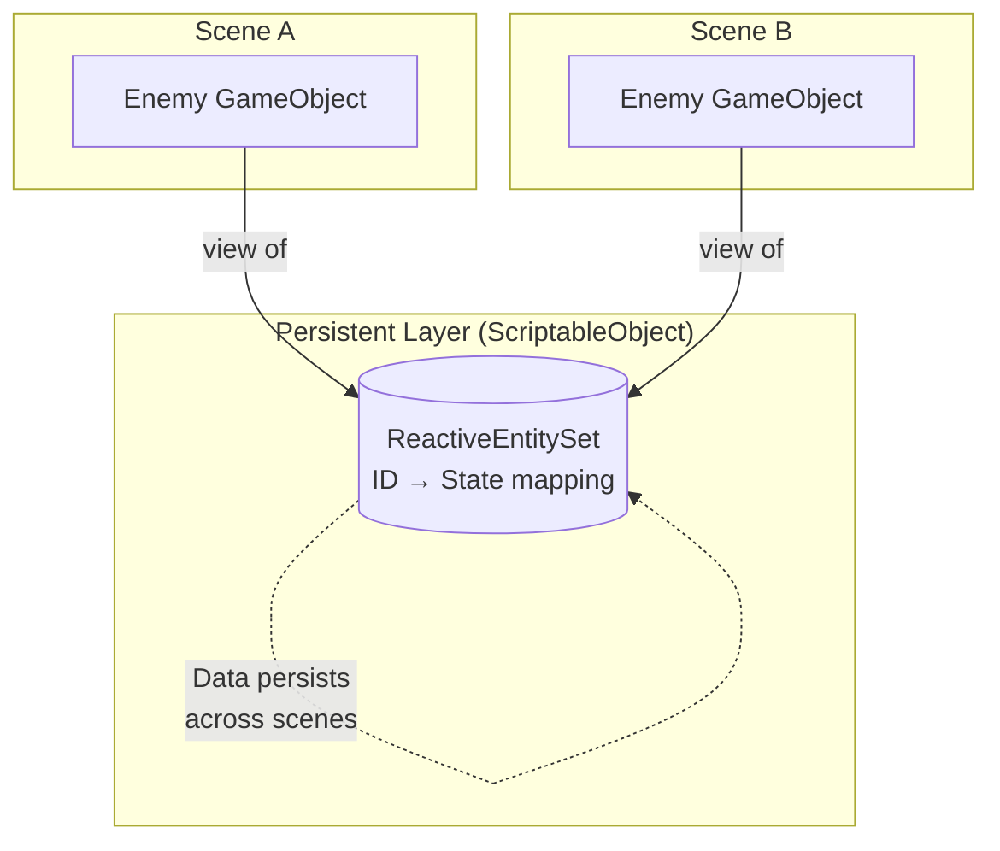

# Entity, Object, and View

---

## Purpose

This page explains the core conceptual model of Reactive Entity Sets: the distinction between Entity, Object, and View. Understanding this model is essential for using RES effectively.

---

## Entity vs Object

RES makes a clear distinction between two concepts that Unity typically conflates.

| Concept | Description | Lifecycle |
|---------|-------------|-----------|
| **Entity** | Logical unit with ID and state | Defined by RES registration |
| **Object** | Runtime representation (GameObject) | Defined by Unity instantiation |

### The key insight

An entity's existence is determined by its presence in the ReactiveEntitySet, **not** by the existence of a Unity object.

```
Entity exists in RES         → Entity is "alive"
GameObject exists in scene   → Object is "visible"
```

These can be independent.

### Examples

**Entity without Object**

Data persists, but no visual representation exists.

- Entity registered in Scene A
- Scene A unloads
- Entity data still accessible
- New GameObject can be created in Scene B to visualize it

**Object without Entity**

Visual exists, but not tracked in the set.

- GameObject exists in scene
- Not registered with RES
- RES has no knowledge of it

---

## GameObjects as Views

RES inverts the typical Unity ownership pattern.

### Traditional Unity pattern

```
GameObject owns its data
  └── MonoBehaviour holds state
      └── Data stored in component fields
          └── Destroyed when GameObject is destroyed
```

### RES pattern

```
ReactiveEntitySet owns the data (ScriptableObject)
  └── Data persists across scenes
      └── GameObject is a "view" into that data
          └── Can be destroyed without losing state
```

### Diagram



### Practical implications

This pattern enables several powerful capabilities.

**Cross-scene persistence**

Entity state survives scene transitions without DontDestroyOnLoad.

```csharp
// Scene A: Enemy takes damage
enemySet.UpdateData(enemyId, s => { s.Health = 50; return s; });

// Scene B loads
// Enemy state is still 50 HP
var state = enemySet.GetData(enemyId);  // Health = 50
```

**Network synchronization**

Entities can exist before their visual representation spawns.

```csharp
// Server sends entity data
// Client creates entity in RES first
enemySet.Register(networkId, receivedState);

// Later: spawn visual representation
var enemy = Instantiate(enemyPrefab);
enemy.BindToEntity(networkId);
```

**Object pooling**

Reuse GameObjects while maintaining entity identity.

```csharp
// Return to pool (unregister entity)
enemySet.Unregister(entityId);
pool.Return(gameObject);

// Get from pool (register new entity)
var go = pool.Get();
enemySet.Register(newEntityId, initialState);
```

---

## Scene-independent data layer

RES data is stored in ScriptableObjects, which are project assets.

| Component | Behavior on scene load |
|-----------|------------------------|
| GameObject | Destroyed (unless DontDestroyOnLoad) |
| MonoBehaviour | Destroyed with GameObject |
| **ReactiveEntitySet data** | **Persists (ScriptableObject asset)** |

### When this matters

**Cross-scene state**

Player stats, inventory, game progress that must survive scene transitions.

**Loading screens**

Data remains accessible during async scene loads.

**Global events**

Systems in any scene can query entity data.

### Important caveat

ScriptableObject data persists during a play session but resets in the following cases.

- Exiting Play Mode (in Editor)
- Restarting the application (in builds)

For permanent persistence, serialize to PlayerPrefs, JSON files, or a database.

---

## The "Reactive Entity" in ReactiveEntitySet

The name "Reactive Entity Set" emphasizes that **entities are reactive**, not just the set.

```
Reactive Entity Set
    │
    ├── Reactive Entity: Each entity can notify observers of its state changes
    │   └── OnStateChanged(oldState, newState)
    │
    └── Reactive Set: The set provides aggregate notifications
        ├── OnItemAdded(id)
        ├── OnItemRemoved(id)
        └── OnDataChanged(id)
```

Each entity has its own `OnStateChanged` event. Systems can subscribe to specific entities rather than filtering all set events.

---

## Summary

| Concept | Key point |
|---------|-----------|
| Entity | Logical unit, exists in RES, identified by ID |
| Object | Visual representation, exists in scene, can be created/destroyed |
| View | GameObject that displays entity data, doesn't own the data |
| Scene independence | Entity data persists in ScriptableObject, survives scene loads |
| Reactive | Both individual entities and the set notify observers of changes |

---

## Next steps

- [Data Guidelines](data-guidelines) - Learn what data should go in RES
- [Set Theory Foundation](set-theory) - Explore the mathematical basis
