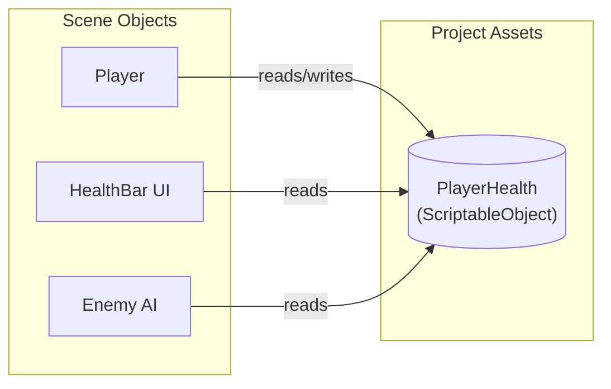
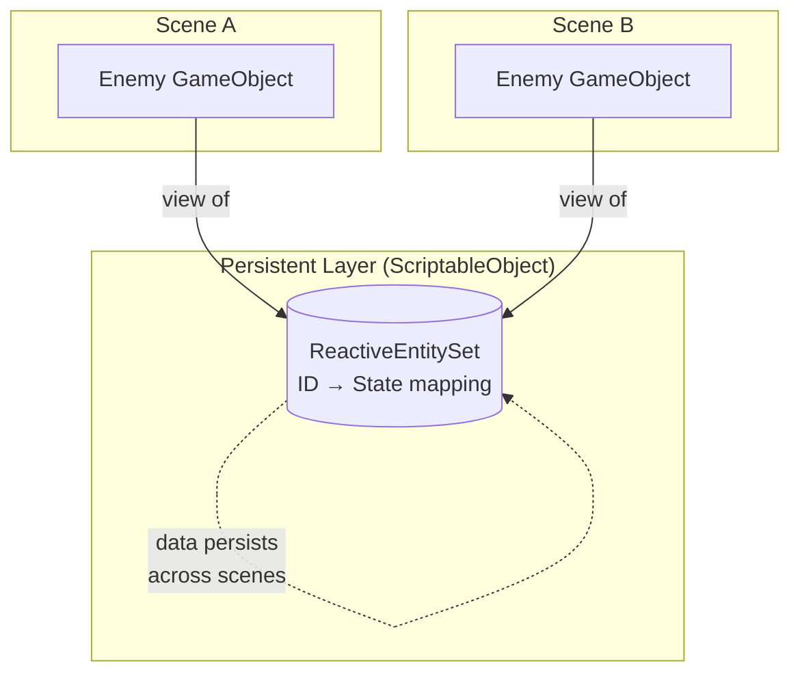

# ScriptableObject basics

---

## Purpose

This page explains the foundational concepts that make Reactive SO work. Understanding these concepts will help you avoid common pitfalls and design better systems.

---

## What are ScriptableObjects?

ScriptableObjects are Unity data containers that exist as assets in your project. Unlike MonoBehaviours attached to GameObjects, ScriptableObjects live independently of scenes.

Key characteristics:

- **Asset-based**: Created in the Project window, saved as `.asset` files
- **Persistent**: Exist outside of scenes, not destroyed on scene load
- **Shared**: Multiple scripts can reference the same asset

---

## Global shared resources

This is the core principle of Reactive SO:

> All scripts referencing the same ScriptableObject asset share the same instance.



When the Player script changes `PlayerHealth.Value`, the HealthBar UI and Enemy AI immediately see the new value. No events needed for simple reads.

### Implications

| Property | Benefit |
|----------|---------|
| Shared state | Multiple systems access the same data without direct references |
| Scene persistence | Data survives scene transitions |
| Inspector visibility | Current values visible in Editor during Play Mode |
| Zero coupling | Systems communicate through assets, not direct references |

---

## Entity vs Object

When working with Reactive Entity Sets, understanding this distinction is critical.

### Definitions

| Concept | Description | Lifecycle |
|---------|-------------|-----------|
| **Entity** | Logical unit with ID and state | Defined by registration in the set |
| **Object** | Runtime representation (GameObject) | Defined by Unity instantiation |

### Key insight

An entity's existence is determined by its presence in the ReactiveEntitySet, **not** by the existence of a Unity object.

```
Entity exists in ReactiveEntitySet  →  Entity is "alive"
GameObject exists in scene          →  Object is "visible"
```

These can be independent:

- Entity without Object: Data persists, no visual representation
- Object without Entity: Visual exists but not tracked in the set

### Benefits

This separation enables:

- **Cross-scene persistence**: Entity state survives scene loads
- **Network synchronization**: Entities exist before their visuals spawn
- **Pooling**: Reuse Objects while maintaining Entity identity

---

## GameObjects as "Views"

Reactive SO inverts the traditional Unity pattern.

### Traditional pattern

```
GameObject owns data
  └── MonoBehaviour stores state
      └── Destroyed with GameObject
```

### Reactive SO pattern

```
ScriptableObject owns data (persistent)
  └── GameObject displays data (view)
      └── Can be destroyed without losing state
```



### Practical example

```csharp
// Traditional: State lost when GameObject destroyed
public class Enemy : MonoBehaviour
{
    private int health = 100;  // Gone when Destroy(gameObject)
}

// Reactive SO: State persists in ScriptableObject
public class Enemy : ReactiveEntity<EnemyState>
{
    // State lives in ReactiveEntitySet
    // GameObject is just the "view"
}
```

---

## Scene-independent data

ScriptableObject data persists across scene loads.

| Component | Scene load behavior |
|-----------|---------------------|
| GameObject | Destroyed (unless DontDestroyOnLoad) |
| MonoBehaviour | Destroyed with GameObject |
| **ScriptableObject data** | **Persists** |

### Use cases

- **Cross-scene state**: Player stats, inventory, progress
- **Global events**: Notify systems in any scene
- **Configuration**: Settings that apply everywhere

### Important note

ScriptableObject data persists during a play session but resets when you exit Play Mode (in Editor) or restart the application. For permanent persistence, serialize to PlayerPrefs or files.

---

## Reactive Views (Future Feature)

{: .note }
> Views are planned for a future release. This section explains the concept.

Views are filtered subsets of a ReactiveEntitySet that automatically update when entity data changes.

### Static View (context-free)

Filter based only on entity data:

```csharp
// All enemies with health below 30%
var lowHealthView = enemies.CreateView(state => state.HealthPercent < 0.3f);
```

Properties:

- Predicate is fixed at creation time
- View membership updates automatically when entity state changes
- No external context required

### Dynamic View (context-dependent)

Filter based on entity data AND external context:

```csharp
// All enemies within range of a position
var nearbyView = enemies.CreateView<Vector3>(
    (state, position) => Vector3.Distance(state.Position, position) < 10f
);

// Evaluate with specific context
var nearbyEnemies = nearbyView.Evaluate(playerPosition);
```

Properties:

- Predicate requires context to evaluate
- Membership updates when entity data changes
- Context changes require re-evaluation

### Performance consideration

Views avoid per-frame iteration:

| Approach | Cost |
|----------|------|
| Every-frame `FindObjectsOfType` + filter | O(n) per frame |
| Reactive View | O(v) per state change |

Views are more efficient when:

```
Change rate × View count < Entity count × Query frequency
```

---

## Summary

| Concept | Key Point |
|---------|-----------|
| Global shared resources | All references share the same instance |
| Entity vs Object | Entity = data identity, Object = visual representation |
| GameObjects as Views | Data owns state, GameObjects display it |
| Scene independence | ScriptableObject data persists across scenes |
| Reactive Views | Filtered subsets that auto-update (future feature) |

---

## Next steps

- [Architecture Patterns](architecture-patterns) - Learn when to use each tool
- [Event Channels Guide]({{ '/en/guides/event-channels' | relative_url }}) - Start using events
- [Reactive Entity Sets Guide]({{ '/en/guides/reactive-entity-sets' | relative_url }}) - Apply Entity vs Object concepts
