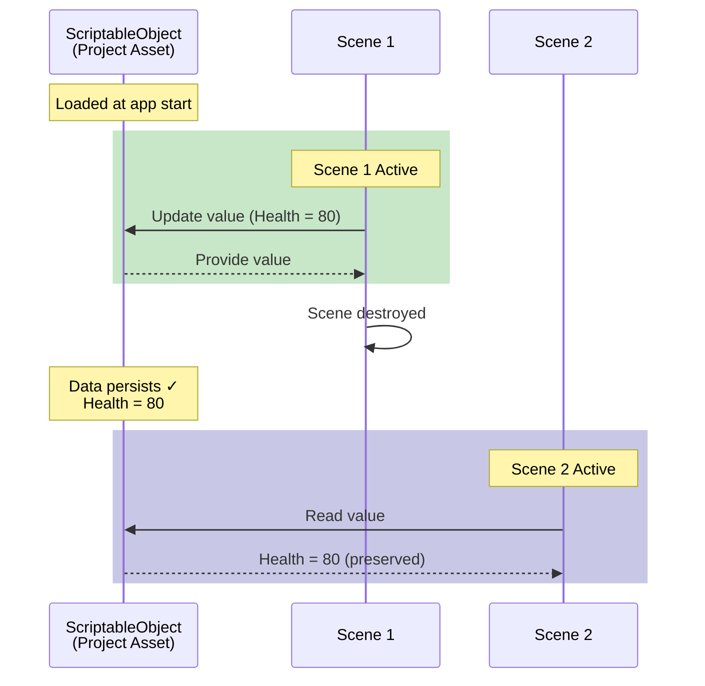
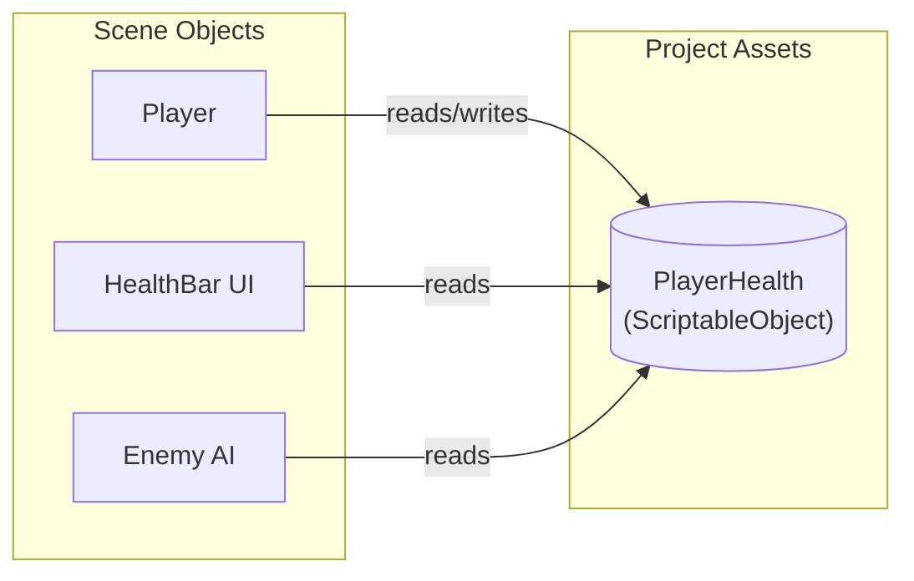

# ScriptableObject basics

---

## Purpose

This page explains the foundational concepts of ScriptableObjects in Unity. Understanding these concepts will help you see why Reactive SO is built the way it is.

---

## What are ScriptableObjects?

ScriptableObjects are Unity data containers that exist as assets in your project. Unlike MonoBehaviours attached to GameObjects, ScriptableObjects live independently of scenes.

```csharp
[CreateAssetMenu(fileName = "PlayerStats", menuName = "Game/Player Stats")]
public class PlayerStats : ScriptableObject
{
    public int maxHealth = 100;
    public float moveSpeed = 5f;
}
```

| Property | Description |
|----------|-------------|
| **Asset-based** | Created in the Project window, saved as `.asset` files |
| **Persistent** | Exist outside of scenes, not destroyed on scene load |
| **Shared** | Multiple scripts can reference the same asset |
| **Serializable** | Data is saved and visible in the Inspector |

---

## Why use ScriptableObjects?

### 1. Memory efficiency

When you use a ScriptableObject, all references point to the same instance. Compare this to MonoBehaviour data.

```
Traditional: 100 enemies × 10 KB data = 1 MB memory
ScriptableObject: 100 enemies × 1 shared asset = 10 KB memory
```

### 2. Scene independence

ScriptableObject data persists across scene loads.

| Component | Scene load behavior |
|-----------|---------------------|
| GameObject | Destroyed (unless DontDestroyOnLoad) |
| MonoBehaviour | Destroyed with GameObject |
| **ScriptableObject data** | **Persists** (conditional, see note below) |

{: .warning }
> **Important: SO Unloading**
> ScriptableObjects may be unloaded from memory by Unity if they are not referenced by any active object during a scene transition. If unloaded, all runtime data will be lost. To prevent this, ensure your SO assets are referenced by a persistent object like a `DontDestroyOnLoad` manager.



### 3. Decoupled architecture

Systems communicate through ScriptableObject assets instead of direct references.



When the Player script changes `PlayerHealth.Value`, the HealthBar UI and Enemy AI immediately see the new value without direct references to each other.

---

## The origin: Unite Austin 2017

Reactive SO is inspired by Ryan Hipple's influential talk **"Game Architecture with Scriptable Objects"** at Unite Austin 2017.

### Core principles from the talk

| Principle | Description |
|-----------|-------------|
| **Modular** | Systems don't directly depend on each other |
| **Editable** | Designers can tweak values at runtime |
| **Debuggable** | Each piece can be tested in isolation |

### Key patterns introduced

The talk introduced several patterns that form the foundation of Reactive SO.

- **Variables** - Shared data as ScriptableObject assets (FloatVariable, IntVariable)
- **Events** - Decoupled communication through GameEvent assets
- **Runtime Sets** - Track objects without singletons

{: .note }
> This talk is the most-watched Unite conference video on Unity's YouTube channel.

### Resources

- [Sample Project (GitHub)](https://github.com/roboryantron/Unite2017)
- [Slides (SlideShare)](https://www.slideshare.net/RyanHipple/game-architecture-with-scriptable-objects)

---

## ScriptableObject lifecycle

### In Editor

| Action | Saved to disk? |
|--------|----------------|
| Change via Inspector | Yes (automatic) |
| Change via script | No (call `EditorUtility.SetDirty()`) |
| Play Mode changes | No (in-memory only, lost when exiting Play Mode) |

### In Build

ScriptableObject assets are **read-only** at runtime. Changes made during gameplay are lost when the application closes.

{: .warning }
> For permanent data persistence, serialize to PlayerPrefs, JSON files, or a database.

---

## Official Unity resources

### Documentation

- [Unity Manual: ScriptableObject](https://docs.unity3d.com/6000.2/Documentation/Manual/class-ScriptableObject.html)
- [Scripting API: ScriptableObject](https://docs.unity3d.com/6000.2/Documentation/ScriptReference/ScriptableObject.html)

### Tutorials

- [Unity Learn: Introduction to Scriptable Objects](https://learn.unity.com/tutorial/introduction-to-scriptable-objects) (65 min)
- [Three ways to architect your game with ScriptableObjects](https://unity.com/how-to/architect-game-code-scriptable-objects)
- [Separate Game Data and Logic with ScriptableObjects](https://unity.com/how-to/separate-game-data-logic-scriptable-objects)

---

## Related open-source projects

| Project | Description |
|---------|-------------|
| [Unity Atoms](https://github.com/unity-atoms/unity-atoms) | Full implementation of ScriptableObject architecture with Variables, Events, and more |
| [ScriptableObject-Architecture](https://github.com/DanielEverland/ScriptableObject-Architecture) | Another implementation based on Ryan Hipple's patterns |

---

## Summary

| Concept | Key Point |
|---------|-----------|
| ScriptableObject | Data container that exists as a project asset |
| Shared instance | All references point to the same object |
| Scene persistence | Data survives scene loads |
| Decoupling | Systems communicate through assets, not direct references |

---

## Next steps

- [Architecture Patterns](architecture-patterns) - Learn when to use each Reactive SO tool
- [Event Channels Guide]({{ '/en/guides/event-channels' | relative_url }}) - Start using events
- [Variables Guide]({{ '/en/guides/variables' | relative_url }}) - Share state between systems
