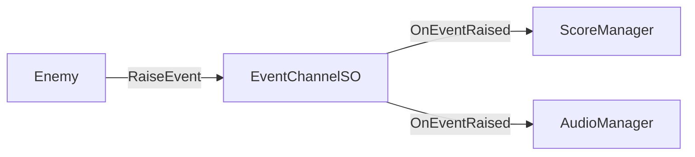

# Testability

---

## Purpose

This page explains why Reactive SO architecture is naturally testable. You will learn how ScriptableObject-based design enables unit testing with minimal setup.

---

## The testability advantage

Traditional Unity code often has tight coupling that makes testing difficult:

```csharp
// Hard to test: Direct singleton dependency
public class Enemy : MonoBehaviour
{
    void Die()
    {
        GameManager.Instance.AddScore(100);  // Can't mock this
        AudioManager.Instance.PlaySound("death");  // Can't isolate
    }
}
```

With Reactive SO, dependencies are injectable via the Inspector:

```csharp
// Easy to test: Injectable dependencies
public class Enemy : MonoBehaviour
{
    [SerializeField] private IntEventChannelSO onScoreAdded;
    [SerializeField] private StringEventChannelSO onAudioRequest;

    void Die()
    {
        onScoreAdded?.RaiseEvent(100);  // Can inject test SO
        onAudioRequest?.RaiseEvent("death");  // Fully isolated
    }
}
```

---

## Three pillars of testable code

Reactive SO follows Ryan Hipple's principles from [Unite 2017](https://www.youtube.com/watch?v=raQ3iHhE_Kk):

### Modular

Systems do not directly depend on each other. ScriptableObjects act as intermediaries:



Each system can be tested in isolation by creating a test EventChannel.

### Editable

Data lives in ScriptableObject assets, not hard-coded in scripts. This means:

- Designers can adjust values without code changes
- Test configurations can be created as separate assets
- Runtime values are visible in the Inspector

### Debuggable

Built-in monitoring tools ([Event Monitor]({{ '/en/debugging/monitor' | relative_url }}), [Variable Monitor]({{ '/en/debugging/monitor' | relative_url }})) let you observe system behavior in real-time.

---

## How Reactive SO enables testing

### Inspector as a Non-Coding DI Container

One of the most powerful features of Reactive SO is that **Unity's Inspector itself becomes your Dependency Injection (DI) container.** You don't need third-party frameworks like VContainer or Zenject to achieve decoupling.

- **Zero setup** - Assign dependencies by dragging and dropping assets in the Inspector.
- **Visual mocking** - Swap a production data set with a "test data set" asset without touching a single line of code.
- **Designer-friendly** - Designers can create specific test scenarios by creating new ScriptableObject assets with custom values.

### State Injection

Testing complex game states (e.g., "a boss with 10% HP and enraged status") usually requires playing through the game or using debug commands. With Reactive Entity Sets (RES), you can use **State Injection**:

```csharp
[Test]
public void BossBattle_Enraged_Test()
{
    // 1. Create a fresh set instance
    var set = ScriptableObject.CreateInstance<EnemyEntitySetSO>();
    
    // 2. Inject specific complex state instantly
    set.Register(bossId, new EnemyState { Health = 10, IsEnraged = true });
    
    // 3. Run logic and verify results
    damageSystem.ApplyDamage(bossId, 15);
    Assert.IsTrue(set[bossId].IsDead);
}
```

This "State Injection" turns hours of manual debugging into milliseconds of automated testing.

### Snapshots as Test Cases

The [Snapshot API]({{ '/en/advanced/reactive-entity-sets' | relative_url }}) takes testability to the ultimate level. Because RES data is strictly separated from logic, you can:

1.  **Capture** a snapshot when a bug occurs in production.
2.  **Save** that snapshot as an asset or binary file.
3.  **Load** that snapshot in a unit test to reproduce the exact state.
4.  **Verify** the fix by running the logic over the loaded snapshot.

This transforms failing game states into permanent regression tests.

### Verification through Observability

Traditional unit testing often relies on checking "side effects" (e.g., did a private field change?). In Reactive SO, we prioritize **Observability**.

Tests verify logic by subscribing to the same **Event Channels** and **Variables** that the UI and other systems use. This means your tests are "watching" the system just like a user or a debugger would, leading to more robust and meaningful assertions.

---

## Testing without mock libraries

You do not need Moq, NSubstitute, or other mocking frameworks.

### Why manual mocks are sufficient

1. **ScriptableObjects are simple data containers** - No complex behavior to mock
2. **Events are easy to verify** - Just subscribe and check if called
3. **State is directly accessible** - No need for mock setups

### Interface-based mocking (when needed)

For external dependencies (file I/O, dialogs), use simple interfaces:

```csharp
// Interface
public interface IFileService
{
    void WriteAllText(string path, string content);
}

// Production implementation
public class FileService : IFileService
{
    public void WriteAllText(string path, string content)
        => File.WriteAllText(path, content);
}

// Test mock
public class MockFileService : IFileService
{
    public string LastWrittenPath { get; private set; }
    public string LastWrittenContent { get; private set; }

    public void WriteAllText(string path, string content)
    {
        LastWrittenPath = path;
        LastWrittenContent = content;
    }
}
```

This pattern is used in Reactive SO's own tests (see `EventMonitorExporterRefactoredTests`).

---

## What makes testing easy

| Feature | Testing Benefit |
|---------|-----------------|
| **ScriptableObject.CreateInstance** | Create test instances without assets |
| **Event subscription** | Verify events were raised with correct values |
| **Value properties** | Assert state directly |
| **No scene required** | Edit Mode tests run fast |
| **Inspector injection** | Swap dependencies via serialization |

---

## Summary

Reactive SO enables testable architecture through:

1. **Decoupled systems** - ScriptableObjects as intermediaries
2. **Inspector injection** - Dependencies assigned via Unity's serialization
3. **Simple mocking** - CreateInstance for SOs, interfaces for externals
4. **Built-in observability** - Monitor tools for debugging

---

## References

- [Testing Guide]({{ '/en/guides/testing' | relative_url }}) - Practical testing patterns and code examples
- [Ryan Hipple's Unite 2017 Talk](https://www.youtube.com/watch?v=raQ3iHhE_Kk) - Original ScriptableObject architecture talk
- [Unity: Architect with ScriptableObjects](https://unity.com/how-to/architect-game-code-scriptable-objects) - Official Unity guide
