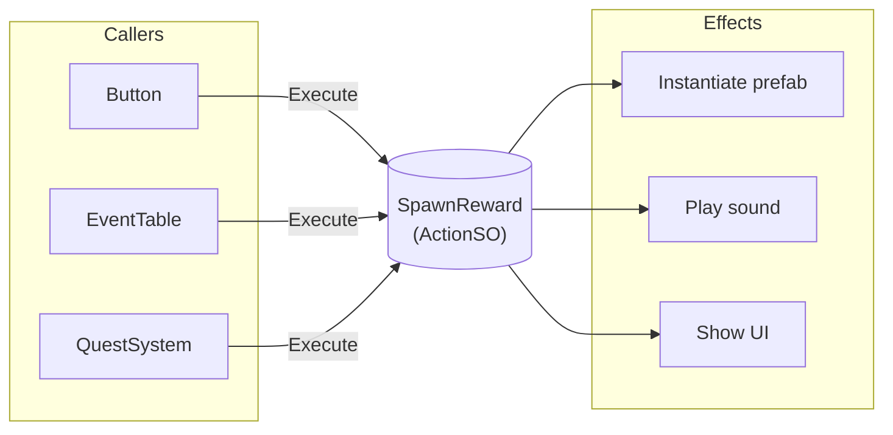

# Actions

{: .note }
> Actions are available since v2.1.0. This feature implements the Command pattern using ScriptableObjects.

---

## Purpose

This guide explains how to use Actions (ActionSO) to define reusable, data-driven commands. You will learn when to use them, how to set them up, and best practices for common scenarios.

---

## What are actions?

Actions are ScriptableObject assets that encapsulate executable commands. They implement the Command pattern, allowing you to define reusable behaviors as assets that can be configured in the Inspector and triggered from code.



This pattern offers several benefits.

- Actions can be configured in the Inspector without code changes
- The same action can be reused across multiple systems
- Caller information is tracked automatically for debugging
- Actions integrate with the Monitor Window for real-time visibility

---

## When to use actions

Use Actions for the following scenarios.

- **Data-driven systems** - Quest rewards, event tables, dialogue responses
- **Configurable behaviors** - Spawn effects, play sounds, show UI
- **Reusable commands** - Actions that need to be triggered from multiple places
- **Inspector-configurable logic** - When designers need to tweak behavior without code

Do not use Actions for the following scenarios.

- **Simple method calls** - When you only call the method from one place
- **State queries** - Actions are for execution, not for returning values
- **High-frequency operations** - Actions have slight overhead for tracking

For simple notifications, consider [Event Channels](event-channels) instead.

---

## Basic usage

### Step 1: Create an action class

Create a new class that inherits from `ActionSO`.

```csharp
using Tang3cko.ReactiveSO;
using UnityEngine;

[CreateAssetMenu(
    fileName = "SpawnEffect",
    menuName = "Game/Actions/Spawn Effect"
)]
public class SpawnEffectAction : ActionSO
{
    [Header("Settings")]
    [SerializeField] private GameObject effectPrefab;
    [SerializeField] private Vector3 offset;
    [SerializeField] private float duration = 2f;

    public override void Execute(
        string callerMember = "",
        string callerFile = "",
        int callerLine = 0)
    {
        var instance = Object.Instantiate(effectPrefab);
        instance.transform.position += offset;
        Object.Destroy(instance, duration);

#if UNITY_EDITOR
        var callerInfo = new CallerInfo(callerMember, callerFile, callerLine);
        NotifyActionExecuted(callerInfo);
        LogAction($"Spawned {effectPrefab.name}");
#endif
    }
}
```

### Step 2: Create an action asset

Right-click in the Project window and select the menu path you defined.

```text
Create > Game > Actions > Spawn Effect
```

Configure the action's parameters in the Inspector.

### Step 3: Execute the action

Reference the action asset and call `Execute()`.

```csharp
using Tang3cko.ReactiveSO;
using UnityEngine;

public class RewardSystem : MonoBehaviour
{
    [SerializeField] private ActionSO rewardAction;

    public void GiveReward()
    {
        // Always use null-conditional to avoid NullReferenceException
        rewardAction?.Execute();
    }
}
```

---

## Generic actions

Use `ActionSO<T>` when the action needs to receive a parameter at execution time.

```csharp
using Tang3cko.ReactiveSO;
using UnityEngine;

[CreateAssetMenu(
    fileName = "DamageAction",
    menuName = "Game/Actions/Damage"
)]
public class DamageAction : ActionSO<int>
{
    [Header("Settings")]
    [SerializeField] private GameObject damageVFX;
    [SerializeField] private AudioClip damageSound;

    public override void Execute(int damage,
        string callerMember = "",
        string callerFile = "",
        int callerLine = 0)
    {
        Debug.Log($"Dealing {damage} damage");
        // Apply damage logic here

#if UNITY_EDITOR
        var callerInfo = new CallerInfo(callerMember, callerFile, callerLine);
        NotifyActionExecuted(callerInfo);
        LogAction($"Damage: {damage}");
#endif
    }
}
```

Execute with a parameter.

```csharp
[SerializeField] private ActionSO<int> damageAction;

public void Attack()
{
    int damage = CalculateDamage();
    damageAction?.Execute(damage);
}
```

---

## Use cases

### Quest reward system

```csharp
[CreateAssetMenu(menuName = "Game/Actions/Give Item")]
public class GiveItemAction : ActionSO
{
    [SerializeField] private ItemData item;
    [SerializeField] private int quantity = 1;

    public override void Execute(
        string callerMember = "",
        string callerFile = "",
        int callerLine = 0)
    {
        InventoryManager.Instance.AddItem(item, quantity);

#if UNITY_EDITOR
        NotifyActionExecuted(new CallerInfo(callerMember, callerFile, callerLine));
#endif
    }
}
```

```csharp
// Quest definition with configurable rewards
public class Quest : ScriptableObject
{
    public string questName;
    public ActionSO[] rewardActions;

    public void Complete()
    {
        foreach (var action in rewardActions)
        {
            action?.Execute();
        }
    }
}
```

### Event table

```csharp
[CreateAssetMenu(menuName = "Game/Event Table")]
public class EventTableSO : ScriptableObject
{
    [System.Serializable]
    public class EventEntry
    {
        public string eventId;
        public ActionSO[] actions;
    }

    [SerializeField] private EventEntry[] entries;

    public void TriggerEvent(string eventId)
    {
        var entry = System.Array.Find(entries, e => e.eventId == eventId);
        if (entry != null)
        {
            foreach (var action in entry.actions)
            {
                action?.Execute();
            }
        }
    }
}
```

### Dialogue response

```csharp
[System.Serializable]
public class DialogueChoice
{
    public string text;
    public ActionSO[] onChosenActions;
}

public class DialogueUI : MonoBehaviour
{
    public void OnChoiceSelected(DialogueChoice choice)
    {
        foreach (var action in choice.onChosenActions)
        {
            action?.Execute();
        }
    }
}
```

---

## Best practices

### Use null-conditional operator

Prevent errors when the action is not assigned.

```csharp
// Good: Safe if not assigned
rewardAction?.Execute();

// Bad: Throws NullReferenceException if not assigned
rewardAction.Execute();
```

### Keep actions focused

Each action should do one thing well.

```csharp
// Good: Single responsibility
[CreateAssetMenu(menuName = "Game/Actions/Play Sound")]
public class PlaySoundAction : ActionSO { ... }

[CreateAssetMenu(menuName = "Game/Actions/Spawn VFX")]
public class SpawnVFXAction : ActionSO { ... }

// Bad: Does too many things
[CreateAssetMenu(menuName = "Game/Actions/Play Sound And Spawn VFX And Update Score")]
public class DoEverythingAction : ActionSO { ... }
```

### Use description field

Document what the action does in the Inspector.

```csharp
public class MyAction : ActionSO
{
    // The base class provides a description field
    // Set it in the Inspector to document the action
}
```

### Organize action assets

Create a folder structure for your action assets.

```text
Assets/
└── ScriptableObjects/
    └── Actions/
        ├── Rewards/
        │   ├── GiveGold.asset
        │   └── GiveItem.asset
        ├── Effects/
        │   ├── SpawnExplosion.asset
        │   └── PlayFanfare.asset
        └── UI/
            └── ShowNotification.asset
```

---

## Debugging

Reactive SO includes debugging tools to help you track action execution.

- **Monitor Window** - See action executions in real-time during Play Mode
- **Console Logging** - Enable `showInConsole` in the Inspector to log executions
- **Caller Information** - Automatically tracks which code triggered the action

For detailed debugging instructions, see the [Debugging Overview]({{ '/en/debugging/' | relative_url }}).

---

## Common issues

### Action not executing

1. Check that the action asset is assigned in the Inspector
2. Verify the action's `Execute` method contains your logic
3. Confirm you are calling `Execute()` not just referencing the action
4. Check the Monitor Window for execution logs

### NullReferenceException when executing

1. Use the null-conditional operator (`?.Execute()`)
2. Verify the action asset is assigned in the Inspector

### Caller info not showing

1. Do not pass explicit values to the caller parameters
2. Ensure `NotifyActionExecuted` is called in the `Execute` method
3. Check that `showInMonitor` is enabled in the action's Inspector

---

## References

- [Action Types Reference]({{ '/en/reference/action-types' | relative_url }})
- [Event Channels Guide](event-channels) - For notification-style communication
- [Debugging Overview]({{ '/en/debugging/' | relative_url }})
