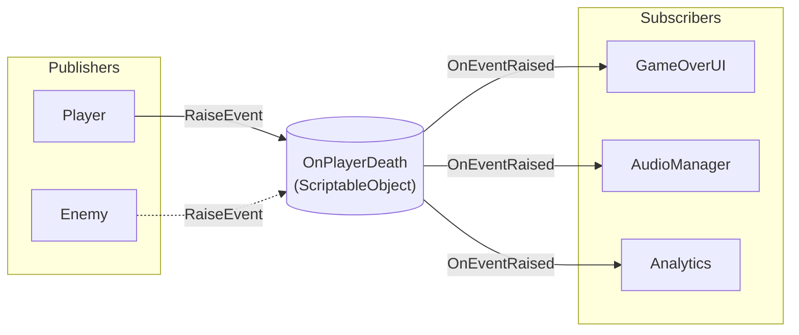

# Event channels

{: .note }
> Event Channels are available since v1.0.0 (stable release). Long, Double, Quaternion, and Color event types were added in v1.1.0.

---

## Purpose

This guide explains how to use Event Channels to decouple communication between game systems. You will learn when to use them, how to set them up, and best practices for common scenarios.

---

## What are event channels?

Event Channels are ScriptableObject assets that act as message brokers between publishers and subscribers. Publishers raise events without knowing who listens. Subscribers respond to events without knowing who raised them.



This decoupling offers several benefits:

- Systems can be developed and tested independently
- Event flow is visible in the Unity Inspector
- No direct references between components required
- Easy to add or remove subscribers without modifying publishers

---

## When to use event channels

Use Event Channels for:

- **Game-wide notifications** - Player died, level completed, game paused
- **Cross-system communication** - UI responding to gameplay events
- **Fire-and-forget messages** - Events where you don't need a return value

Do not use Event Channels for:

- **Per-instance state** - Individual enemy health, specific object properties
- **Request-response patterns** - When you need a return value immediately
- **High-frequency updates** - Events firing every frame

For per-instance state, consider [Reactive Entity Sets](reactive-entity-sets) instead.

---

## Basic usage

### Step 1: Create an event channel asset

Right-click in the Project window and select the following menu path.

```text
Create > Reactive SO > Channels > Void Event
```

Name it descriptively, such as `OnPlayerDeath` or `OnLevelCompleted`.

### Step 2: Create a publisher

The publisher raises the event when something happens:

```csharp
using Tang3cko.ReactiveSO;
using UnityEngine;

public class Player : MonoBehaviour
{
    [SerializeField] private VoidEventChannelSO onPlayerDeath;

    public void Die()
    {
        // Always use null-conditional to avoid NullReferenceException
        onPlayerDeath?.RaiseEvent();
    }
}
```

### Step 3: Create a subscriber

The subscriber listens for the event and responds:

```csharp
using Tang3cko.ReactiveSO;
using UnityEngine;

public class GameOverUI : MonoBehaviour
{
    [SerializeField] private VoidEventChannelSO onPlayerDeath;
    [SerializeField] private GameObject gameOverPanel;

    private void OnEnable()
    {
        onPlayerDeath.OnEventRaised += ShowGameOver;
    }

    private void OnDisable()
    {
        onPlayerDeath.OnEventRaised -= ShowGameOver;
    }

    private void ShowGameOver()
    {
        gameOverPanel.SetActive(true);
    }
}
```

### Step 4: Connect in the Inspector

1. Select the Player GameObject
2. Drag the `OnPlayerDeath` asset to the serialized field
3. Do the same for GameOverUI

Both components now communicate through the asset without referencing each other.

---

## Event types

Reactive SO provides 12 built-in event types:

| Type | Parameter | Example Use Case |
|------|-----------|------------------|
| Void | None | OnGameStart, OnPlayerDeath |
| Int | `int` | OnScoreChanged, OnLevelUp |
| Long | `long` | OnTimestamp |
| Float | `float` | OnHealthChanged, OnProgress |
| Double | `double` | OnPreciseValue |
| Bool | `bool` | OnPaused, OnMuted |
| String | `string` | OnDialogue, OnNotification |
| Vector2 | `Vector2` | OnInputAxis, OnTouchPosition |
| Vector3 | `Vector3` | OnSpawnPosition, OnTargetPosition |
| Quaternion | `Quaternion` | OnCameraRotation |
| Color | `Color` | OnThemeChanged |
| GameObject | `GameObject` | OnEnemySpawned, OnTargetChanged |

For detailed information on each type, see the [Event Types Reference]({{ '/en/reference/event-types' | relative_url }}).

---

## Passing data with events

For events with parameters, pass the data when raising:

```csharp
// Publisher
[SerializeField] private IntEventChannelSO onScoreChanged;

public void AddScore(int points)
{
    currentScore += points;
    onScoreChanged?.RaiseEvent(currentScore);
}
```

```csharp
// Subscriber
[SerializeField] private IntEventChannelSO onScoreChanged;

private void OnEnable()
{
    onScoreChanged.OnEventRaised += UpdateScoreUI;
}

private void OnDisable()
{
    onScoreChanged.OnEventRaised -= UpdateScoreUI;
}

private void UpdateScoreUI(int newScore)
{
    scoreText.text = $"Score: {newScore}";
}
```

---

## Multiple subscribers

One event channel can have multiple subscribers. All subscribers receive the event:

```csharp
// All of these respond to the same OnPlayerDeath event:
// - GameOverUI shows the game over screen
// - AudioManager plays death sound
// - AnalyticsManager logs the death
// - AchievementManager checks death-related achievements
```

Subscribers execute in the order they subscribed. Do not rely on execution order for game logic.

---

## Best practices

### Always unsubscribe

Failing to unsubscribe causes memory leaks and errors:

```csharp
// ✅ Good: Balanced subscribe/unsubscribe
private void OnEnable()
{
    eventChannel.OnEventRaised += HandleEvent;
}

private void OnDisable()
{
    eventChannel.OnEventRaised -= HandleEvent;
}
```

```csharp
// ❌ Bad: Never unsubscribes
private void Start()
{
    eventChannel.OnEventRaised += HandleEvent;
}
// Object is destroyed but callback remains registered
```

### Use null-conditional operator

Prevent errors when the event channel is not assigned:

```csharp
// ✅ Good: Safe if not assigned
onPlayerDeath?.RaiseEvent();

// ❌ Bad: Throws NullReferenceException if not assigned
onPlayerDeath.RaiseEvent();
```

### Name events clearly

Use descriptive names that indicate what happened:

```csharp
// ✅ Good: Clear what happened
OnPlayerDeath
OnLevelCompleted
OnScoreChanged

// ❌ Bad: Unclear or action-based
PlayerEvent
DoSomething
UpdateScore
```

### Organize event assets

Create a folder structure for your event channels:

```
Assets/
└── ScriptableObjects/
    └── Events/
        ├── Player/
        │   ├── OnPlayerDeath.asset
        │   └── OnPlayerDamaged.asset
        ├── Game/
        │   ├── OnGameStart.asset
        │   └── OnGameOver.asset
        └── UI/
            └── OnMenuOpened.asset
```

---

## Debugging

Reactive SO includes debugging tools to help you understand event flow:

- **Event Monitor Window** - See events in real-time during Play Mode
- **Subscribers List** - View all current subscribers in the Inspector
- **Manual Trigger** - Raise events from the Inspector for testing

<!-- TODO: Add screenshot of Event Channel Inspector showing Debug section with Subscribers List -->

For detailed debugging instructions, see the [Debugging Overview]({{ '/en/debugging/' | relative_url }}).

---

## Common issues

### Event not received

1. Check that the subscriber is active (`enabled` and `gameObject.activeInHierarchy`)
2. Verify the same asset is assigned to both publisher and subscriber
3. Confirm `OnEnable` subscription happens before the event is raised
4. Check the Subscribers List in the event channel's Inspector

### Multiple events received

1. Ensure you unsubscribe in `OnDisable`
2. Check for duplicate subscriptions (subscribing in both `Start` and `OnEnable`)

### NullReferenceException when raising

1. Use the null-conditional operator (`?.RaiseEvent()`)
2. Verify the event channel is assigned in the Inspector

---

## References

- [Event Types Reference]({{ '/en/reference/event-types' | relative_url }})
- [Variables Guide](variables) - For shared state that persists
- [Debugging Overview]({{ '/en/debugging/' | relative_url }})
- [Architecture Guide]({{ '/en/guides/architecture' | relative_url }}) - Choosing the right pattern
