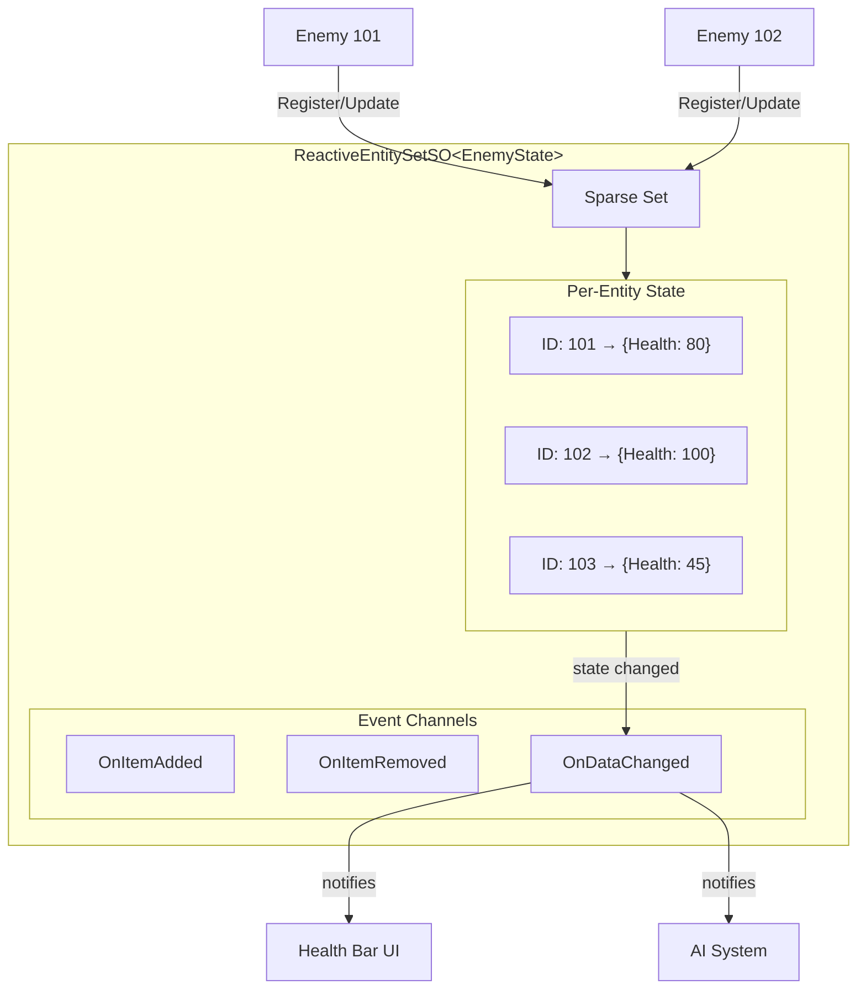

# Reactive entity sets

{: .warning }
> **Experimental Feature** - Reactive Entity Sets are available in v2.1.0 (unreleased). The API may change in future versions. Use in production at your own discretion.

---

## Purpose

This guide explains how to use Reactive Entity Sets for centralized entity state management. You will learn the difference from Runtime Sets, how to define entity data, and how to subscribe to per-entity state changes.

---

## What are reactive entity sets?

Reactive Entity Sets are ScriptableObject-based state containers that store per-entity data with automatic change notifications. Unlike Runtime Sets that only track object references, Reactive Entity Sets store actual state (health, score, status effects) for each entity.

```csharp
// Store state by entity ID
entitySet.Register(this, new EnemyState { Health = 100 });

// Read state anywhere
var state = entitySet.GetData(entityId);

// Update state with automatic events
entitySet.UpdateData(this, state => {
    state.Health -= 10;
    return state;
});
```

This architecture enables:

- **Scene Persistence** - Entity state survives scene loading
- **Global Access** - Access any entity's state by ID
- **O(1) Performance** - Constant time operations using Sparse Set
- **Per-Entity Events** - Subscribe to specific entity changes

---

## When to use reactive entity sets

### Use reactive entity sets when

- You need **per-entity state** (health, mana, status effects)
- You need **ID-based lookup** without finding the object
- State must **persist across scenes**
- External systems need to **read entity data** (UI, AI, networking)

### Use runtime sets when

- You only need to **track active objects** (no per-entity state)
- You iterate over **all objects** without needing individual data
- You don't need **ID-based lookup**

### Comparison

| Feature | Runtime Sets | Reactive Entity Sets |
|---------|--------------|----------------------|
| Stores | Object references | Per-entity data structs |
| Lookup | Iteration only | O(1) by ID |
| Events | Collection changes | Per-entity + collection |
| Persistence | Scene lifecycle | ScriptableObject |
| Use case | Object tracking | State management |

### Quick decision guide

| Scenario | Use |
|----------|-----|
| Track all enemies in level | Runtime Set |
| Store each enemy's health and status | Reactive Entity Set |
| Display minimap icons | Runtime Set |
| Show individual health bars | Reactive Entity Set |

---

## Architecture overview



The data flows through the system in three stages.

1. **Entity spawns** → `ReactiveEntity.OnEnable()` → Registers with EntitySet
2. **State updates** → `UpdateData()` → Per-entity callbacks fire
3. **Entity destroyed** → `ReactiveEntity.OnDisable()` → Unregisters from EntitySet

---

## Basic usage

### Step 1: Define your state struct

Create a struct to hold entity data. It must be `[System.Serializable]`:

```csharp
using System;

[Serializable]
public struct EnemyState
{
    public int Health;
    public int MaxHealth;
    public bool IsStunned;

    public float HealthPercent => MaxHealth > 0 ? (float)Health / MaxHealth : 0f;
    public bool IsDead => Health <= 0;
}
```

### Step 2: Create a reactive entity set asset

Create a class inheriting from `ReactiveEntitySetSO<T>`:

```csharp
using Tang3cko.ReactiveSO;
using UnityEngine;

[CreateAssetMenu(
    fileName = "EnemyEntitySet",
    menuName = "Reactive SO/Entity Sets/Enemy"
)]
public class EnemyEntitySetSO : ReactiveEntitySetSO<EnemyState>
{
    // Base class provides all functionality
}
```

Then create an asset in the Project window by selecting the following menu path.

```text
Create > Reactive SO > Entity Sets > Enemy
```

### Step 3: Create event channels (optional)

If you need notifications for set-level changes, create event channels.

```text
Create > Reactive SO > Channels > Int Event
```

Assign them to the entity set's fields. The available event fields are described below.

- **On Item Added** - Fires when entity registers
- **On Item Removed** - Fires when entity unregisters
- **On Data Changed** - Fires when any entity's data changes
- **On Set Changed** - Fires on any change

### Step 4: Create your entity component

Use the `ReactiveEntity<T>` base class for automatic lifecycle management:

```csharp
using Tang3cko.ReactiveSO;
using UnityEngine;

public class Enemy : ReactiveEntity<EnemyState>
{
    [SerializeField] private EnemyEntitySetSO entitySet;
    [SerializeField] private int maxHealth = 100;

    // Required: specify which set to use
    protected override ReactiveEntitySetSO<EnemyState> Set => entitySet;

    // Required: specify initial state
    protected override EnemyState InitialState => new EnemyState
    {
        Health = maxHealth,
        MaxHealth = maxHealth,
        IsStunned = false
    };

    public void TakeDamage(int damage)
    {
        var state = State;
        state.Health = Mathf.Max(0, state.Health - damage);
        State = state;  // Automatically triggers events

        if (state.IsDead)
        {
            Destroy(gameObject);  // OnDisable unregisters automatically
        }
    }
}
```

### Step 5: Query entity data

Access entity data from any script:

```csharp
public class EnemyManager : MonoBehaviour
{
    [SerializeField] private EnemyEntitySetSO entitySet;

    public int GetTotalEnemyHealth()
    {
        int total = 0;
        entitySet.ForEach((id, state) => {
            total += state.Health;
        });
        return total;
    }
}
```

<!-- TODO: Add screenshot of Reactive Entity Set Inspector showing registered entities and their state during Play Mode -->

---

## API reference

### Properties

| Property | Type | Description |
|----------|------|-------------|
| `Count` | `int` | Number of registered entities |
| `EntityIds` | `ArraySegment<int>` | All registered entity IDs |
| `Data` | `ArraySegment<TData>` | All entity data |

### Methods

| Method | Description |
|--------|-------------|
| `Register(owner, data)` | Register entity with initial state |
| `Unregister(owner)` | Remove entity from set |
| `GetData(owner)` | Get entity's current state |
| `TryGetData(owner, out data)` | Safely get entity's state |
| `SetData(owner, data)` | Update entity's state |
| `UpdateData(owner, func)` | Update state with function |
| `GetDataRef(id)` | Get reference to state for direct modification |
| `NotifyDataChanged(owner)` | Manually notify after GetDataRef modification |
| `Contains(owner)` | Check if entity exists |
| `Clear()` | Remove all entities |
| `ForEach(action)` | Iterate all entities |
| `SubscribeToEntity(id, callback)` | Subscribe to entity changes |
| `UnsubscribeFromEntity(id, callback)` | Unsubscribe from entity |

---

## Subscribing to changes

### Per-entity subscription

Track changes to a specific entity:

```csharp
public class EnemyHealthBar : MonoBehaviour
{
    [SerializeField] private EnemyEntitySetSO entitySet;
    [SerializeField] private Image fillImage;

    private int trackedEntityId;

    public void TrackEnemy(int entityId)
    {
        // Unsubscribe from previous
        if (trackedEntityId != 0)
        {
            entitySet.UnsubscribeFromEntity(trackedEntityId, OnStateChanged);
        }

        trackedEntityId = entityId;
        entitySet.SubscribeToEntity(entityId, OnStateChanged);

        // Update immediately
        if (entitySet.TryGetData(entityId, out var state))
        {
            UpdateBar(state);
        }
    }

    private void OnDisable()
    {
        if (trackedEntityId != 0)
        {
            entitySet.UnsubscribeFromEntity(trackedEntityId, OnStateChanged);
        }
    }

    private void OnStateChanged(EnemyState oldState, EnemyState newState)
    {
        UpdateBar(newState);

        // Can compare old and new state
        if (newState.Health < oldState.Health)
        {
            PlayDamageEffect();
        }
    }

    private void UpdateBar(EnemyState state)
    {
        fillImage.fillAmount = state.HealthPercent;
    }
}
```

### Using ReactiveEntity.OnStateChanged

When using the `ReactiveEntity<T>` base class:

```csharp
public class EnemyStatusUI : MonoBehaviour
{
    [SerializeField] private Enemy trackedEnemy;
    [SerializeField] private Image healthFill;

    private void OnEnable()
    {
        if (trackedEnemy != null)
        {
            trackedEnemy.OnStateChanged += HandleStateChanged;
        }
    }

    private void OnDisable()
    {
        if (trackedEnemy != null)
        {
            trackedEnemy.OnStateChanged -= HandleStateChanged;
        }
    }

    private void HandleStateChanged(EnemyState oldState, EnemyState newState)
    {
        healthFill.fillAmount = newState.HealthPercent;
    }
}
```

### Set-level event channels

Subscribe to set-level changes via event channels:

```csharp
public class EnemyCounter : MonoBehaviour
{
    [SerializeField] private IntEventChannelSO onEnemyAdded;
    [SerializeField] private IntEventChannelSO onEnemyRemoved;
    [SerializeField] private Text countText;

    private int enemyCount;

    private void OnEnable()
    {
        onEnemyAdded.OnEventRaised += HandleEnemyAdded;
        onEnemyRemoved.OnEventRaised += HandleEnemyRemoved;
    }

    private void OnDisable()
    {
        onEnemyAdded.OnEventRaised -= HandleEnemyAdded;
        onEnemyRemoved.OnEventRaised -= HandleEnemyRemoved;
    }

    private void HandleEnemyAdded(int entityId)
    {
        enemyCount++;
        UpdateDisplay();
    }

    private void HandleEnemyRemoved(int entityId)
    {
        enemyCount--;
        UpdateDisplay();
    }

    private void UpdateDisplay()
    {
        countText.text = $"Enemies: {enemyCount}";
    }
}
```

---

## Common patterns

### Pattern 1: Boss health bar

Track a specific boss entity's health:

```csharp
public class BossHealthBar : MonoBehaviour
{
    [SerializeField] private BossEntitySetSO bossSet;
    [SerializeField] private Slider healthSlider;
    [SerializeField] private Text healthText;

    private int bossId;

    public void SetBoss(int entityId)
    {
        bossId = entityId;
        bossSet.SubscribeToEntity(bossId, OnBossStateChanged);

        if (bossSet.TryGetData(bossId, out var state))
        {
            UpdateUI(state);
        }
    }

    private void OnBossStateChanged(BossState oldState, BossState newState)
    {
        UpdateUI(newState);

        if (newState.IsDead)
        {
            gameObject.SetActive(false);
        }
    }

    private void UpdateUI(BossState state)
    {
        healthSlider.value = state.HealthPercent;
        healthText.text = $"{state.Health} / {state.MaxHealth}";
    }
}
```

### Pattern 2: Status effect system

Apply and track status effects:

```csharp
[Serializable]
public struct EntityStatus
{
    public bool IsPoisoned;
    public float PoisonEndTime;
    public bool IsSlowed;
    public float SlowEndTime;
}

public class StatusEffectManager : MonoBehaviour
{
    [SerializeField] private StatusEntitySetSO statusSet;

    public void ApplyPoison(int entityId, float duration)
    {
        statusSet.UpdateData(entityId, status => {
            status.IsPoisoned = true;
            status.PoisonEndTime = Time.time + duration;
            return status;
        });
    }

    private void Update()
    {
        // Check expired effects
        statusSet.ForEach((id, status) => {
            if (status.IsPoisoned && Time.time >= status.PoisonEndTime)
            {
                statusSet.UpdateData(id, s => {
                    s.IsPoisoned = false;
                    return s;
                });
            }
        });
    }
}
```

### Pattern 3: Save and load

Persist entity state across sessions:

```csharp
public class SaveSystem : MonoBehaviour
{
    [SerializeField] private PlayerEntitySetSO playerSet;

    public void SaveGame()
    {
        foreach (var entityId in playerSet.EntityIds)
        {
            if (playerSet.TryGetData(entityId, out var state))
            {
                PlayerPrefs.SetInt($"Player_{entityId}_Health", state.Health);
                PlayerPrefs.SetInt($"Player_{entityId}_Level", state.Level);
            }
        }
    }

    public void LoadEntityState(int entityId)
    {
        if (PlayerPrefs.HasKey($"Player_{entityId}_Health"))
        {
            var state = new PlayerState
            {
                Health = PlayerPrefs.GetInt($"Player_{entityId}_Health"),
                Level = PlayerPrefs.GetInt($"Player_{entityId}_Level")
            };
            playerSet.SetData(entityId, state);
        }
    }
}
```

---

## Best practices

### Keep state structs simple

Use primitive types for best performance:

```csharp
// Good: Simple value types
[Serializable]
public struct EntityState
{
    public int Health;
    public float Speed;
    public Vector3 LastPosition;
}
```

```csharp
// Bad: Reference types cause allocation
[Serializable]
public struct EntityState
{
    public List<int> Modifiers;  // Avoid
    public string Name;           // Avoid if possible
}
```

### Use UpdateData for atomic modifications

```csharp
// Good: Atomic update
entitySet.UpdateData(this, state => {
    state.Health -= damage;
    state.IsStunned = damage > 50;
    return state;
});
```

```csharp
// Bad: Non-atomic, state may change between get and set
var state = entitySet.GetData(this);
state.Health -= damage;
entitySet.SetData(this, state);
```

### Always unsubscribe

```csharp
// Good: Balanced subscription
private void OnEnable()
{
    entitySet.SubscribeToEntity(entityId, OnStateChanged);
}

private void OnDisable()
{
    entitySet.UnsubscribeFromEntity(entityId, OnStateChanged);
}
```

```csharp
// Bad: Memory leak
private void Start()
{
    entitySet.SubscribeToEntity(entityId, OnStateChanged);
}
// Missing unsubscribe in OnDisable
```

### Don't mutate state directly

```csharp
// Bad: Direct mutation doesn't trigger events
var state = entitySet.GetData(entityId);
state.Health -= 10;  // Set is NOT updated!
```

```csharp
// Good: Use SetData or UpdateData
entitySet.UpdateData(entityId, state => {
    state.Health -= 10;
    return state;
});
```

---

## Performance

### O(1) operations

Reactive Entity Sets use a Sparse Set data structure:

| Operation | Time Complexity |
|-----------|-----------------|
| Register | O(1) |
| Unregister | O(1) |
| GetData | O(1) |
| SetData | O(1) |
| Iteration | O(n) |

### Memory efficiency

The Sparse Set allocates memory in pages, only creating pages for used ID ranges. This is efficient for sparse ID distributions.

---

## Scene persistence

### State survives scene changes

Entity data is stored in ScriptableObjects and persists across scene loads:

```csharp
// Scene A: Enemy registers
entitySet.Register(enemyId, initialState);

// Scene B loads
// State is still accessible
if (entitySet.TryGetData(enemyId, out var state))
{
    // State persists
}
```

### Clear on scene unload

Clean up when changing scenes:

```csharp
public class SceneCleanup : MonoBehaviour
{
    [SerializeField] private EnemyEntitySetSO entitySet;

    private void OnDestroy()
    {
        entitySet.Clear();
    }
}
```

---

## Troubleshooting

### State not updating

Ensure you use `SetData` or `UpdateData`. Direct struct mutation does not update the set:

```csharp
// Wrong
var state = entitySet.GetData(id);
state.Health = 50;  // Set not updated!

// Correct
entitySet.SetData(id, new EnemyState { Health = 50 });
```

### Events not firing

1. Verify the entity is registered with `Contains()`
2. Check that you subscribed before the state change
3. Ensure event channels are assigned in the Inspector

### Entity not found

1. Check if `OnEnable` runs before you query the entity
2. Verify the entity ID is correct (`GetInstanceID()` changes each play session)
3. Use `TryGetData` instead of `GetData` for safe access

### Memory leaks

Always unsubscribe in `OnDisable`:

```csharp
private void OnDisable()
{
    entitySet.UnsubscribeFromEntity(entityId, OnStateChanged);
}
```

---

## References

- [Event Channels Guide](event-channels) - For fire-and-forget notifications
- [Variables Guide](variables) - For shared global state
- [Runtime Sets Guide](runtime-sets) - For simple object tracking
