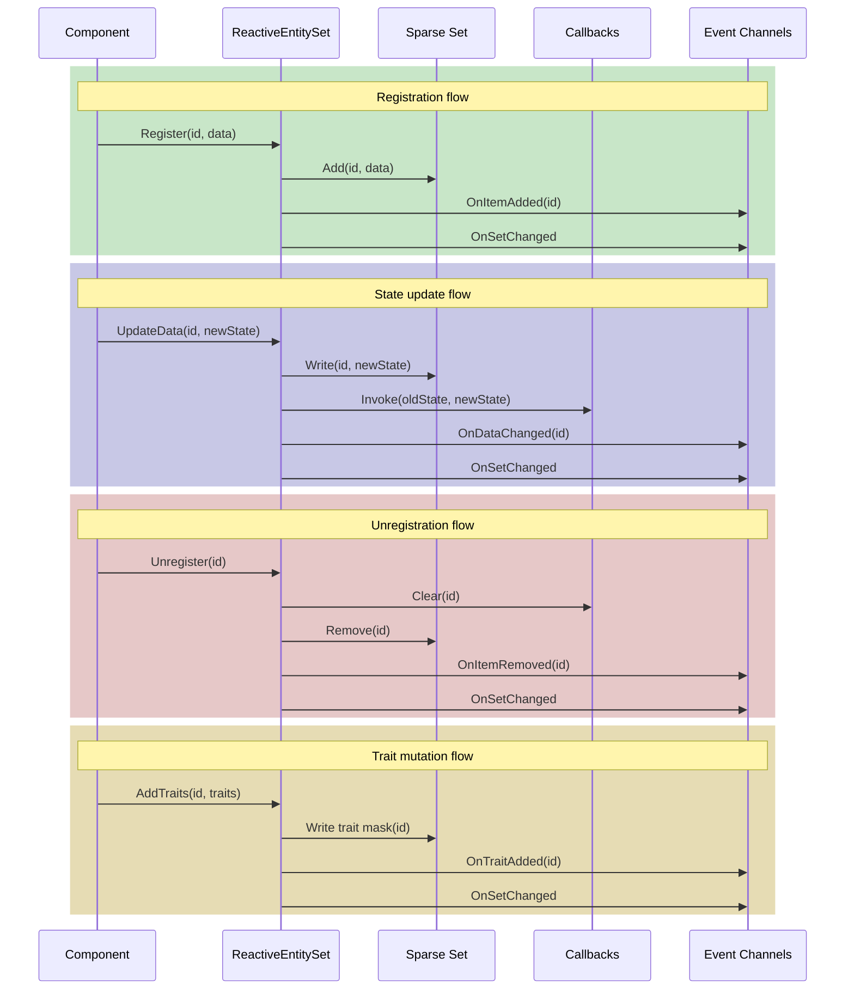

# Events

---

## Purpose

This page covers per-entity subscriptions, ReactiveEntity base class events, and set-level event channels.

---

## Per-entity subscription

Track changes to a specific entity by its ID.

```csharp
public class EnemyHealthBar : MonoBehaviour
{
    [SerializeField] private EnemyEntitySetSO entitySet;
    [SerializeField] private Image fillImage;

    private int trackedEntityId;

    public void TrackEnemy(int entityId)
    {
        // Unsubscribe from previous
        if (trackedEntityId != 0)
        {
            entitySet.UnsubscribeFromEntity(trackedEntityId, OnStateChanged);
        }

        trackedEntityId = entityId;
        entitySet.SubscribeToEntity(entityId, OnStateChanged);

        // Update immediately
        if (entitySet.TryGetData(entityId, out var state))
        {
            UpdateBar(state);
        }
    }

    private void OnDisable()
    {
        if (trackedEntityId != 0)
        {
            entitySet.UnsubscribeFromEntity(trackedEntityId, OnStateChanged);
        }
    }

    private void OnStateChanged(EnemyState oldState, EnemyState newState)
    {
        UpdateBar(newState);

        // Can compare old and new state
        if (newState.Health < oldState.Health)
        {
            PlayDamageEffect();
        }
    }

    private void UpdateBar(EnemyState state)
    {
        fillImage.fillAmount = state.HealthPercent;
    }
}
```

### Subscription API

| Method | Description |
|--------|-------------|
| `SubscribeToEntity(id, callback)` | Subscribe to state changes for a specific entity |
| `UnsubscribeFromEntity(id, callback)` | Unsubscribe from a specific entity |

### Callback signature

The callback receives both the old and new state.

```csharp
void OnStateChanged(TData oldState, TData newState)
```

Compare the two values to detect what changed.

---

## Using ReactiveEntity.OnStateChanged

When your entity inherits from `ReactiveEntity<T>`, it exposes an `OnStateChanged` event.

```csharp
public class EnemyStatusUI : MonoBehaviour
{
    [SerializeField] private Enemy trackedEnemy;
    [SerializeField] private Image healthFill;

    private void OnEnable()
    {
        if (trackedEnemy != null)
        {
            trackedEnemy.OnStateChanged += HandleStateChanged;
        }
    }

    private void OnDisable()
    {
        if (trackedEnemy != null)
        {
            trackedEnemy.OnStateChanged -= HandleStateChanged;
        }
    }

    private void HandleStateChanged(EnemyState oldState, EnemyState newState)
    {
        healthFill.fillAmount = newState.HealthPercent;
    }
}
```

### When to use each approach

| Approach | Use when |
|----------|----------|
| `SubscribeToEntity(id, callback)` | You have an entity ID but not a reference to the object |
| `ReactiveEntity.OnStateChanged` | You have a direct reference to the entity component |

---

## Set-level event channels

Subscribe to set-level changes via event channels. These fire whenever any entity in the set changes.

### Available event fields

| Field | Fires when |
|-------|------------|
| On Item Added | An entity registers |
| On Item Removed | An entity unregisters |
| On Data Changed | Any entity's data changes |
| On Set Changed | Any change occurs |
| On Trait Added | Traits are added to an entity |
| On Trait Removed | Traits are removed from an entity |

### Example: enemy counter

```csharp
public class EnemyCounter : MonoBehaviour
{
    [SerializeField] private IntEventChannelSO onEnemyAdded;
    [SerializeField] private IntEventChannelSO onEnemyRemoved;
    [SerializeField] private Text countText;

    private int enemyCount;

    private void OnEnable()
    {
        onEnemyAdded.OnEventRaised += HandleEnemyAdded;
        onEnemyRemoved.OnEventRaised += HandleEnemyRemoved;
    }

    private void OnDisable()
    {
        onEnemyAdded.OnEventRaised -= HandleEnemyAdded;
        onEnemyRemoved.OnEventRaised -= HandleEnemyRemoved;
    }

    private void HandleEnemyAdded(int entityId)
    {
        enemyCount++;
        UpdateDisplay();
    }

    private void HandleEnemyRemoved(int entityId)
    {
        enemyCount--;
        UpdateDisplay();
    }

    private void UpdateDisplay()
    {
        countText.text = $"Enemies: {enemyCount}";
    }
}
```

### Creating and assigning event channels

1. Create event channels in the Project window

   ```text
   Create > Reactive SO > Channels > Int Event
   ```

2. Assign them to your ReactiveEntitySetSO asset in the Inspector

3. Subscribe to the event channels from your scripts

---

## Event timing

Events fire at specific points during registration, state updates, and unregistration.



### State update flow

```
UpdateData() or State = newState
  → State written to Sparse Set
  → Per-entity callbacks invoked
  → OnDataChanged event channel raised (if assigned)
  → OnSetChanged event channel raised (if assigned)
```

### Registration flow

```
Register() or ReactiveEntity.OnEnable()
  → Entity added to Sparse Set
  → OnItemAdded event channel raised (if assigned)
  → OnSetChanged event channel raised (if assigned)
```

### Unregistration flow

```
Unregister() or ReactiveEntity.OnDisable()
  → Per-entity callbacks cleared
  → Entity removed from Sparse Set
  → OnItemRemoved event channel raised (if assigned)
  → OnSetChanged event channel raised (if assigned)
```

---

## Trait events

Trait events fire when you call `AddTraits`, `RemoveTraits`, `SetTraits`, or `ClearTraits`. They pass the entity ID, same as `OnItemAdded`.

```csharp
public class AggroUI : MonoBehaviour
{
    [SerializeField] private IntEventChannelSO onTraitAdded;
    [SerializeField] private IntEventChannelSO onTraitRemoved;
    [SerializeField] private EnemyEntitySetSO enemySet;

    private void OnEnable()
    {
        onTraitAdded.OnEventRaised += HandleTraitAdded;
        onTraitRemoved.OnEventRaised += HandleTraitRemoved;
    }

    private void OnDisable()
    {
        onTraitAdded.OnEventRaised -= HandleTraitAdded;
        onTraitRemoved.OnEventRaised -= HandleTraitRemoved;
    }

    private void HandleTraitAdded(int entityId)
    {
        if (enemySet.HasTraits<EnemyTraits>(entityId, EnemyTraits.IsAggro))
        {
            ShowAggroIndicator(entityId);
        }
    }

    private void HandleTraitRemoved(int entityId)
    {
        if (!enemySet.HasTraits<EnemyTraits>(entityId, EnemyTraits.IsAggro))
        {
            HideAggroIndicator(entityId);
        }
    }
}
```

For the full traits API, see [Traits](traits).

---

## Subscription lifecycle

Always unsubscribe when the subscriber is disabled or destroyed.

```csharp
// Good: Balanced subscription
private void OnEnable()
{
    entitySet.SubscribeToEntity(entityId, OnStateChanged);
}

private void OnDisable()
{
    entitySet.UnsubscribeFromEntity(entityId, OnStateChanged);
}
```

```csharp
// Bad: Memory leak
private void Start()
{
    entitySet.SubscribeToEntity(entityId, OnStateChanged);
}
// Missing unsubscribe in OnDisable
```

---

## Next steps

- [Traits](traits) - Trait mutation, querying, and iteration
- [Patterns](patterns) - See common usage patterns
- [Best Practices](best-practices) - Performance tips and troubleshooting
