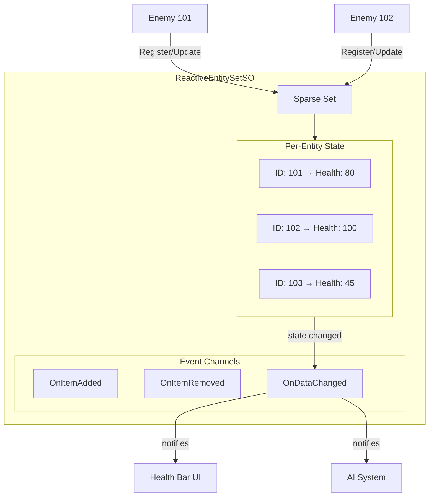

# Reactive Entity Sets Guide

{: .warning }
> **Experimental Feature** - Reactive Entity Sets are available in v2.1.0 (unreleased). The API may change in future versions. Use in production at your own discretion.

{: .warning }
> **Critical Note: Runtime Data Persistence**
> While ScriptableObjects can store data across scenes, Unity may unload them from memory if they are not referenced by any active object during a scene transition. If unloaded, all runtime data (e.g., entity state) will be lost. To prevent this, use the Manager Scene pattern with `ReactiveEntitySetHolder`. See [Persistence](persistence) for details.

---

## Purpose

This guide explains how to use Reactive Entity Sets for centralized entity state management. You will learn the difference from Runtime Sets, how to define entity data, and how to subscribe to per-entity state changes.

---

## What are reactive entity sets?

Reactive Entity Sets are ScriptableObject-based state containers that store per-entity data with automatic change notifications. Unlike Runtime Sets that only track object references, Reactive Entity Sets store actual state (health, score, status effects) for each entity.

```csharp
// Store state by entity ID
entitySet.Register(this, new EnemyState { Health = 100 });

// Read state anywhere
var state = entitySet.GetData(entityId);

// Update state with automatic events
entitySet.UpdateData(this, state => {
    state.Health -= 10;
    return state;
});
```

This architecture enables:

- **Scene Persistence** - Entity state survives scene loading
- **Global Access** - Access any entity's state by ID
- **O(1) Performance** - Constant time operations using Sparse Set
- **Per-Entity Events** - Subscribe to specific entity changes

---

## When to use reactive entity sets

### Use reactive entity sets when

- You need **per-entity state** (health, mana, status effects)
- You need **ID-based lookup** without finding the object
- State must **persist across scenes**
- External systems need to **read entity data** (UI, AI, networking)

### Use runtime sets when

- You only need to **track active objects** (no per-entity state)
- You iterate over **all objects** without needing individual data
- You don't need **ID-based lookup**

### Comparison

| Feature | Runtime Sets | Reactive Entity Sets |
|---------|--------------|----------------------|
| Stores | Object references | Per-entity data structs |
| Lookup | Iteration only | O(1) by ID |
| Events | Collection changes | Per-entity + collection |
| Persistence | Scene lifecycle | ScriptableObject |
| Use case | Object tracking | State management |

### Quick decision guide

| Scenario | Use |
|----------|-----|
| Track all enemies in level | Runtime Set |
| Store each enemy's health and status | Reactive Entity Set |
| Display minimap icons | Runtime Set |
| Show individual health bars | Reactive Entity Set |

---

## Architecture overview



{: .note }
> **Sparse Set**: A data structure that achieves O(1) registration, lookup, and removal. It provides fast mapping from entity IDs to state data.

The data flows through the system in three stages.

1. **Entity spawns** → `ReactiveEntity.OnEnable()` → Registers with EntitySet
2. **State updates** → `UpdateData()` → Per-entity callbacks fire
3. **Entity destroyed** → `ReactiveEntity.OnDisable()` → Unregisters from EntitySet

---

## Guide sections

| Page | Description |
|------|-------------|
| [Basic Usage](basic-usage) | Define state structs, create assets, register entities |
| [Events](events) | Per-entity subscriptions, set-level notifications |
| [Patterns](patterns) | Boss health bars, status effects, save/load |
| [Best Practices](best-practices) | Performance tips, troubleshooting |
| [Persistence](persistence) | Prevent data loss across scene transitions |
| [Job System](job-system) | High-performance parallel processing with Orchestrator |

---

## Related documentation

For the design philosophy and theoretical foundations, see [RES Design]({{ '/en/design-philosophy/reactive-entity-sets/' | relative_url }}).
