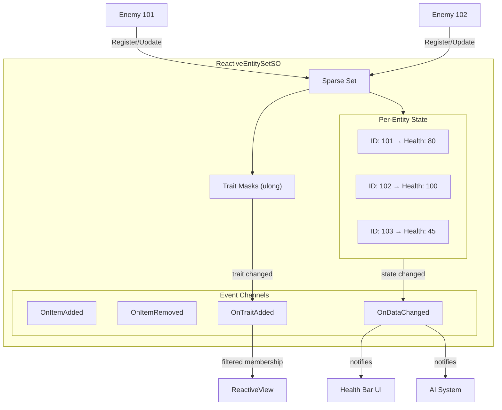

# Reactive Entity Sets guide

{: .warning }
> **Experimental Feature** - Reactive Entity Sets are available in v2.1.0. The API may change in future versions. Use in production at your own discretion.

{: .warning }
> **Critical Note: Runtime Data Persistence**
> While ScriptableObjects can store data across scenes, Unity may unload them from memory if they are not referenced by any active object during a scene transition. If unloaded, all runtime data (e.g., entity state) will be lost. To prevent this, use the Manager Scene pattern with `ReactiveEntitySetHolder`. See [Persistence](persistence) for details.

---

## Purpose

This guide covers Reactive Entity Sets for centralized entity state management. It walks through what makes them different from Runtime Sets, defining entity data, and subscribing to per-entity state changes.

---

## What are reactive entity sets?

Reactive Entity Sets are ScriptableObject-based state containers that store per-entity data with automatic change notifications. Unlike Runtime Sets that only track object references, Reactive Entity Sets store actual state (health, score, status effects) for each entity.

```csharp
// Store state by entity ID
entitySet.Register(this, new EnemyState { Health = 100 });

// Read state anywhere
var state = entitySet.GetData(entityId);

// Update state with automatic events
entitySet.UpdateData(this, state => {
    state.Health -= 10;
    return state;
});
```

This architecture enables:

- Entity state survives scene loading
- Any entity's state is accessible by ID
- Sparse Set backing gives constant-time operations (O(1))
- Observers can subscribe to specific entity changes

---

## When to use reactive entity sets

### Use reactive entity sets when

- You need per-entity state (health, mana, status effects)
- You need ID-based lookup without finding the object
- State must persist across scenes
- External systems need to read entity data (UI, AI, networking)

### Use runtime sets when

- You only need to track active objects (no per-entity state)
- The code iterates over all objects without needing individual data
- ID-based lookup is not required

### Comparison

| Feature | Runtime Sets | Reactive Entity Sets |
|---------|--------------|----------------------|
| Stores | Object references | Per-entity data structs |
| Lookup | Iteration only | O(1) by ID |
| Events | Collection changes | Per-entity + collection |
| Persistence | Scene lifecycle | ScriptableObject |
| Use case | Object tracking | State management |

### Quick decision guide

| Scenario | Use |
|----------|-----|
| Track all enemies in level | Runtime Set |
| Store each enemy's health and status | Reactive Entity Set |
| Display minimap icons | Runtime Set |
| Show individual health bars | Reactive Entity Set |

---

## Architecture overview


```mermaid
flowchart TB
    subgraph EntitySet["ReactiveEntitySetSO<EnemyState>"]
        SS[Sparse Set]
        subgraph Data["Per-Entity State"]
            D1["ID: 101 → Health: 80"]
            D2["ID: 102 → Health: 100"]
            D3["ID: 103 → Health: 45"]
        end
        Traits["Trait Masks (ulong)"]
        subgraph Events["Event Channels"]
            E1[OnItemAdded]
            E2[OnItemRemoved]
            E3[OnDataChanged]
            E4[OnTraitAdded]
        end
    end

    View[ReactiveView]

    Enemy1[Enemy 101] -->|Register/Update| SS
    Enemy2[Enemy 102] -->|Register/Update| SS
    SS --> Data
    SS --> Traits

    Data -->|state changed| E3
    Traits -->|trait changed| E4
    E3 -->|notifies| UI[Health Bar UI]
    E3 -->|notifies| AI[AI System]
    E4 -->|filtered membership| View
```

{: .note }
> **Sparse Set** — A data structure that achieves O(1) registration, lookup, and removal. It provides fast mapping from entity IDs to state data.

The data flows through the system in three stages.

1. When an entity spawns, `ReactiveEntity.OnEnable()` registers it with the EntitySet.
2. State updates go through `UpdateData()`, which fires per-entity callbacks.
3. On destruction, `ReactiveEntity.OnDisable()` unregisters the entity from the EntitySet.

---

## Guide sections

| Page | Description |
|------|-------------|
| [Basic Usage](basic-usage) | Define state structs, create assets, register entities |
| [Events](events) | Per-entity subscriptions, set-level notifications |
| [Traits](traits) | Bitmask flags for entity classification and filtering |
| [Views](views) | Reactive filtered subsets with automatic membership |
| [Patterns](patterns) | Boss health bars, status effects, save/load |
| [Best Practices](best-practices) | Performance tips, troubleshooting |
| [Persistence](persistence) | Prevent data loss across scene transitions |
| [Job System](job-system) | High-performance parallel processing with Orchestrator |
| [Observability](observability) | Set theoretic observability and snapshot patterns |

---

## Related documentation

For the design philosophy and theoretical foundations, see [RES Design]({{ '/en/design-philosophy/reactive-entity-sets/' | relative_url }}).
