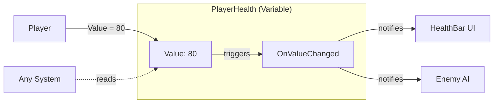

# Variables

## Purpose

This guide explains how to use Variables to create reactive shared state in your game. You will learn when to choose Variables over Event Channels, how to set them up, and how to use GPU Sync to drive shaders.

---

## What are variables?

Variables are ScriptableObject assets that store a single typed value and automatically raise events when that value changes. They combine the benefits of Event Channels with persistent state.



```csharp
// Set value - automatically fires event if changed
playerHealth.Value = 80;

// Read value - no event subscription needed
int currentHealth = playerHealth.Value;
```

---

## When to use variables

### Use variables when

- You need **shared state** that multiple systems can read
- You want **automatic change detection** (events only fire when value actually changes)
- UI needs to **display current value** without waiting for events
- You need to **persist state** between events

### Use event channels when

- You only need to **notify** about an action (no persistent state)
- The data is **transient** (button click, collision)
- You don't need to query the current value

### Quick decision guide

| Scenario | Use |
|----------|-----|
| Player died (notification) | Event Channel |
| Player health changed (state + notification) | Variable |
| Score changed (state + notification) | Variable |
| Button clicked (notification) | Event Channel |
| Game paused (state) | Variable |

---

## Available types

| Type | Example Use Cases |
|------|-------------------|
| Int | Score, health, currency, level |
| Long | Timestamps, large numbers |
| Float | Timer, volume, progress (0-1) |
| Double | High-precision values |
| Bool | Game paused, player alive, feature enabled |
| String | Player name, level name, status message |
| Vector2 | 2D position, joystick input |
| Vector3 | 3D position, velocity, spawn point |
| Quaternion | Rotation, orientation |
| Color | UI color, material tint |
| GameObject | Current target, selected object |

---

## Basic usage

### Step 1: Create a variable asset

Right-click in the Project window:

```
Create > Reactive SO > Variables > Int Variable
```

Name it descriptively, such as `PlayerHealth` or `CurrentScore`.

### Step 2: Configure the variable

Select the asset and configure in the Inspector:

- **Initial Value** - The starting value (e.g., 100 for health)
- **Description** - What this variable represents

### Step 3: Create an event channel (optional)

If you need to be notified of changes:

```
Create > Reactive SO > Channels > Int Event
```

Assign it to the variable's **On Value Changed** field.

### Step 4: Use in your scripts

```csharp
using Tang3cko.ReactiveSO;
using UnityEngine;

public class Player : MonoBehaviour
{
    [SerializeField] private IntVariableSO playerHealth;

    public void TakeDamage(int damage)
    {
        // Setting Value automatically fires the event if changed
        playerHealth.Value -= damage;
    }

    public void Heal(int amount)
    {
        playerHealth.Value += amount;
    }
}
```

```csharp
public class HealthBar : MonoBehaviour
{
    [SerializeField] private IntVariableSO playerHealth;
    [SerializeField] private Image fillImage;

    private void Update()
    {
        // Read current value directly
        fillImage.fillAmount = playerHealth.Value / 100f;
    }
}
```

---

## Subscribing to changes

For event-driven updates, subscribe to the event channel:

```csharp
public class HealthDisplay : MonoBehaviour
{
    [SerializeField] private IntVariableSO playerHealth;
    [SerializeField] private IntEventChannelSO onHealthChanged;
    [SerializeField] private Text healthText;

    private void OnEnable()
    {
        onHealthChanged.OnEventRaised += UpdateDisplay;
        // Show initial value immediately
        UpdateDisplay(playerHealth.Value);
    }

    private void OnDisable()
    {
        onHealthChanged.OnEventRaised -= UpdateDisplay;
    }

    private void UpdateDisplay(int health)
    {
        healthText.text = $"HP: {health}";
    }
}
```

---

## Change detection

Variables use `EqualityComparer<T>` to detect changes. Events only fire when the value actually changes:

```csharp
playerHealth.Value = 100;  // Event fires (initial set)
playerHealth.Value = 80;   // Event fires (100 != 80)
playerHealth.Value = 80;   // No event (80 == 80)
```

This prevents unnecessary updates when setting the same value.

---

## Initial value and reset

### Initial value

Set the **Initial Value** in the Inspector. This is the value used when:

- Entering Play Mode
- Clicking **Reset to Initial** in the Inspector

### Resetting during gameplay

Use the **Reset to Initial** button in the Inspector during Play Mode to quickly reset values for testing.

### Best practice

Set meaningful initial values in the Inspector rather than in code:

```csharp
// ❌ Bad: Hardcoded initial value
private void Start()
{
    playerHealth.Value = 100;  // Don't do this
}

// ✅ Good: Use Inspector's Initial Value
// The variable already starts at 100 from Initial Value
```

---

## GPU Sync

GPU Sync automatically synchronizes Variable values to shader global properties. This allows shaders, VFX Graph, and Compute Shaders to react to gameplay state.

### Supported types

| Variable Type | Shader Method | HLSL Type |
|---------------|---------------|-----------|
| Int | `SetGlobalInteger` | `int` |
| Float | `SetGlobalFloat` | `float` |
| Vector2 | `SetGlobalVector` | `float4` (xy) |
| Vector3 | `SetGlobalVector` | `float4` (xyz) |
| Color | `SetGlobalColor` | `float4` |
| Bool | `SetGlobalInteger` | `int` (0 or 1) |

String, GameObject, Long, and Double do not support GPU Sync.

### Enabling GPU Sync

1. Select a Variable asset
2. Enable **GPU Sync Enabled**
3. Set the **GPU Property Name** (e.g., `_PlayerHealth`)

<!-- TODO: Add screenshot of Variable Inspector showing GPU Sync settings -->

### Using in shaders

The value is automatically available as a global property:

```hlsl
// No C# bridging code needed
float health = _PlayerHealth;
float3 playerPos = _PlayerPosition.xyz;

// React to gameplay state
float healthFactor = saturate(health / 100.0);
```

### Use cases

- **Low health vignette** - Shader darkens screen edges when health is low
- **Player proximity effects** - VFX that reacts to player position
- **Game state visuals** - Danger level affects lighting color
- **Compute shader input** - Physics simulations using gameplay data

---

## Common patterns

### Pattern 1: Multiple readers

Multiple systems can read the same variable:

```csharp
// ScoreManager writes
currentScore.Value += 10;

// ScoreText reads
scoreText.text = $"Score: {currentScore.Value}";

// HighScoreChecker listens to event
onScoreChanged.OnEventRaised += CheckHighScore;
```

### Pattern 2: Loading from save data

```csharp
public void LoadGame(SaveData save)
{
    // Setting values notifies all listeners
    playerHealth.Value = save.health;
    playerLevel.Value = save.level;
    playerGold.Value = save.gold;
}
```

### Pattern 3: AI reading player state

```csharp
public class EnemyAI : MonoBehaviour
{
    [SerializeField] private IntVariableSO playerHealth;

    private void Update()
    {
        // Read player state without coupling
        if (playerHealth.Value < 30)
        {
            BecomeAggressive();
        }
    }
}
```

---

## Best practices

### Name descriptively

```csharp
// ✅ Good: Clear ownership and purpose
PlayerHealth
CurrentScore
IsPaused

// ❌ Bad: Ambiguous
Health
Score
Paused
```

### Use Inspector for configuration

Configure Initial Value and Description in the Inspector rather than hardcoding in scripts.

### Don't overuse events

If a system only needs the current value, read it directly instead of subscribing to events.

### Document in Inspector

Use the Description field to explain what each variable represents.

---

## Limitations

### No built-in history

Variables only store the current value. For history, implement it in a subscriber:

```csharp
private List<int> scoreHistory = new();

private void OnScoreChanged(int score)
{
    scoreHistory.Add(score);
}
```

### Reference type mutations not detected

For GameObject variables, changing properties doesn't trigger events:

```csharp
// ❌ No event (reference didn't change)
target.Value.GetComponent<Enemy>().health = 50;

// ✅ Event fires (reference changed)
target.Value = newEnemy;
```

---

## Creating custom variable types

For custom data types, inherit from `VariableSO<T>`:

```csharp
[CreateAssetMenu(
    fileName = "WeaponVariable",
    menuName = "Reactive SO/Variables/Weapon Variable"
)]
public class WeaponVariableSO : VariableSO<Weapon>
{
    // Inherits all functionality
}
```

Create a matching event channel:

```csharp
[CreateAssetMenu(
    fileName = "WeaponEvent",
    menuName = "Reactive SO/Channels/Weapon Event"
)]
public class WeaponEventChannelSO : EventChannelSO<Weapon>
{
}
```

---

## References

- [Event Channels Guide](event-channels) - For fire-and-forget notifications
- [Event Types Reference]({{ '/en/reference/event-types' | relative_url }}) - All available types
- [Runtime Sets Guide](runtime-sets) - For tracking object collections
