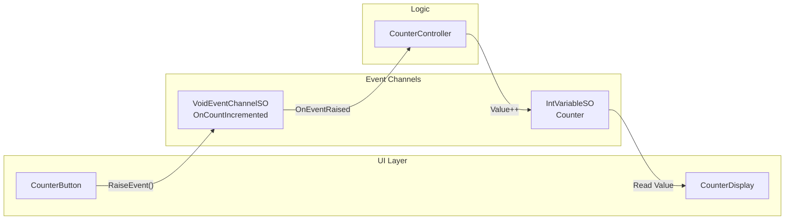

# Basic Demo (Counter)

## Overview

Demonstrates the fundamental **Event Channels** and **Variables** pattern with a simple counter UI. This demo shows how components can communicate through ScriptableObject-based events and share state through Variables, achieving complete decoupling.

The counter UI consists of the following elements.

- An increment button that raises an event
- A display that reads the counter value
- A reset button that restores the initial value

## Features Used

| Feature | Asset | Description |
|---------|-------|-------------|
| Event Channel | `OnCountIncremented` (VoidEventChannelSO) | Button click event |
| Variable | `Counter` (IntVariableSO) | Shared counter state |

## Architecture

**Key Insight**: `CounterButton`, `CounterController`, and `CounterDisplay` have no direct dependencies on each other. All communication flows through Event Channels and Variables, making each component independently testable and reusable.

## Key Files

| File | Description |
|------|-------------|
| `Scripts/CounterButton.cs` | Raises `VoidEventChannelSO` on button click |
| `Scripts/CounterController.cs` | Subscribes to event and increments `IntVariableSO` |
| `Scripts/CounterDisplay.cs` | Reads and displays `IntVariableSO.Value` |
| `ScriptableObjects/Events/OnCountIncremented.asset` | VoidEventChannelSO for button clicks |
| `ScriptableObjects/Variables/Counter.asset` | IntVariableSO storing counter value |

## Use Cases

This pattern is applicable to any scenario requiring decoupled component communication.

- **Score Systems**: Multiple UI elements displaying shared score
- **Inventory Updates**: Events for item pickup, Variables for item counts
- **Game State**: Pause/resume events, health/mana variables
- **Settings**: Toggle events, preference variables
