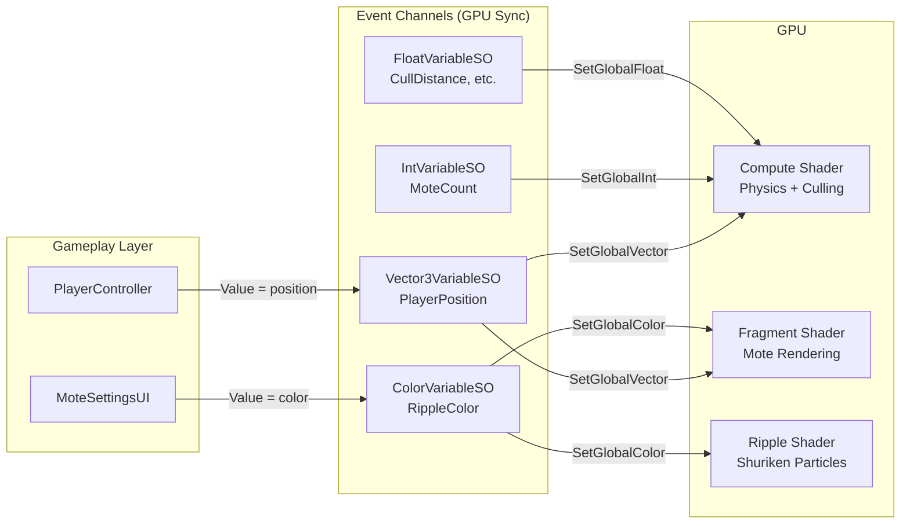

# Mote Demo (GPU Sync)

## Overview

Demonstrates the **GPU Sync** feature of Event Channels. This demo shows how VariableSO types can automatically sync values to shaders via `Shader.SetGlobal~()`, enabling GPU-based rendering to react to gameplay state without direct script-to-shader coupling.

**Key demonstration**: GPU Sync works with both **Compute Shaders** and **Shuriken Particle Systems** via custom shaders that reference global properties.

10,000 motes respond to player proximity.

- Motes glow brighter as the player approaches
- Motes repel and float upward when touched
- Motes smoothly return to their home positions using spring-damper physics
- Distance culling ensures only nearby motes are rendered

Footstep ripples complement the motes.

- Ripple particles emit as the player walks
- Ripples share the same color as motes via GPU Sync (`_RippleColor`)
- UI color changes affect both motes and ripples simultaneously

## Features Used

| Feature | Asset | Shader Property | Description |
| :--- | :--- | :--- | :--- |
| GPU Sync (Vector3) | `PlayerPosition` | `_PlayerPosition` | Player position for proximity effects |
| GPU Sync (Color) | `RippleColor` | `_RippleColor` | Shared color for motes and ripples |
| GPU Sync (Int) | `MoteCount` | `_MoteCount` | Number of motes to simulate |
| GPU Sync (Float) | `CullDistance` | `_CullDistance` | Maximum render distance from player |
| GPU Sync (Float) | `RepulsionRadius` | `_RepulsionRadius` | Player repulsion range |
| GPU Sync (Float) | `RepulsionStrength` | `_RepulsionStrength` | Repulsion force intensity |
| GPU Sync (Float) | `LiftStrength` | `_LiftStrength` | Upward lift when repelled |
| GPU Sync (Float) | `SpringStiffness` | `_SpringStiffness` | Return-to-home spring force |
| GPU Sync (Float) | `Damping` | `_Damping` | Velocity damping coefficient |

## Architecture



**Key Insight**: No direct dependency between `PlayerController` and `MoteSimulation`, or between `MoteSettingsUI` and particle systems. VariableSO acts as a decoupled bridge, allowing the GPU to access gameplay state without coupling.

**Why Shuriken?** GPU Sync uses `Shader.SetGlobal~()` to sync values. Shuriken particles can use custom shaders that reference global properties. VFX Graph cannot access `Shader.SetGlobal~()` (requires `VisualEffect.SetXXX()` API instead).

## Technical Details

### GPU Pipeline

1. **Compute Shader** (`Mote.compute`)
   - In-place physics simulation (spring-damper + repulsion)
   - Distance culling via AppendBuffer
   - Only motes within `_CullDistance` are output

2. **Fragment Shader** (`Mote.shader`)
   - Billboard quad rendering
   - Proximity-based glow effect using `_RippleColor`
   - URP compatible

3. **Shuriken Particles** (`Ripple.shader`)
   - Ring-shaped ripple effect for footsteps
   - References `_RippleColor` global property
   - Demonstrates GPU Sync with standard particle systems

### Buffer Strategy

- **Single Buffer**: In-place GPU update (no CPU-GPU sync)
- **AppendBuffer**: Distance culling output
- **DrawMeshInstancedIndirect**: Dynamic instance count from culled results

## Key Files

| File | Description |
| :--- | :--- |
| `Scripts/PlayerController.cs` | Updates Vector3VariableSO with player position |
| `Scripts/MoteSimulation.cs` | Manages GPU buffers and dispatches Compute Shader |
| `Scripts/FootstepRippleEmitter.cs` | Emits ripple particles when player moves |
| `Scripts/MoteSettingsUI.cs` | UI bindings for VariableSO parameters |
| `Scripts/TPSCameraFollow.cs` | Third-person camera using Vector3VariableSO |
| `Shaders/Mote.compute` | Physics simulation + distance culling |
| `Shaders/Mote.shader` | Billboard rendering with proximity glow |
| `Shaders/Ripple.shader` | Ring-shaped ripple for Shuriken particles |
| `ScriptableObjects/Variables/*.asset` | VariableSO assets with GPU Sync enabled |
| `UI/MoteSettings.uxml` | Settings panel layout |

## Use Cases

This pattern is applicable to scenarios where GPU effects need to react to gameplay.

- **Particles / Motes**: Glow and scatter when player approaches
- **Magic Aura**: Visual effects that follow or react to player position
- **Environmental Effects**: GPU-simulated effects responding to gameplay state
- **Shader Parameters**: Any shader property that needs to react to game variables

## GPU Sync Usage

To use GPU Sync in your own project:

1. Create a VariableSO asset (Int, Float, Vector3, etc.)
2. Enable **GPU Sync** in the Inspector
3. Set the **Property Name** (e.g., `_PlayerHealth`)
4. Reference the global property in your shader.

```hlsl
// Shader automatically receives the value
float3 playerPos = _PlayerPosition.xyz;
float cullDist = _CullDistance;
```

No bridging code required. The VariableSO handles synchronization automatically.
