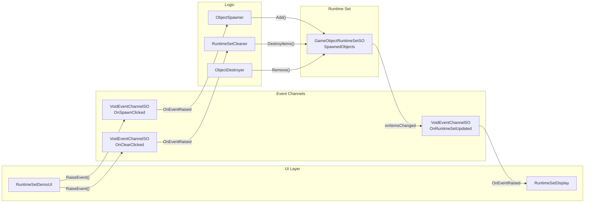

# Runtime Sets Demo

## Overview

Demonstrates the **Runtime Sets** pattern - a ScriptableObject-based approach to managing dynamic collections of objects without using singletons.

The demo shows:

- Spawning and destroying objects with automatic collection tracking
- Event-driven UI updates when the collection changes
- Inspector visibility of active objects in real-time

## Features Used

| Feature | Asset | Description |
| :--- | :--- | :--- |
| Runtime Set | `SpawnedObjects` (GameObjectRuntimeSetSO) | Tracks all spawned objects |
| Event Channel | `OnSpawnClicked` (VoidEventChannelSO) | Spawn button event |
| Event Channel | `OnClearClicked` (VoidEventChannelSO) | Clear button event |
| Event Channel | `OnRuntimeSetUpdated` (VoidEventChannelSO) | Collection change notification |

## Architecture

**Key Insight**: Runtime Sets eliminate the need for manager singletons. Objects register themselves to a shared RuntimeSetSO, and the collection automatically notifies subscribers when items are added or removed.

## Key Files

| File | Description |
| :--- | :--- |
| `Scripts/RuntimeSetDemoUI.cs` | Connects UI buttons to EventChannels |
| `Scripts/ObjectSpawner.cs` | Spawns objects and registers to RuntimeSet |
| `Scripts/ObjectDestroyer.cs` | Removes objects on collision |
| `Scripts/RuntimeSetDisplay.cs` | Displays current object count |
| `Scripts/RuntimeSetCleaner.cs` | Clears all objects from RuntimeSet |
| `ScriptableObjects/RuntimeSets/SpawnedObjects.asset` | GameObjectRuntimeSetSO |

## How to Use

1. Open the `RuntimeSetsDemo` scene
2. Enter Play Mode
3. Click **Spawn Object** to create random cubes/spheres
4. Select the `SpawnedObjects` asset in the Project window to observe real-time tracking
5. Collide spawned objects with each other to destroy them
6. Click **Clear All** to remove all objects at once

## Use Cases

This pattern is applicable to any scenario requiring dynamic object collection management.

- **Enemy Management**: Track all active enemies without a manager singleton
- **Spawned Objects**: Manage dynamically created pickups, projectiles, effects
- **UI Elements**: Track active panels for bulk operations (close all, minimize all)
- **Level Cleanup**: Destroy all spawned objects when changing scenes
