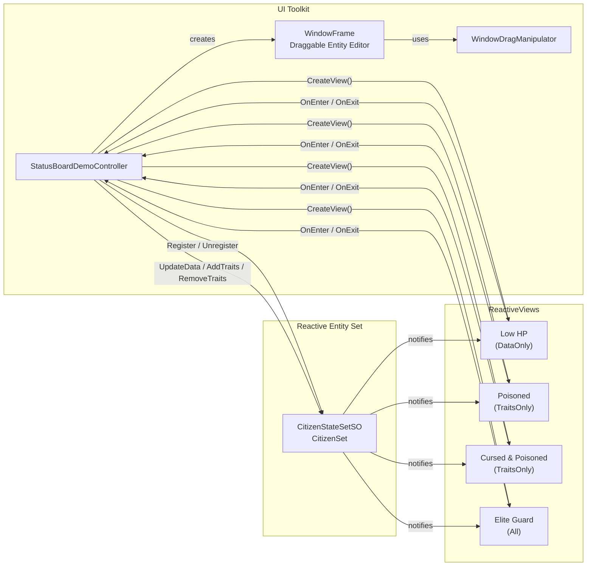

# Status Board Demo

{: .warning }
> **Experimental Feature** - This demo uses Traits and Views from v2.2.0 (unreleased). The API may change in future versions. Use in production at your own discretion.

## Overview

A hands-on dashboard for exploring **Traits** and **ReactiveViews**. Click an entity in the left panel to open its editor window, adjust HP or toggle traits, then watch the right panel update live.

The demo covers all three `ViewTrigger` modes:

- **DataOnly** -- view reacts only to data changes (HP threshold)
- **TraitsOnly** -- view reacts only to trait changes (single-trait and multi-trait AND mask)
- **All** -- view reacts to both data and trait changes (combined HP + trait condition)

## Features Used

| Feature | Asset / Class | Description |
| :--- | :--- | :--- |
| Reactive Entity Set | `CitizenSet` (CitizenStateSetSO) | Stores all citizen entities with `CitizenState` data |
| Traits | `CitizenTrait` ([Flags] enum) | Per-entity bitmask flags: Cursed, Poisoned, Shielded |
| ReactiveView (DataOnly) | Low HP view | Matches entities with HP < 30% |
| ReactiveView (TraitsOnly) | Poisoned view | Matches entities with the Poisoned trait |
| ReactiveView (TraitsOnly) | Cursed & Poisoned view | Matches entities with both Cursed AND Poisoned traits |
| ReactiveView (All) | Elite Guard view | Matches entities with HP > 80% and the Shielded trait |

See the [Traits]({{ '/en/guides/reactive-entity-sets/traits' | relative_url }}) and [Views]({{ '/en/guides/reactive-entity-sets/views' | relative_url }}) guides for the full API.

## Architecture

**Key Insight**: No ScriptableObject event channels are needed. The controller creates `ReactiveView` instances directly from the entity set and subscribes to their `OnEnter` / `OnExit` events. When entity data or traits change, the views automatically re-evaluate their predicates and the UI updates accordingly.

## Key Files

| File | Description |
| :--- | :--- |
| `Scripts/Data/CitizenState.cs` | Entity data struct: `Hp`, `MaxHp` |
| `Scripts/Data/CitizenTrait.cs` | `[Flags]` enum: Cursed, Poisoned, Shielded |
| `Scripts/Sets/CitizenStateSetSO.cs` | `ReactiveEntitySetSO<CitizenState>` asset type |
| `Scripts/UI/StatusBoardDemoController.cs` | Main controller -- manages entities, views, and UI |
| `Scripts/UI/Elements/WindowFrame.cs` | Draggable window VisualElement with titlebar and close button |
| `Scripts/UI/Elements/WindowDragManipulator.cs` | PointerManipulator for titlebar drag |
| `UI/StatusBoardDemo.uxml` | 3-column layout (left sidebar, center workspace, right sidebar) |
| `UI/USS/StatusBoardDemo.uss` | Dark theme styling |
| `ScriptableObjects/CitizenSet.asset` | CitizenStateSetSO instance |

## How to Use

1. Open the `StatusBoardDemo` scene
2. Enter Play Mode -- 12 entities are spawned with random HP and traits
3. Click **Add** / **Remove** buttons in the left sidebar to add or remove 5 entities at a time
4. Click an entity row in the left sidebar to open its draggable editor window in the center workspace
5. Drag the HP slider to change an entity's health -- observe how the Low HP and Elite Guard views update
6. Toggle the **Cursed**, **Poisoned**, and **Shielded** trait buttons -- observe how the trait-based views update
7. Watch the right sidebar panels to see entities enter and exit each ReactiveView in real time

## Use Cases

The same pattern works anywhere entities move in and out of groups based on changing state:

| Use Case | Example |
| :--- | :--- |
| Status Effects | Track all poisoned or stunned units for visual feedback or tick damage |
| Alert Systems | Highlight low-health allies or high-threat enemies in a HUD |
| Squad Composition | Automatically group units by combined stat + trait criteria (e.g., eligible healers) |
| Filter Dashboards | Build debug or admin panels that show live filtered views of game state |
