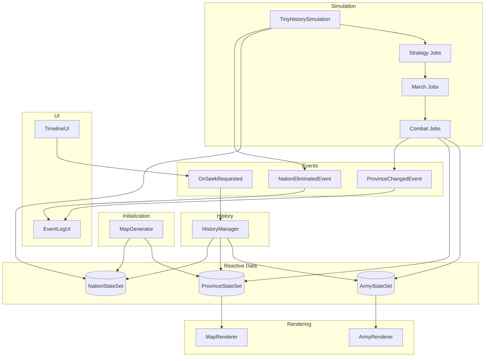
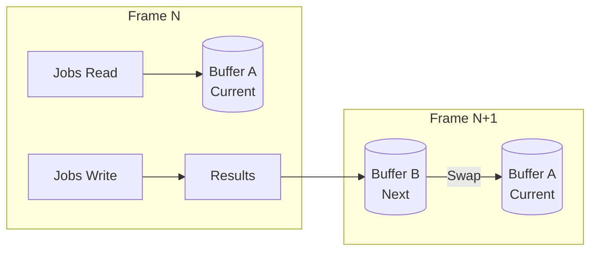
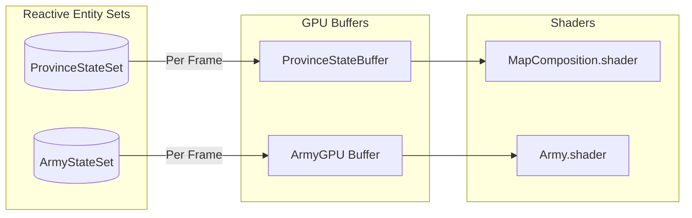
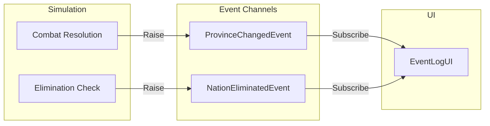

# Architecture

---

## Purpose

This page provides a visual overview of Tiny History Demo's architecture. Use it to understand how systems connect and how data flows between them.

---

## System Overview



---

## Simulation Loop

Each frame, the simulation executes a multi-stage pipeline using Unity Jobs.

```
Frame Start
     │
     ▼
┌─────────────────────┐
│  1. Strategy Job    │  Decide army movement targets
│     (Sequential)    │  based on nation AI personalities
└──────────┬──────────┘
           ▼
┌─────────────────────┐
│  2. March Job       │  Move armies toward targets
│     (Parallel)      │  using pre-baked shortest paths
└──────────┬──────────┘
           ▼
┌─────────────────────┐
│  3. Combat Job      │  Resolve battles when armies
│     (Sequential)    │  from different nations meet
└──────────┬──────────┘
           ▼
┌─────────────────────┐
│  4. Economy         │  Spawn/destroy armies based
│     (Every N frames)│  on territory control
└──────────┬──────────┘
           ▼
┌─────────────────────┐
│  5. History         │  Capture state snapshot
│     (Every N frames)│  to circular buffer
└──────────┬──────────┘
           ▼
┌─────────────────────┐
│  6. GPU Render      │  Update GPU buffers for
│                     │  province and army rendering
└──────────┬──────────┘
           ▼
      Frame End
```

---

## Data Flow

### Entity Sets and Jobs

Jobs read from and write to Reactive Entity Sets using double buffering.



### Entity Sets to GPU

Province and army data flows from Entity Sets to GPU buffers via manual updates.



### Events to UI

Domain events flow from the simulation to the UI for logging.



---

## Key Components

| Component | Role | Key File |
| :--- | :--- | :--- |
| TinyHistorySimulation | Main controller, orchestrates simulation | `TinyHistorySimulation.cs` |
| MapGenerator | Procedural map with provinces and nations | `MapGenerator.cs` |
| StrategyJob / MarchJob / CombatJob | Job System tasks for simulation | `Jobs/*.cs` |
| ArmyTargetAssigner | AI decision-making for army movements | `Strategy/ArmyTargetAssigner.cs` |
| HistoryManager | Snapshot capture and restoration | `HistoryManager.cs` |
| MapRenderer | GPU province rendering with ownership colors | `MapRenderer.cs` |
| ArmyRenderer | GPU instanced rendering for armies | `ArmyRenderer.cs` |
| TimelineUI | Playback controls and timeline slider | `UI/TimelineUI.cs` |
| EventLogUI | Chronicle of historical events | `UI/EventLogUI.cs` |

---

## Extension Points

This sample demonstrates core patterns, but several extension points are already prepared in the code. Look for `NOTE: Expansion point` comments in the source files.

### Ready-to-Use Extension Points

The following data is already computed and passed through the system, but not yet consumed:

| File | Extension Point | Current State |
| :--- | :--- | :--- |
| `TerrainType.cs` | Terrain-based movement cost, combat modifiers, visual differentiation | Assigned during generation and passed to GPU, but unused in logic/rendering |
| `PersonalityGenerator.cs` | Runtime nation spawning (rebellions, splits) | `GenerateSingle()` method exists but unused |
| `MapGenerator.cs` | Continent count for map info UI or continent-based mechanics | Computed but not consumed |
| `CombatResult.cs` | Army IDs for battle statistics, detailed logs, kill tracking | Written by CombatJob but not read |

These are low-hanging fruit - the data already flows through the system, you just need to add consumers.

### Advanced Patterns

For users who want to push the architecture further:

#### GPU-Based Movement (Texture Data Container)

For larger scales (100K+ units), consider storing positions in a `RenderTexture` instead of CPU-side Entity Sets:

- RGBA channels = X, Y, TargetX, TargetY
- Compute Shaders update positions entirely on GPU
- RES remains "source of truth" for logic (nation ownership, alive/dead)

```
┌─────────────────┐     ┌─────────────────┐     ┌─────────────────┐
│  RES (CPU)      │     │  Orchestrator   │     │  GPU Texture    │
│  Logic Layer    │ ──► │  ID Mapping     │ ──► │  Physics Layer  │
│  - Nation ID    │     │  Diff Injection │     │  - Position     │
│  - Target ID    │     │                 │     │  - Velocity     │
│  - Alive Flag   │     │                 │     │  - Interpolation│
└─────────────────┘     └─────────────────┘     └─────────────────┘
```

#### Historical "Ink" Accumulation

Accumulate battle history visually on the map:

- Write "battle intensity" to a persistent `HistoryTexture` whenever combat occurs
- Blend province colors with historical data to show war-torn regions
- Use blur/decay for gradient effects over time

#### Other Ideas

| Extension | Description |
| :--- | :--- |
| Fog of War | Track explored/visible regions per nation via texture |
| Trade Routes | Visualize economic connections between provinces |
| Multi-Timeline | Branch history into parallel timelines for comparison |

> **Note** - Advanced patterns go beyond Reactive SO basics. They're presented as inspiration for users who want to push the architecture further.
{: .note }

---

## Next Steps

- Learn how domain events and UI communication work in [Event Channels](event-channels)
- Learn how Jobs and GPU integration work in [Reactive Entity Sets](reactive-entity-sets)
