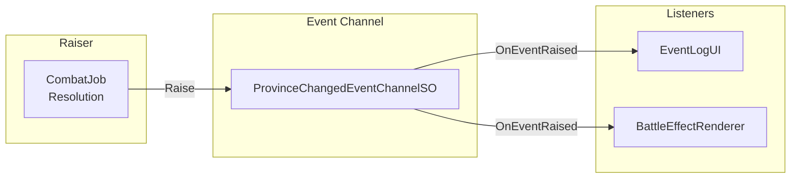
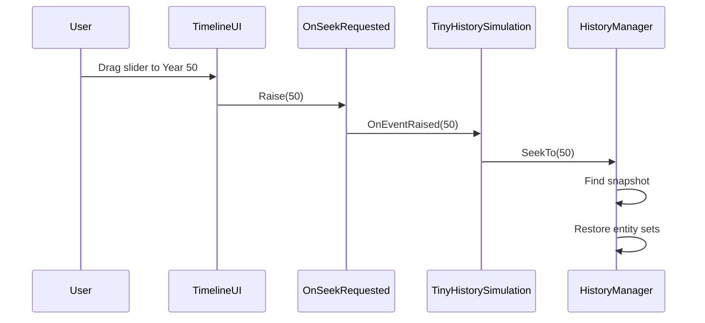
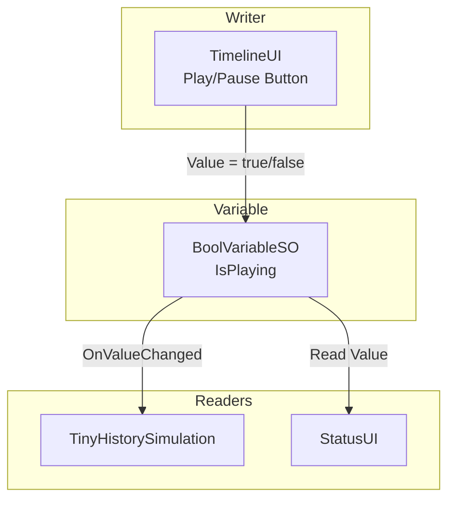

# Event Channels Integration

---

## Purpose

This page explains how Tiny History Demo uses Event Channels for domain events, UI communication, and state synchronization.

---

## Overview

The sample demonstrates three Event Channel patterns:

1. **Domain Events**: Notify when significant game events occur
2. **UI Communication**: Allow UI to request actions without direct coupling
3. **Reactive Variables**: Share state across multiple components

---

## Event Channels Used

| Event Channel | Type | Purpose |
| :--- | :--- | :--- |
| ProvinceChangedEvent | ProvinceChangedEventChannelSO | Province ownership changes |
| NationEliminatedEvent | NationEliminatedEventChannelSO | Nation loses all territory |
| OnSeekRequested | IntEventChannelSO | UI requests timeline seek |
| IsPlaying | BoolVariableSO | Play/pause state |
| CurrentFrame | IntVariableSO | Current simulation frame |
| SimulationSpeed | FloatVariableSO | Playback speed multiplier |

---

## Pattern 1: Domain Events

Domain events notify interested parties when significant game events occur. The event raiser doesn't need to know who is listening.

### ProvinceChangedEvent

Fired when combat resolves and a province changes ownership.

**Payload**:

- Year when the change occurred
- Province ID
- Previous owner nation ID
- New owner nation ID

> **Key Insight** - The combat system doesn't know about UI or visual effects. It raises an event with the relevant data. Any component can subscribe to react.
{: .note }

### NationEliminatedEvent

Fired when a nation loses its last province.

**Payload**:

- Year when elimination occurred
- Nation ID

**Listeners**:

- EventLogUI adds an entry to the chronicle

---

## Pattern 2: UI to Simulation Communication

UI components need to request actions from the simulation without holding direct references. Event Channels provide this decoupled communication.

### OnSeekRequested

When the user drags the timeline slider, the UI raises an event rather than directly manipulating simulation state.

> **Key Insight** - The UI doesn't need to know how seeking works internally. It requests "go to year X" and the simulation handles the details.
{: .note }

**Benefits**:

- UI can be developed and tested independently
- Seeking logic can change without affecting UI
- Multiple UI elements could trigger seeks

---

## Pattern 3: Reactive Variables for State Sync

Reactive Variables allow multiple components to observe shared state without direct references.

### Shared State Variables

| Variable | Type | Writers | Readers |
| :--- | :--- | :--- | :--- |
| IsPlaying | BoolVariableSO | TimelineUI | TinyHistorySimulation, StatusUI |
| CurrentFrame | IntVariableSO | TinyHistorySimulation | TimelineUI, StatusUI |
| TotalFrames | IntVariableSO | TinyHistorySimulation | TimelineUI |
| SimulationSpeed | FloatVariableSO | TimelineUI | TinyHistorySimulation |

### Example: Play/Pause State

> **Key Insight** - When the user clicks Play, the UI only updates the Variable. The simulation subscribes to changes and responds accordingly. Neither component knows about the other.
{: .note }

---

## Architecture Benefits

Using Event Channels in this sample provides:

1. **Loose Coupling**: Combat doesn't know about UI, UI doesn't know about simulation
2. **Testability**: Each component can be tested in isolation with mock events
3. **Extensibility**: Add new listeners without modifying existing code
4. **Clarity**: Data flow is explicit through named Event Channel assets

---

## Key Files

| File | Description |
| :--- | :--- |
| `ScriptableObjects/Events/ProvinceChangedEvent.asset` | Province ownership change event |
| `ScriptableObjects/Events/NationEliminatedEvent.asset` | Nation elimination event |
| `ScriptableObjects/Events/OnSeekRequested.asset` | Timeline seek request event |
| `ScriptableObjects/Variables/IsPlaying.asset` | Play/pause state variable |
| `ScriptableObjects/Variables/CurrentFrame.asset` | Current frame variable |
| `Scripts/UI/EventLogUI.cs` | Subscribes to domain events |
| `Scripts/UI/TimelineUI.cs` | Raises seek events, reads/writes variables |

---

## Next Steps

- Learn how Jobs and GPU integration work in [Reactive Entity Sets](reactive-entity-sets)
- Return to [Architecture](architecture) for the full system overview

---

## Learn More

Want to use Event Channels in your own project?

- [Event Channels Guide]({{ '/en/guides/event-channels' | relative_url }}) - Complete guide to creating and using Event Channels
- [Variables Guide]({{ '/en/guides/variables' | relative_url }}) - How to use Reactive Variables for state synchronization
