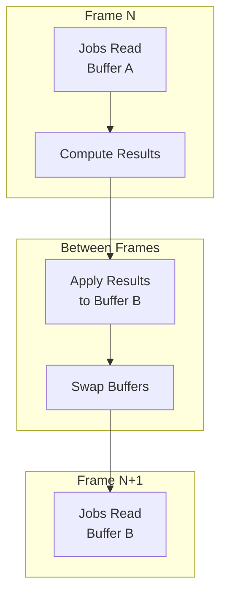
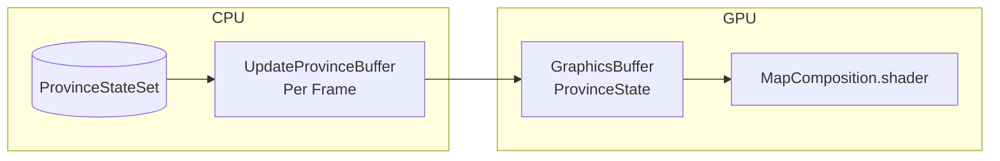
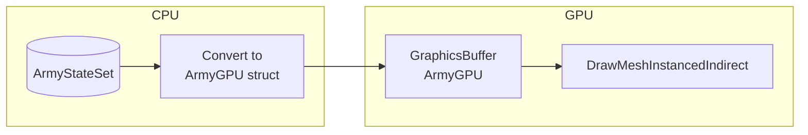
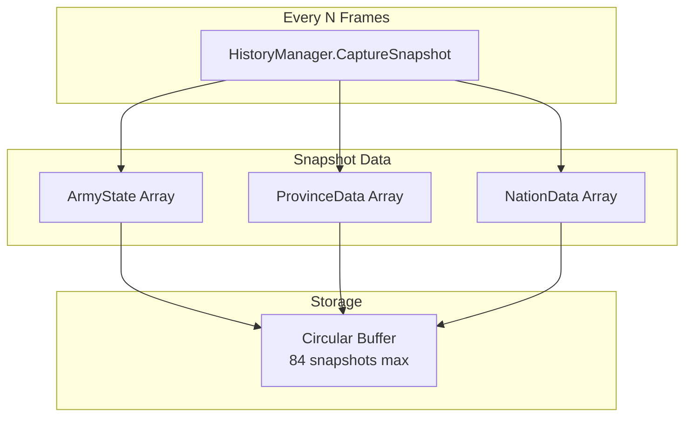
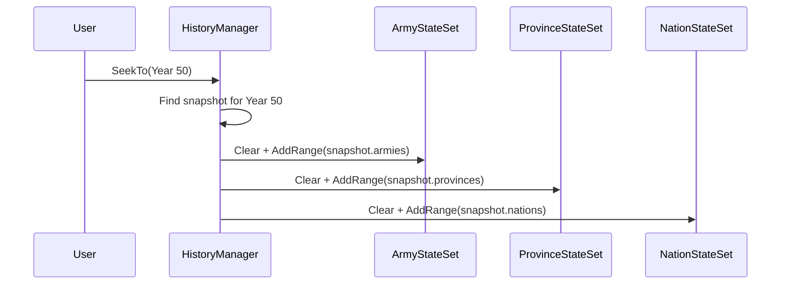

# Reactive Entity Sets Integration

---

## Purpose

This page explains how Tiny History Demo uses Reactive Entity Sets for Jobs integration, custom GPU rendering, and history snapshots.

---

## Overview

The sample demonstrates four patterns:

1. **Jobs Integration**: Double buffering for safe parallel processing
2. **Custom GPU Rendering**: Manual buffer updates for rendering
3. **State Queries**: Aggregation and filtering without allocation
4. **History Snapshots**: Save and restore entity state for time travel

---

## Entity Sets Used

| Entity Set | Entity Type | Typical Count | Purpose |
| :--- | :--- | :--- | :--- |
| ArmyStateSet | ArmyState | ~20,000 max | Active armies with position, target, strength |
| ProvinceStateSet | ProvinceData | ~500 | Map provinces with ownership and terrain |
| NationStateSet | NationData | ~50 | Nations with capital and alive status |

---

## Pattern 1: Jobs Integration with Double Buffering

### The Challenge

Unity Jobs require stable data during execution. If entity state changes mid-job, race conditions and data corruption can occur.

### The Solution: ReactiveEntitySetOrchestrator

The sample uses `ReactiveEntitySetOrchestrator<T>` to manage double buffering automatically.



### How It Works

1. **Schedule Phase**: Jobs receive a `NativeArray` snapshot of current state
2. **Execution Phase**: Jobs read from snapshot, write results to separate output
3. **Completion Phase**: Results are applied to the entity set
4. **Next Frame**: Updated state is available for the next job batch

> **Key Insight** - Jobs never directly modify the entity set. They work with snapshots and produce results that are applied atomically between frames.
{: .note }

### Job Pipeline Example

```
ArmyStateSet (Current State)
         │
         ▼
    ┌─────────┐
    │ Strategy│ → Decide targets
    │   Job   │
    └────┬────┘
         ▼
    ┌─────────┐
    │  March  │ → Update positions
    │   Job   │
    └────┬────┘
         ▼
    ┌─────────┐
    │ Combat  │ → Resolve battles
    │   Job   │
    └────┬────┘
         ▼
ArmyStateSet (Updated State)
```

---

## Pattern 2: Custom GPU Rendering

### Province Rendering

Province ownership data flows from the Entity Set to GPU buffers via manual updates each frame.



**What Gets Copied**:

- Owner nation ID (determines province color)
- Occupation progress (shows invasion overlay)
- Terrain type (affects visual appearance)

> **Note** - This sample uses manual `GraphicsBuffer.SetData()` calls rather than Reactive SO's GPU Sync feature. This approach gives full control over when and how data is uploaded to the GPU.
{: .note }

### Army Rendering

Army positions are copied to GPU every frame for instanced rendering.



**ArmyGPU Data**:

- Current position
- Target position
- March progress (for interpolation)
- Nation ID (for color lookup)

> **Key Insight** - The shader interpolates army positions using march progress, creating smooth movement without per-army CPU updates.
{: .note }

---

## Pattern 3: State Queries

Entity Sets support LINQ-style queries for aggregation and filtering.

### Nation Elimination Check

```csharp
// Check if any province is owned by this nation
bool hasTerritory = provinceStateSet
    .Any(p => p.OwnerNationID == nationID);

if (!hasTerritory)
{
    // Nation eliminated
    nationEliminatedEvent.Raise(currentYear, nationID);
}
```

### Army Count by Nation

```csharp
// Count armies for each nation
foreach (var nation in nationStateSet)
{
    int armyCount = armyStateSet
        .Count(a => a.NationID == nation.ID);

    // Use for economy calculations
}
```

> **Key Insight** - Queries use the underlying `NativeArray` for zero-allocation iteration. No garbage is generated during gameplay.
{: .note }

---

## Pattern 4: History Snapshots

### Capturing State

The sample captures entity set snapshots at regular intervals for timeline navigation.



**Snapshot Contents**:

- Copy of all entity arrays
- Frame number (year)
- Metadata for restoration

### Restoring State

When the user seeks to a past year, entity sets are restored from the snapshot.



> **Key Insight** - The collection-like API (`Clear`, `AddRange`) makes save/restore trivial. Entity Sets behave like standard collections but with reactive capabilities.
{: .note }

### Timeline Branching

When seeking to the past and resuming play, future snapshots are discarded.

```
Timeline: [Yr10] [Yr20] [Yr30] [Yr40] [Yr50]
                              ▲
                         User seeks here

After resume:
Timeline: [Yr10] [Yr20] [Yr30] [Yr40] [Yr41] [Yr42] ...
                              └── New history branch
```

---

## Memory Efficiency

The sample uses several strategies to minimize memory allocation:

| Strategy | Implementation |
| :--- | :--- |
| Pre-allocated buffers | Entity sets sized at initialization |
| Circular buffer | Fixed snapshot count, oldest overwritten |
| NativeArray views | Zero-copy iteration for queries |
| Struct entities | Value types avoid heap allocation |

---

## Key Files

| File | Description |
| :--- | :--- |
| `ScriptableObjects/EntitySets/ArmyStateSet.asset` | Army entity set |
| `ScriptableObjects/EntitySets/ProvinceStateSet.asset` | Province entity set |
| `ScriptableObjects/EntitySets/NationStateSet.asset` | Nation entity set |
| `Scripts/TinyHistorySimulation.cs` | Orchestrator setup and job scheduling |
| `Scripts/HistoryManager.cs` | Snapshot capture and restoration |
| `Scripts/MapRenderer.cs` | Province GPU rendering |
| `Scripts/ArmyRenderer.cs` | Army GPU rendering |

---

## Next Steps

- Return to [Architecture](architecture) for the full system overview
- Learn about Event Channels in [Event Channels](event-channels)

---

## Learn More

Want to use Reactive Entity Sets in your own project?

- [Reactive Entity Sets Guide]({{ '/en/guides/reactive-entity-sets/' | relative_url }}) - Complete guide covering basic usage, events, patterns, and best practices
- [Variables Guide]({{ '/en/guides/variables' | relative_url }}) - How to use GPU Sync with Variables
