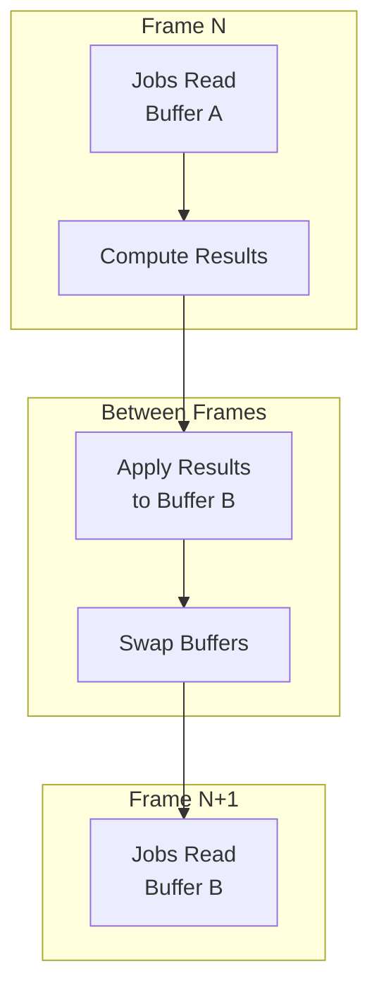
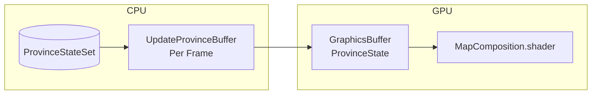
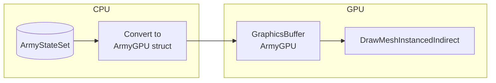
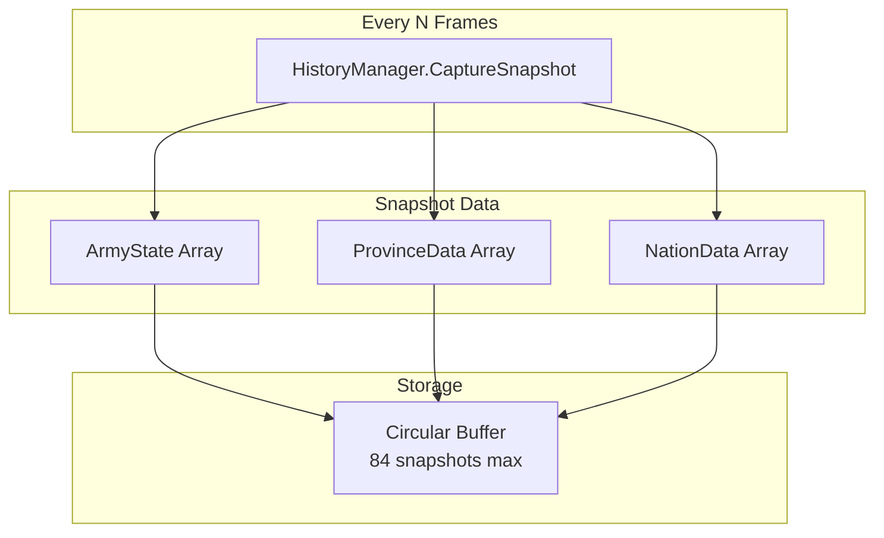
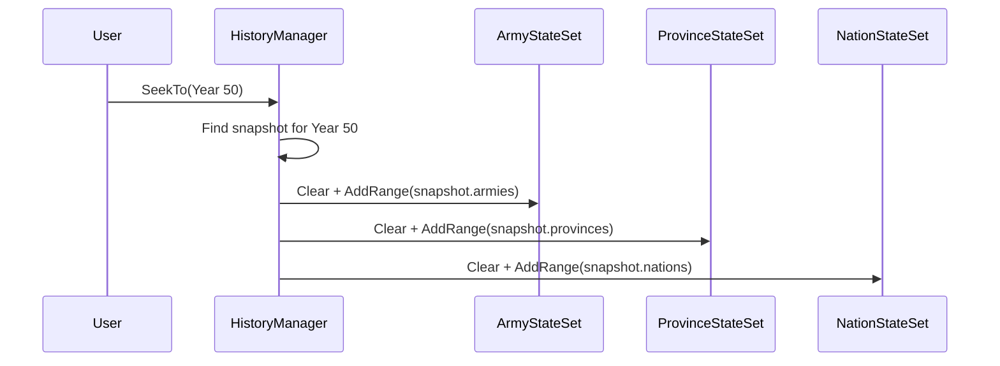

# Reactive entity sets integration

---

## Purpose

This page explains how Tiny History Demo uses Reactive Entity Sets for Jobs integration, custom GPU rendering, and history snapshots.

---

## Overview

The sample demonstrates four patterns:

1. Jobs integration -- double buffering for safe parallel processing
2. Custom GPU rendering -- manual buffer updates for rendering
3. State queries -- aggregation and filtering without allocation
4. History snapshots -- save and restore entity state for time travel

---

## Entity sets used

| Entity Set | Entity Type | Typical Count | Purpose |
| :--- | :--- | :--- | :--- |
| ArmyStateSet | ArmyState | ~20,000 max | Active armies with position, target, strength |
| ProvinceStateSet | ProvinceData | ~500 | Map provinces with ownership and terrain |
| NationStateSet | NationData | ~50 | Nations with capital and alive status |

---

## Pattern 1: Jobs integration with double buffering

### The challenge

Unity Jobs require stable data during execution. If entity state changes mid-job, race conditions and data corruption can occur.

### The solution: ReactiveEntitySetOrchestrator

The sample uses `ReactiveEntitySetOrchestrator<T>` to manage double buffering automatically.


```mermaid
graph TB
    subgraph "Frame N"
        READ_A[Jobs Read<br/>Buffer A]
        COMPUTE[Compute Results]
    end

    subgraph "Between Frames"
        APPLY[Apply Results<br/>to Buffer B]
        SWAP[Swap Buffers]
    end

    subgraph "Frame N+1"
        READ_B[Jobs Read<br/>Buffer B]
    end

    READ_A --> COMPUTE --> APPLY --> SWAP --> READ_B
```

### How it works

1. During scheduling, jobs receive a `NativeArray` snapshot of the current state.
2. While executing, jobs read from that snapshot and write results to separate output.
3. On completion, results are applied to the entity set.
4. The next frame sees the updated state, ready for the next job batch.

> Jobs never directly modify the entity set. They work with snapshots and produce results that are applied atomically between frames.
{: .note }

{: .note }
> TinyHistory uses **DataOnly** updates: IDs never change during simulation, so the ID buffer is **not copied**.  
> If your job changes IDs or entity count, use `UpdateMode.DataAndIds` and write to `GetBackBufferIds()`.

### Job pipeline example

```
ArmyStateSet (Current State)
         │
         ▼
    ┌─────────┐
    │ Strategy│ → Decide targets
    │   Job   │
    └────┬────┘
         ▼
    ┌─────────┐
    │  March  │ → Update positions
    │   Job   │
    └────┬────┘
         ▼
    ┌─────────┐
    │ Combat  │ → Resolve battles
    │   Job   │
    └────┬────┘
         ▼
ArmyStateSet (Updated State)
```

---

## Pattern 2: Custom GPU rendering

### Province rendering

Province ownership data flows from the Entity Set to GPU buffers via manual updates each frame.


```mermaid
graph LR
    subgraph "CPU"
        P_SET[(ProvinceStateSet)]
        UPDATE[UpdateProvinceBuffer<br/>Per Frame]
    end

    subgraph "GPU"
        P_BUF[GraphicsBuffer<br/>ProvinceState]
        SHADER[MapComposition.shader]
    end

    P_SET --> UPDATE --> P_BUF --> SHADER
```

Each frame copies the owner nation ID (which determines province color), occupation progress (for the invasion overlay), and terrain type (which affects visual appearance).

> This sample uses manual `GraphicsBuffer.SetData()` calls rather than Reactive SO's GPU Sync feature. This approach gives full control over when and how data reaches the GPU.
{: .note }

### Army rendering

Army positions are copied to GPU every frame for instanced rendering.


```mermaid
graph LR
    subgraph "CPU"
        A_SET[(ArmyStateSet)]
        CONV[Convert to<br/>ArmyGPU struct]
    end

    subgraph "GPU"
        A_BUF[GraphicsBuffer<br/>ArmyGPU]
        INST[DrawMeshInstancedIndirect]
    end

    A_SET --> CONV --> A_BUF --> INST
```

The `ArmyGPU` struct holds current position, target position, march progress for interpolation, and nation ID for color lookup.

> The shader interpolates army positions using march progress, so movement looks smooth without per-army CPU updates.
{: .note }

---

## Pattern 3: State queries

Entity Sets support LINQ-style queries for aggregation and filtering.

### Nation elimination check

```csharp
// Check if any province is owned by this nation
bool hasTerritory = provinceStateSet
    .Any(p => p.OwnerNationID == nationID);

if (!hasTerritory)
{
    // Nation eliminated
    nationEliminatedEvent.Raise(currentYear, nationID);
}
```

### Army count by nation

```csharp
// Count armies for each nation
foreach (var nation in nationStateSet)
{
    int armyCount = armyStateSet
        .Count(a => a.NationID == nation.ID);

    // Use for economy calculations
}
```

> Queries iterate over the underlying `NativeArray` directly, so no garbage is generated during gameplay.
{: .note }

---

## Pattern 4: History snapshots

### Capturing state

The sample captures entity set snapshots at regular intervals for timeline navigation.


```mermaid
graph TB
    subgraph "Every N Frames"
        CAPTURE[HistoryManager.CaptureSnapshot]
    end

    subgraph "Snapshot Data"
        S_A[ArmyState Array]
        S_P[ProvinceData Array]
        S_N[NationData Array]
    end

    subgraph "Storage"
        BUFFER[Circular Buffer<br/>84 snapshots max]
    end

    CAPTURE --> S_A --> BUFFER
    CAPTURE --> S_P --> BUFFER
    CAPTURE --> S_N --> BUFFER
```

Each snapshot stores a copy of all entity arrays, the frame number (year), and metadata needed for restoration.

### Restoring state

When the user seeks to a past year, entity sets are restored from the snapshot.


```mermaid
sequenceDiagram
    participant User
    participant HistoryManager
    participant ArmyStateSet
    participant ProvinceStateSet
    participant NationStateSet

    User->>HistoryManager: SeekTo(Year 50)
    HistoryManager->>HistoryManager: Find snapshot for Year 50
    HistoryManager->>ArmyStateSet: Clear + AddRange(snapshot.armies)
    HistoryManager->>ProvinceStateSet: Clear + AddRange(snapshot.provinces)
    HistoryManager->>NationStateSet: Clear + AddRange(snapshot.nations)
```

> Because entity sets expose a collection-like API (`Clear`, `AddRange`), save and restore is straightforward. They behave like standard collections but fire reactive callbacks on change.
{: .note }

### Timeline branching

When seeking to the past and resuming play, future snapshots are discarded.

```
Timeline: [Yr10] [Yr20] [Yr30] [Yr40] [Yr50]
                              ▲
                         User seeks here

After resume:
Timeline: [Yr10] [Yr20] [Yr30] [Yr40] [Yr41] [Yr42] ...
                              └── New history branch
```

---

## Memory efficiency

The sample uses several strategies to minimize memory allocation:

| Strategy | Implementation |
| :--- | :--- |
| Pre-allocated buffers | Entity sets sized at initialization |
| Circular buffer | Fixed snapshot count, oldest overwritten |
| NativeArray views | Zero-copy iteration for queries |
| Struct entities | Value types avoid heap allocation |

---

## Key files

| File | Description |
| :--- | :--- |
| `ScriptableObjects/EntitySets/ArmyStateSet.asset` | Army entity set |
| `ScriptableObjects/EntitySets/ProvinceStateSet.asset` | Province entity set |
| `ScriptableObjects/EntitySets/NationStateSet.asset` | Nation entity set |
| `Scripts/TinyHistorySimulation.cs` | Orchestrator setup and job scheduling |
| `Scripts/HistoryManager.cs` | Snapshot capture and restoration |
| `Scripts/MapRenderer.cs` | Province GPU rendering |
| `Scripts/ArmyRenderer.cs` | Army GPU rendering |

---

## Next steps

- Return to [Architecture](architecture) for the full system overview
- Learn about Event Channels in [Event Channels](event-channels)

---

## Learn more

Want to use Reactive Entity Sets in your own project?

- [Reactive Entity Sets Guide]({{ '/en/guides/reactive-entity-sets/' | relative_url }}) - Complete guide covering basic usage, events, patterns, and best practices
- [Variables Guide]({{ '/en/guides/variables' | relative_url }}) - How to use GPU Sync with Variables
