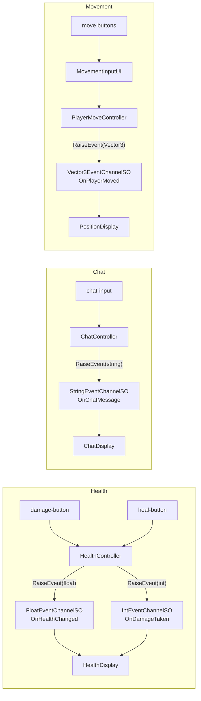

# Typed EventChannels Demo

## Overview

Demonstrates using **typed EventChannels directly** (Float, String, Vector3, Int) without a
Variable in between. Where `BasicDemo` centers on `IntVariableSO` and only raises
`IntEventChannelSO` as a side effect of a Variable's value changing, this sample shows each
channel type being raised and listened to on its own.

The demo UI has three independent sections:

- **Health** - `FloatEventChannelSO` for the current health value, `IntEventChannelSO` for
  discrete damage amounts
- **Chat** - `StringEventChannelSO` for chat messages
- **Movement** - `Vector3EventChannelSO` for position updates, driven by on-screen directional
  buttons

## Features Used

| Feature | Asset | Description |
| :--- | :--- | :--- |
| Event Channel | `OnHealthChanged` (FloatEventChannelSO) | Current health value |
| Event Channel | `OnDamageTaken` (IntEventChannelSO) | Damage amount taken |
| Event Channel | `OnChatMessage` (StringEventChannelSO) | Chat message text |
| Event Channel | `OnPlayerMoved` (Vector3EventChannelSO) | Updated position |

## Architecture

**Key Insight**: Every controller/display pair in this sample communicates purely through a
typed EventChannel `SerializeField` - none of them hold a direct reference to each other, and
none of them route through a Variable.

## Key Files

| File | Description |
| :--- | :--- |
| `Scripts/HealthController.cs` | Raises `FloatEventChannelSO` and `IntEventChannelSO` on damage/heal |
| `Scripts/HealthDisplay.cs` | Listens to both health channels and updates a ProgressBar/Label |
| `Scripts/ChatController.cs` | Raises `StringEventChannelSO` from a TextField + Button |
| `Scripts/ChatDisplay.cs` | Listens to `StringEventChannelSO` and appends to a ScrollView log |
| `Scripts/PlayerMoveController.cs` | Moves its transform and raises `Vector3EventChannelSO` |
| `Scripts/MovementInputUI.cs` | Directional buttons that call `PlayerMoveController.Move()` |
| `Scripts/PositionDisplay.cs` | Listens to `Vector3EventChannelSO` and displays coordinates |
| `ScriptableObjects/Events/OnHealthChanged.asset` | FloatEventChannelSO for health value |
| `ScriptableObjects/Events/OnDamageTaken.asset` | IntEventChannelSO for damage amount |
| `ScriptableObjects/Events/OnChatMessage.asset` | StringEventChannelSO for chat text |
| `ScriptableObjects/Events/OnPlayerMoved.asset` | Vector3EventChannelSO for position |

## How to Use

1. Open the `TypedEventChannelsDemo` scene
2. Enter Play Mode
3. Click **Damage** / **Heal** to raise the health channels and watch the bar and log update
4. Type a message in the chat field and click **Send** to raise `OnChatMessage`
5. Click a directional button to move the player and raise `OnPlayerMoved`

## Use Cases

- **Health/Stat Systems**: Float channels for continuous values (HP, stamina, mana)
- **Chat/Log Systems**: String channels for arbitrary text payloads
- **Position/Transform Sync**: Vector3 channels for movement, spawn points, waypoints
- **Discrete Counters**: Int channels for damage, score deltas, item counts
