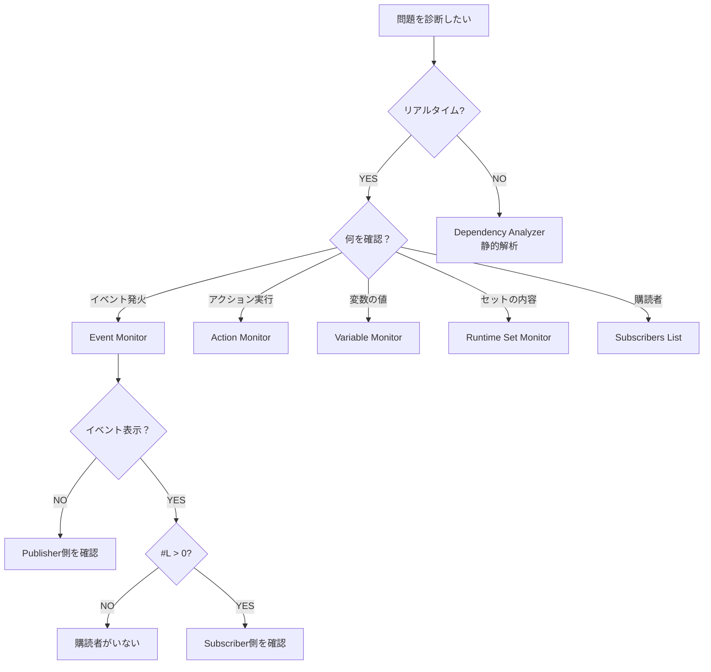

# デバッグ

---

## 目的

このセクションでは、Reactive SOのイベントフローをデバッグし、問題を診断する方法を説明します。組み込みのデバッグツールの使い方と、一般的な問題のトラブルシューティング方法を学びます。

---

## 利用可能なツール

Reactive SOは以下のデバッグツールを提供しています。

| ツール | 目的 |
|------|---------|
| [Event Monitor](monitor) | 呼び出し元情報を含むリアルタイムイベント追跡 |
| [Action Monitor](monitor) | アクション実行のリアルタイム追跡 |
| [Variable Monitor](monitor) | リアルタイム変数状態監視 |
| [Runtime Set Monitor](monitor) | リアルタイムランタイムセット監視 |
| [Asset Browser](asset-browser) | すべてのReactive SOアセットを閲覧・検索・管理 |
| [Dependency Analyzer](dependency-analyzer) | シーンとプレハブの静的解析 |
| Manual Trigger | コードなしでInspectorからイベントやアクションをテスト |
| Subscribers List | Play Mode中のアクティブなサブスクライバーを表示 |

---

## ツール選択ガイド

| 質問 | ツール |
|----------|------|
| イベントは発火していますか? | Event Monitor (Monitor Window) |
| アクションは実行されましたか? | Action Monitor (Monitor Window) |
| 現在の変数の値は何ですか? | Variable Monitor (Monitor Window) |
| ランタイムセットにどのオブジェクトが含まれていますか? | Runtime Set Monitor (Monitor Window) |
| このイベントには誰がサブスクライブしていますか? | Subscribers List |
| このアセットはどこで使用されていますか? | Dependency Analyzer |
| プレイせずにテストできますか? | Manual Trigger |
| このイベントを発生させたコードはどれですか? | Event Monitor (Monitor Window - Caller列) |
| メモリリークはありますか? | Subscribers List (シーン遷移時) |
| すべてのアセットは割り当てられていますか? | Dependency Analyzer |
| イベントと一緒に渡された値は何ですか? | Event Monitor (Monitor Window - Value列) |

---

## 一般的なデバッグシナリオ

### イベントが発火しない

**問題**
ボタンクリックが期待される動作をトリガーしません。

**手順**

1. Event Monitorを開く (Window > Reactive SO > Monitor)
2. イベントチャンネルで "Show In Event Log" が有効になっていることを確認
3. ゲーム内でボタンをクリック
4. イベントがログに表示されるかチェック

**診断**

- イベントが表示される: 問題はサブスクライバー側。Subscribers Listを確認。
- イベントが表示されない: 問題はパブリッシャー側。イベントチャンネルの割り当てと `RaiseEvent()` 呼び出しを確認。

### アクションが実行されない

**問題**
Actionで定義したクエスト報酬やエフェクトがトリガーされません。

**手順**

1. Action Monitorを開く (Window > Reactive SO > Monitor)
2. Actionアセットで "Show In Monitor" が有効になっていることを確認
3. ゲーム内で該当のロジックをトリガー
4. アクションの実行がログに表示されるかチェック

**診断**

- アクションが表示される: ActionのC#実装にロジックエラーがないか確認。
- アクションが表示されない: `Execute()` を呼び出しているコードを確認し、アセットが割り当てられているか検証。

### イベントは発火するが何も起こらない

**問題**
イベントがEvent Monitorに表示されるが期待される動作が発生しません。

**手順**

1. Event Monitorの#L列をチェック (リスナー数)
2. #L = 0の場合、誰もサブスクライブしていません
3. イベントチャンネルを選択してSubscribers Listを確認
4. 期待されるMonoBehaviourがリストされているか確認

**診断**

- サブスクライバーが存在する: サブスクライバーメソッドのロジックを確認
- サブスクライバーが存在しない: `OnEnable`/`OnDisable` のサブスクリプションコードを確認
- 間違ったサブスクライバー: イベントチャンネルの割り当てを確認

---

## デバッグ設定

各アセットにはInspectorにデバッグオプションがあります。

### Show In Monitor / Event Log

有効にすると、Play Mode中の活動がMonitor Windowに表示されます。

### Show In Console

有効にすると、活動がUnity Consoleに出力されます。従来の Debug.Log スタイルのデバッグに使用します。

---

## 参考資料

- [トラブルシューティング]({{ '/ja/troubleshooting' | relative_url }}) - 一般的な問題