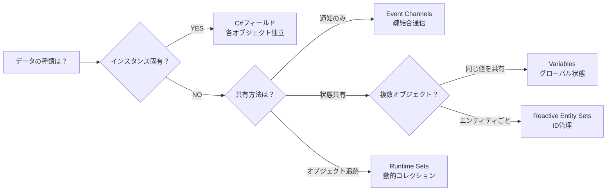

# アーキテクチャパターン

---

## 目的

このガイドは、各状況で適切なReactive SOツールを選択するのに役立ちます。Event Channels、Variables、Runtime Sets、Reactive Entity Setsをいつ使用するか、また標準のC#フィールドがより良い選択肢となるケースを学びます。

---

## 4つのツール

Reactive SOは4つの補完的なツールを提供します：

| ツール | 目的 | 最適な用途 |
|--------|------|------------|
| **Event Channels** | グローバル通知 | Fire-and-forgetメッセージ、疎結合通信 |
| **Variables** | 共有状態 | グローバル値、クロスシーン永続性 |
| **Runtime Sets** | オブジェクトコレクション | アクティブオブジェクト追跡、シングルトン置き換え |
| **Reactive Entity Sets** | エンティティごとの状態 | IDベースルックアップ、エンティティ状態管理 |

---

## Instance vs Globalルール

Reactive SOを使用する際の最も重要な判断：

> **インスタンスデータ**（オブジェクトごとに固有）→ C#フィールドを使用
> **グローバルデータ**（オブジェクト間で共有）→ ScriptableObjectを使用

### なぜ重要か

ScriptableObjectは**共有リソース**です。同じアセットを参照するすべてのスクリプトが同じデータを共有します。

```csharp
// 悪い例：すべてのスポーンされた敵が同じ体力を共有！
public class Enemy : MonoBehaviour
{
    [SerializeField] private IntVariableSO health;  // 共有される！

    void TakeDamage(int damage)
    {
        health.Value -= damage;  // すべての敵に影響
    }
}
```

```csharp
// 良い例：各敵が独立した体力を持つ
public class Enemy : MonoBehaviour
{
    private int health = 100;  // インスタンス固有

    void TakeDamage(int damage)
    {
        health -= damage;  // この敵のみに影響
    }
}
```

### 決定ツリー

以下のフローチャートで、状況に応じた適切なツールを選択できます：



---

## 各ツールの使用タイミング

### Event Channels

システムを疎結合化する**グローバル通知**に使用：

```csharp
// 最適：ゲーム全体の通知
[SerializeField] VoidEventChannelSO onPlayerDied;
[SerializeField] VoidEventChannelSO onLevelCompleted;
[SerializeField] IntEventChannelSO onScoreChanged;

// 最適：システム間通信
[SerializeField] GameObjectEventChannelSO onEnemySpawned;
[SerializeField] StringEventChannelSO onAudioRequest;
```

インスタンス固有のイベントには使用しないでください：

```csharp
// 悪い例：すべての敵が同じ死亡イベントに反応
public class Enemy : MonoBehaviour
{
    [SerializeField] private VoidEventChannelSO onDeath;

    private void OnEnable() => onDeath.OnEventRaised += Die;

    public void TakeDamage(int damage)
    {
        if (health <= 0)
            onDeath.RaiseEvent();  // すべての敵が死亡！
    }
}
```

### Variables

複数のシステムが読み取る**グローバル状態**に使用：

```csharp
// 最適：グローバルゲーム状態
[SerializeField] IntVariableSO playerScore;
[SerializeField] BoolVariableSO isPaused;
[SerializeField] FloatVariableSO masterVolume;

// 最適：デザイナー設定可能な値
[SerializeField] FloatVariableSO enemySpawnRate;
[SerializeField] IntVariableSO maxEnemies;
```

インスタンス状態には使用しないでください：

```csharp
// 悪い例：個々の敵の体力
[SerializeField] IntVariableSO health;  // すべての敵が共有！

// 良い例：代わりにC#フィールドを使用
private int health = 100;
```

### Runtime Sets

シングルトンなしで**アクティブオブジェクトを追跡**：

```csharp
// 最適：動的オブジェクト管理
[SerializeField] GameObjectRuntimeSetSO enemies;
[SerializeField] GameObjectRuntimeSetSO pickups;
[SerializeField] TransformRuntimeSetSO waypoints;

// オブジェクトが自己登録
private void OnEnable() => enemies?.Add(gameObject);
private void OnDisable() => enemies?.Remove(gameObject);
```

### Reactive Entity Sets

IDベースルックアップを持つ**エンティティごとの状態**に使用：

```csharp
// 最適：エンティティごとのデータストレージ
[SerializeField] EnemyEntitySetSO entitySet;

// 各エンティティが独立した状態を持つ
entitySet.Register(this, new EnemyState { Health = 100 });
entitySet.UpdateData(this, state => {
    state.Health -= damage;
    return state;
});
```

---

## 共通パターン

### パターン1：動的な敵スポーン

インスタンスフィールドとグローバルイベントを組み合わせる：

```csharp
public class Enemy : MonoBehaviour
{
    // インスタンス固有の状態
    [SerializeField] private int maxHealth = 100;
    private int currentHealth;

    // クロスシステム通知用のグローバルイベント
    [SerializeField] private IntEventChannelSO onAnyEnemyDamaged;
    [SerializeField] private VoidEventChannelSO onAnyEnemyDied;

    private void Start() => currentHealth = maxHealth;

    public void TakeDamage(int damage)
    {
        currentHealth -= damage;
        onAnyEnemyDamaged?.RaiseEvent(currentHealth);

        if (currentHealth <= 0)
        {
            onAnyEnemyDied?.RaiseEvent();
            Destroy(gameObject);
        }
    }
}
```

### パターン2：グローバルスコアシステム

真に共有される状態にはVariablesを使用：

```csharp
public class ScoreManager : MonoBehaviour
{
    [SerializeField] private IntVariableSO score;

    private void OnEnable() => score.ResetToInitial();

    public void AddPoints(int points)
    {
        score.Value += points;  // 自動的にOnValueChangedを発火
    }
}

public class ScoreDisplay : MonoBehaviour
{
    [SerializeField] private IntVariableSO score;
    [SerializeField] private Text scoreText;

    private void Update()
    {
        scoreText.text = $"Score: {score.Value}";
    }
}
```

### パターン3：Runtime Setsでの敵管理

シングルトンマネージャーを置き換える：

```csharp
public class EnemySpawner : MonoBehaviour
{
    [SerializeField] private GameObject enemyPrefab;
    [SerializeField] private GameObjectRuntimeSetSO activeEnemies;
    [SerializeField] private VoidEventChannelSO onWaveComplete;

    private void Update()
    {
        // FindObjectsOfType不要
        if (activeEnemies.Count == 0)
            onWaveComplete?.RaiseEvent();
    }
}

public class Enemy : MonoBehaviour
{
    [SerializeField] private GameObjectRuntimeSetSO activeEnemies;

    private void OnEnable() => activeEnemies?.Add(gameObject);
    private void OnDisable() => activeEnemies?.Remove(gameObject);
}
```

### パターン4：ハイブリッドアプローチ

複数のパターンを組み合わせる：

```csharp
public class Player : MonoBehaviour
{
    // インスタンス状態
    private int currentAmmo = 30;

    // グローバル設定（デザイナー調整可能）
    [SerializeField] private IntVariableSO maxAmmo;
    [SerializeField] private FloatVariableSO reloadTime;

    // グローバルイベント
    [SerializeField] private IntEventChannelSO onAmmoChanged;

    public void Shoot()
    {
        if (currentAmmo > 0)
        {
            currentAmmo--;
            onAmmoChanged?.RaiseEvent(currentAmmo);
        }
    }

    public void Reload()
    {
        currentAmmo = maxAmmo.Value;  // グローバル設定から読み取り
    }
}
```

---

## よくある間違い

### 間違い1：インスタンスイベントにEvent Channelsを使用

```csharp
// 悪い例：すべての敵が同じ死亡イベントを購読
onDeath.OnEventRaised += Die;  // 1体が死ぬとすべて死亡！

// 良い例：インスタンスロジックには直接メソッド呼び出しを使用
private void Die()
{
    onAnyEnemyDied?.RaiseEvent();  // グローバルに通知（オプション）
    Destroy(gameObject);           // この敵のみ
}
```

### 間違い2：インスタンス状態にVariablesを使用

```csharp
// 悪い例：共有体力
[SerializeField] IntVariableSO health;

// 良い例：インスタンス体力
private int health = 100;
```

### 間違い3：ScriptableObjectの過剰使用

```csharp
// 悪い例：すべてがScriptableObjectである必要はない
[SerializeField] private FloatVariableSO moveSpeed;
[SerializeField] private FloatVariableSO jumpHeight;
[SerializeField] private FloatVariableSO gravity;

// 良い例：インスタンス固有の設定にはC#フィールドを使用
[SerializeField] private float moveSpeed = 5f;
[SerializeField] private float jumpHeight = 2f;
```

---

## 決定ガイド

### 状態管理

| シナリオ | 使用 | 理由 |
|----------|------|------|
| プレイヤースコア（単一値） | VariableSO | 真にグローバル、共有 |
| ゲーム設定（音量など） | VariableSO | デザイナー調整可能、永続 |
| 敵の体力（複数インスタンス） | C#フィールド | 各自が独立した状態が必要 |
| 弾の速度（複数インスタンス） | C#フィールド | インスタンス固有、パフォーマンス |
| 現在のレベル | VariableSO | グローバル、クロスシーン |
| アクティブな敵リスト | RuntimeSetSO | 動的コレクション追跡 |
| エンティティごとの状態（体力、ステータス） | ReactiveEntitySetSO | IDベースルックアップ、エンティティごとのイベント |

### イベント通信

| シナリオ | 使用 | 理由 |
|----------|------|------|
| プレイヤー死亡通知 | EventChannelSO | グローバル、複数リスナー |
| 敵がダメージを受けた（どの敵でも） | EventChannelSO | UI、オーディオにグローバル通知 |
| 個々の敵の死亡ロジック | C#メソッド | インスタンス固有 |
| ボタンクリック → UI応答 | EventChannelSO | UIとゲームロジックを分離 |
| 衝突処理 | C#メソッド | インスタンス固有の物理 |

### コレクション管理

| シナリオ | 使用 | 理由 |
|----------|------|------|
| すべてのアクティブな敵を追跡 | RuntimeSetSO | シングルトンマネージャーを置き換え |
| スポーンされた弾を管理 | RuntimeSetSO | 自動クリーンアップ付き動的 |
| 近くのオブジェクトをクエリ | Physics.OverlapSphere | パフォーマンス、空間的 |
| マネージャー内の静的List<T> | RuntimeSetSO | より良いテスト性 |

---

## まとめ

| ツール | 使用タイミング | 避けるタイミング |
|--------|----------------|------------------|
| Event Channels | グローバル通知、疎結合メッセージング | インスタンス固有イベント |
| Variables | グローバル状態、デザイナー設定 | インスタンス状態 |
| Runtime Sets | オブジェクト追跡、シングルトン置き換え | エンティティごとのデータストレージ |
| Reactive Entity Sets | エンティティ状態、IDベースルックアップ | 単純なオブジェクト追跡 |
| C#フィールド | インスタンス状態、パフォーマンス重視 | システム間で共有される状態 |

---

## 参照

- [Unity: Architect with ScriptableObjects](https://unity.com/how-to/architect-game-code-scriptable-objects)
- [Unity: ScriptableObjects as Event Channels](https://unity.com/how-to/scriptableobjects-event-channels-game-code)
- [Ryan Hipple's Unite 2017 Talk](https://www.youtube.com/watch?v=raQ3iHhE_Kk)
