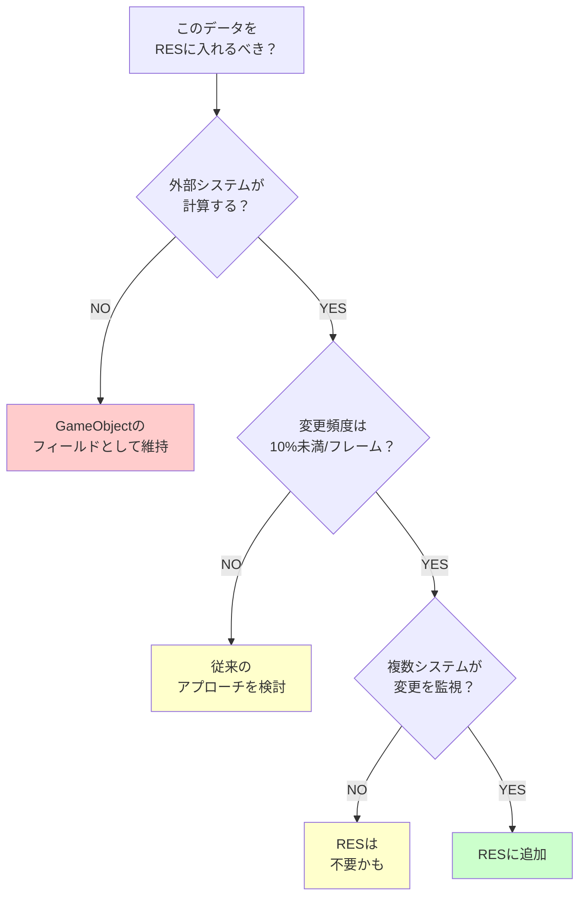

# データガイドライン

---

## 目的

このページでは、ReactiveEntitySetに含めるべきデータとGameObjectに残すべきデータを説明します。これらのガイドラインに従うことで、よりクリーンなアーキテクチャとバグの減少につながります。

---

## 基本ルール

> **GameObjectの外部で計算または管理されるデータのみを含める。**

このルールが、データがRESに属するかMonoBehaviourに属するかを決定します。

---

## データ所有の例

| データ | 計算元 | RESに含める？ | 理由 |
|--------|--------|--------------|------|
| Health | ダメージシステム（外部） | はい | 外部ロジックが変更 |
| MaxHealth | 設定/初期化 | はい | 参照データ |
| SpeedMultiplier | バフシステム（外部） | はい | 外部ロジックが変更 |
| IsStunned | ステータスエフェクトシステム | はい | 外部ロジックが制御 |
| KilledByPlayer | デスシステム | はい | 外部フラグ |
| **Position** | Transform（GameObject） | **いいえ** | GameObjectが所有 |
| **Rotation** | Transform（GameObject） | **いいえ** | GameObjectが所有 |
| **Scale** | Transform（GameObject） | **いいえ** | GameObjectが所有 |

---

## なぜPositionは除外されるか

Positionは重要なエンティティデータのように見えますが、通常はRESに含めるべきではありません。

### 理由

1. **所有権**: GameObjectのTransformコンポーネントがpositionを所有
2. **更新頻度**: Positionは毎フレーム変更されることが多い
3. **二重の真実源**: RESに格納すると同期問題が発生
4. **メリットがない**: Transformは必要な人に既にこのデータを提供

### 例外

**サーバーがpositionを計算する**ネットワークゲームは異なります。

```csharp
// サーバー権威の移動
// サーバーがpositionを計算し、クライアントに送信
// RESが権威的なソースになる

[Serializable]
public struct NetworkEntityState
{
    public Vector3 Position;      // サーバー計算、RESにOK
    public Quaternion Rotation;   // サーバー計算、RESにOK
    public int Health;
}
```

この場合、GameObjectのTransformはRES内の権威的なpositionの**ビュー**です。

---

## 設計チェックリスト

RESにデータを追加する前に、これらの質問をしてください。



### 1. 所有権

**このデータは外部ロジックによって計算されるか？**

- はい → RESを検討
- いいえ（GameObjectが所有） → GameObjectフィールドとして維持

### 2. 変更頻度

**フレームあたりエンティティの10%未満が変更されるか？**

- はい → RESは効率的
- いいえ → 従来のアプローチの方が良いかもしれない

### 3. 観測可能性

**複数のシステムが変更に反応する必要があるか？**

- はい → RESは組み込みイベントを提供
- いいえ → RESは不要かもしれない

### 4. シーン非依存

**このデータはシーンロードをまたいで永続化する必要があるか？**

- はい → RESはこれを自動的に提供
- いいえ → どちらのアプローチでも可

---

## データ/ロジック分離

RESは自然にクリーンなアーキテクチャパターンを強制します。

### パターン

```
State（struct）      : データのみ、メソッドなし
計算ロジック         : 別クラスの純粋関数
RES                  : ストレージと通知
GameObject           : 可視化とリアクション
```

### なぜこれが機能するか

State構造体は公開フィールドを持ちますが、ビジネスロジックはありません。

```csharp
[Serializable]
public struct EnemyState
{
    public int Health;
    public int MaxHealth;
    public bool IsStunned;

    // プロパティはOK
    public float HealthPercent => MaxHealth > 0 ? (float)Health / MaxHealth : 0f;

    // ただし状態を変更するメソッドは不可
    // void TakeDamage(int damage) ← これはダメ
}
```

計算ロジックは別クラスに存在します。

```csharp
public static class DamageCalculator
{
    public static EnemyState ApplyDamage(EnemyState state, int damage, bool isCritical)
    {
        int finalDamage = isCritical ? damage * 2 : damage;
        state.Health = Mathf.Max(0, state.Health - finalDamage);
        return state;
    }
}
```

使用方法でそれらを結びつけます。

```csharp
enemySet.UpdateData(enemyId, state =>
    DamageCalculator.ApplyDamage(state, damage, isCritical));
```

### メリット

| メリット | 説明 |
|----------|------|
| テスト可能性 | 純粋関数はユニットテストが簡単 |
| 再利用性 | 同じロジックがどのエンティティでも動作 |
| 明確さ | 関心事の明確な分離 |
| スレッドセーフティ | 純粋関数は副作用がない |

---

## 他のパラダイムとの対応

このデータ/ロジック分離は、現代のアーキテクチャパターンと一致しています。

| パラダイム | データ | ロジック |
|-----------|--------|---------|
| 関数型 | イミュータブルデータ | 純粋関数 |
| ECS | Component | System |
| Redux | State | Reducer |
| **RES** | **State struct** | **計算クラス** |

これらのパターンに馴染みがあれば、RESアプローチは自然に感じられるでしょう。

---

## 非同期処理の可能性

データ/ロジック分離は将来の非同期処理を可能にします。

- **State（struct）**: コピー可能、スレッド間で渡せる
- **計算ロジック**: 純粋関数、スレッドセーフ
- **RES更新**: メインスレッドでの単一同期ポイント

重い計算はメインスレッド外で実行でき、完了時に結果をRESに適用できます。

---

## よくある間違い

### 間違い1: Transformデータの格納

```csharp
// これは通常やってはいけない
[Serializable]
public struct EntityState
{
    public Vector3 Position;    // Transformが所有
    public Quaternion Rotation; // Transformが所有
    public int Health;
}
```

### 間違い2: state structにロジックを入れる

```csharp
// これはやってはいけない
[Serializable]
public struct EntityState
{
    public int Health;

    public void TakeDamage(int damage)  // ロジックはここに属さない
    {
        Health -= damage;
    }
}
```

### 間違い3: 頻繁に変更されるデータを含める

```csharp
// これが毎フレーム変更される場合は再検討
[Serializable]
public struct EntityState
{
    public float AnimationTime;  // 毎フレーム変更
    public Vector3 Velocity;     // 毎フレーム変更
}
```

---

## まとめ

| ガイドライン | 説明 |
|-------------|------|
| 外部所有権 | 外部システムが計算するデータのみRESに |
| Transformデータなし | Position/RotationはGameObjectに属する（通常） |
| 低変更頻度 | フレームあたりエンティティの10%未満 |
| データ/ロジック分離 | State構造体 + 純粋関数の計算クラス |
| ネットワークの例外 | サーバー権威のデータはpositionを含められる |

---

## 次のステップ

- [集合論の基礎](set-theory) - 数学的基礎とView理論
- [Reactive Entity Setsガイド]({{ '/ja/guides/reactive-entity-sets/' | relative_url }}) - 実装の詳細
