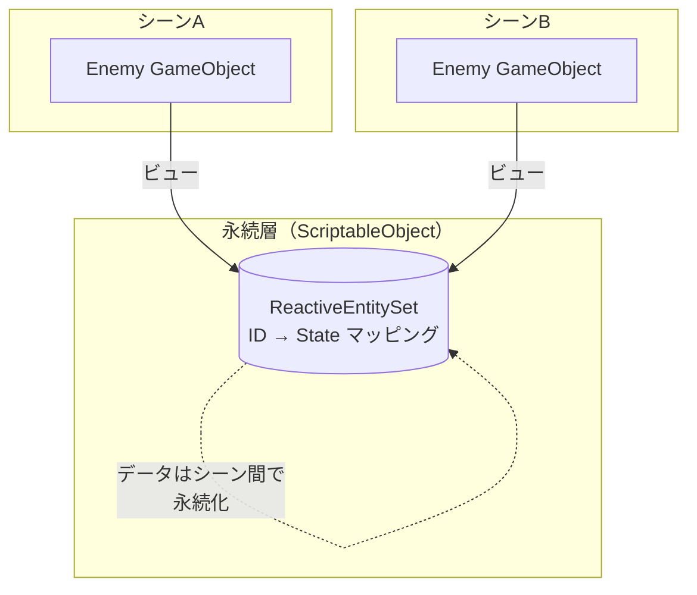

# Entity、Object、View

---

## 目的

このページでは、Reactive Entity Setsの核心的な概念モデルであるEntity、Object、Viewの区別を説明します。このモデルを理解することは、RESを効果的に使用するために不可欠です。

---

## Entity vs Object

RESは、Unityが通常混同する2つの概念を明確に区別します。

| 概念 | 説明 | ライフサイクル |
|------|------|---------------|
| **Entity** | IDと状態を持つ論理的な単位 | RES登録によって定義 |
| **Object** | ランタイム表現（GameObject） | Unityのインスタンス化によって定義 |

### 重要な洞察

エンティティの存在は、ReactiveEntitySetへの登録によって決定され、Unityオブジェクトの存在によっては決定されません。

```
EntityがRESに存在する   → Entityは「生存」
GameObjectがシーンに存在 → Objectは「表示」
```

これらは独立しています。

### 例

**ObjectなしのEntity**

データは永続化されますが、視覚的な表現は存在しません。

- シーンAでEntityを登録
- シーンAがアンロード
- Entityデータはまだアクセス可能
- シーンBで新しいGameObjectを作成して表示可能

**EntityなしのObject**

視覚は存在しますが、セットで追跡されていません。

- GameObjectがシーンに存在
- RESに登録されていない
- RESはそれについて何も知らない

---

## ViewとしてのGameObject

RESは典型的なUnityの所有パターンを反転させます。

### 従来のUnityパターン

```
GameObjectがデータを所有
  └── MonoBehaviourが状態を保持
      └── データはコンポーネントのフィールドに格納
          └── GameObjectが破棄されると失われる
```

### RESパターン

```
ReactiveEntitySetがデータを所有（ScriptableObject）
  └── データはシーンをまたいで永続化
      └── GameObjectはそのデータへの「ビュー」
          └── 状態を失わずに破棄可能
```

### 図解



### 実践的な意味

このパターンはいくつかの強力な機能を可能にします。

**シーン間の永続化**

DontDestroyOnLoadなしでエンティティ状態がシーン遷移を生き残ります。

```csharp
// シーンA: Enemyがダメージを受ける
enemySet.UpdateData(enemyId, s => { s.Health = 50; return s; });

// シーンBがロード
// Enemy状態はまだ50 HP
var state = enemySet.GetData(enemyId);  // Health = 50
```

**ネットワーク同期**

エンティティは視覚的な表現がスポーンする前に存在できます。

```csharp
// サーバーがエンティティデータを送信
// クライアントはまずRESにエンティティを作成
enemySet.Register(networkId, receivedState);

// 後で: 視覚的な表現をスポーン
var enemy = Instantiate(enemyPrefab);
enemy.BindToEntity(networkId);
```

**オブジェクトプーリング**

エンティティのアイデンティティを維持しながらGameObjectを再利用。

```csharp
// プールに返却（エンティティを登録解除）
enemySet.Unregister(entityId);
pool.Return(gameObject);

// プールから取得（新しいエンティティを登録）
var go = pool.Get();
enemySet.Register(newEntityId, initialState);
```

---

## シーン非依存のデータ層

RESデータはScriptableObjectに格納され、プロジェクトアセットです。

| コンポーネント | シーンロード時の動作 |
|---------------|---------------------|
| GameObject | 破棄される（DontDestroyOnLoad以外） |
| MonoBehaviour | GameObjectと共に破棄 |
| **ReactiveEntitySetデータ** | **永続化（ScriptableObjectアセット）** |

### これが重要な場合

**シーン間の状態**

プレイヤーのステータス、インベントリ、ゲーム進行状況など、シーン遷移を生き残る必要があるもの。

**ロード画面**

非同期シーンロード中もデータにアクセス可能。

**グローバルイベント**

どのシーンのシステムもエンティティデータをクエリ可能。

### 重要な注意点

ScriptableObjectデータはプレイセッション中は永続化しますが、以下の場合にリセットされます。

- Play Modeを終了（エディタ内）
- アプリケーションを再起動（ビルド内）

永続的な保存には、PlayerPrefs、JSONファイル、またはデータベースにシリアライズしてください。

---

## ReactiveEntitySetの「Reactive」

「Reactive Entity Set」という名前は、セットだけでなく**エンティティがリアクティブ**であることを強調しています。

```
Reactive Entity Set
    │
    ├── Reactive Entity: 各エンティティがオブザーバーに状態変更を通知
    │   └── OnStateChanged(oldState, newState)
    │
    └── Reactive Set: セットが集約通知を提供
        ├── OnItemAdded(id)
        ├── OnItemRemoved(id)
        └── OnDataChanged(id)
```

各エンティティは独自の`OnStateChanged`イベントを持っています。システムはすべてのセットイベントをフィルタリングする代わりに、特定のエンティティをサブスクライブできます。

---

## まとめ

| 概念 | 重要なポイント |
|------|---------------|
| Entity | 論理的な単位、RESに存在、IDで識別 |
| Object | 視覚的な表現、シーンに存在、作成/破棄可能 |
| View | エンティティデータを表示するGameObject、データを所有しない |
| シーン非依存 | エンティティデータはScriptableObjectに永続化、シーンロードを生き残る |
| Reactive | 個々のエンティティとセットの両方がオブザーバーに変更を通知 |

---

## 次のステップ

- [データガイドライン](data-guidelines) - RESに含めるべきデータを学ぶ
- [集合論の基礎](set-theory) - 数学的基礎を探求する
