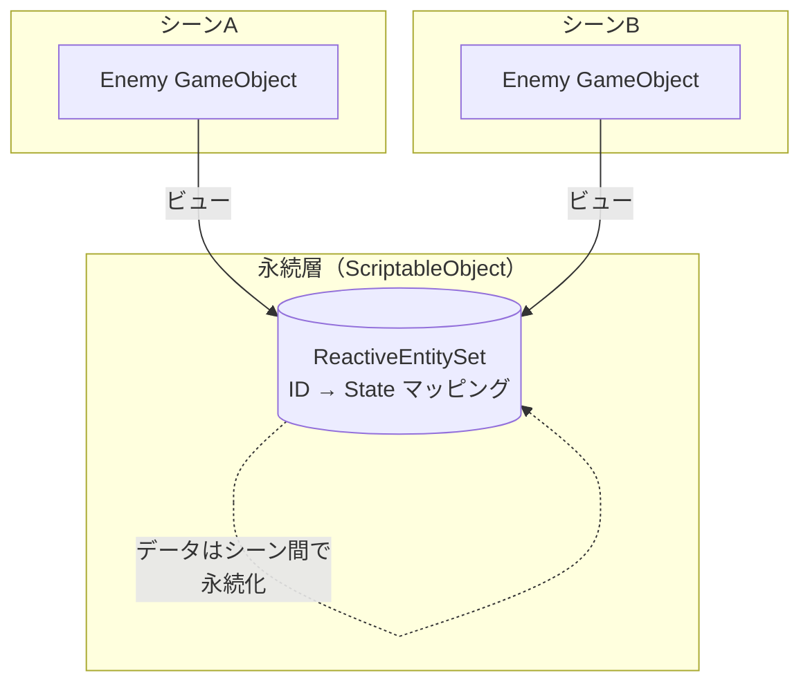

# Entity、Object、View

---

## 目的

Reactive Entity Setsの核心的な概念モデルであるEntity、Object、Viewの区別を説明します。

---

## Entity vs Object

RESでは、Unityが通常混同しがちな2つの概念を明確に分けています。

| 概念 | 説明 | ライフサイクル |
|------|------|---------------|
| **Entity** | IDと状態を持つ論理的な単位 | RES登録によって定義 |
| **Object** | ランタイム表現（GameObject） | Unityのインスタンス化によって定義 |

### 押さえておきたいポイント

エンティティの存在はReactiveEntitySetへの登録によって決まります。Unityオブジェクトの有無では決まりません。

```
EntityがRESに存在する   → Entityは「生存」
GameObjectがシーンに存在 → Objectは「表示」
```

この2つは互いに独立しています。

### 例

**ObjectなしのEntity**

データは永続化されますが、視覚的な表現はありません。

- シーンAでEntityを登録
- シーンAがアンロード
- Entityデータはまだアクセス可能
- シーンBで新しいGameObjectを作成して表示可能

**EntityなしのObject**

見た目は存在しますが、セットでは追跡されていません。

- GameObjectがシーンに存在します
- RESには登録されていません
- RESからは認識できません

---

## ViewとしてのGameObject

RESでは、従来のUnityにおけるデータ所有のパターンを反転させています。

### 従来のUnityパターン

```
GameObjectがデータを所有
  └── MonoBehaviourが状態を保持
      └── データはコンポーネントのフィールドに格納
          └── GameObjectが破棄されると失われる
```

### RESパターン

```
ReactiveEntitySetがデータを所有（ScriptableObject）
  └── データはシーンをまたいで永続化
      └── GameObjectはそのデータへの「ビュー」
          └── 状態を失わずに破棄可能
```

### 図解


```mermaid
flowchart TB
    subgraph Persistent["永続層（ScriptableObject）"]
        RES[("ReactiveEntitySet<br>ID → State マッピング")]
    end

    subgraph SceneA["シーンA"]
        GO1[Enemy GameObject]
        GO1 -->|"ビュー"| RES
    end

    subgraph SceneB["シーンB"]
        GO2[Enemy GameObject]
        GO2 -->|"ビュー"| RES
    end

    RES -.->|"データはシーン間で<br>永続化"| RES
```

### 実践での活用

このパターンによって、いくつかの有用な機能が生まれます。

**シーン間の永続化**

DontDestroyOnLoadを使わなくても、エンティティの状態はシーン遷移をまたいで保持されます。

```csharp
// シーンA: Enemyがダメージを受ける
enemySet.UpdateData(enemyId, s => { s.Health = 50; return s; });

// シーンBがロード
// Enemy状態はまだ50 HP
var state = enemySet.GetData(enemyId);  // Health = 50
```

**ネットワーク同期**

視覚的な表現がスポーンする前でも、エンティティを先に存在させておけます。

```csharp
// サーバーがエンティティデータを送信
// クライアントはまずRESにエンティティを作成
enemySet.Register(networkId, receivedState);

// 後で: 視覚的な表現をスポーン
var enemy = Instantiate(enemyPrefab);
enemy.BindToEntity(networkId);
```

**オブジェクトプーリング**

エンティティのアイデンティティを維持したまま、GameObjectを再利用できます。

```csharp
// プールに返却（エンティティを登録解除）
enemySet.Unregister(entityId);
pool.Return(gameObject);

// プールから取得（新しいエンティティを登録）
var go = pool.Get();
enemySet.Register(newEntityId, initialState);
```

---

## シーン非依存のデータ層

RESのデータはScriptableObjectに格納されており、プロジェクトアセットとして扱われます。

| コンポーネント | シーンロード時の動作 |
|---------------|---------------------|
| GameObject | 破棄される（DontDestroyOnLoad以外） |
| MonoBehaviour | GameObjectと共に破棄 |
| **ReactiveEntitySetデータ** | **永続化（ScriptableObjectアセット）** |

### 活きてくる場面

**シーン間の状態**

プレイヤーのステータス、インベントリ、ゲーム進行状況など、シーン遷移をまたいで保持したいデータに向いています。

**ロード画面**

非同期シーンロード中でもデータにアクセスできます。

**グローバルイベント**

どのシーンのシステムからでもエンティティデータをクエリできます。

### 注意点

ScriptableObjectのデータはプレイセッション中は保持されますが、以下の場合にリセットされます。

- Play Modeを終了（エディタ内）
- アプリケーションを再起動（ビルド内）

永続的に保存したい場合は、PlayerPrefs、JSONファイル、データベースなどへシリアライズしてください。

---

## ReactiveEntitySetの「Reactive」

「Reactive Entity Set」という名前には、セットだけでなくエンティティ自体がリアクティブであるという意味が込められています。

```
Reactive Entity Set
    │
    ├── Reactive Entity: 各エンティティがオブザーバーに状態変更を通知
    │   └── OnStateChanged(oldState, newState)
    │
    └── Reactive Set: セットが集約通知を提供
        ├── OnItemAdded(id)
        ├── OnItemRemoved(id)
        └── OnDataChanged(id)
```

各エンティティは独自の`OnStateChanged`イベントを持っています。セット全体のイベントをフィルタリングしなくても、特定のエンティティだけをサブスクライブできます。

---

## まとめ

| 概念 | 重要なポイント |
|------|---------------|
| Entity | 論理的な単位、RESに存在、IDで識別 |
| Object | 視覚的な表現、シーンに存在、作成/破棄可能 |
| View | エンティティデータを表示するGameObject、データを所有しない |
| シーン非依存 | エンティティデータはScriptableObjectに永続化、シーンロードを生き残る |
| Reactive | 個々のエンティティとセットの両方がオブザーバーに変更を通知 |

---

## 次のステップ

- [データガイドライン](data-guidelines) --- RESに含めるべきデータについて学べます
- [集合論の基礎](set-theory) --- 数学的な基礎を確認できます
