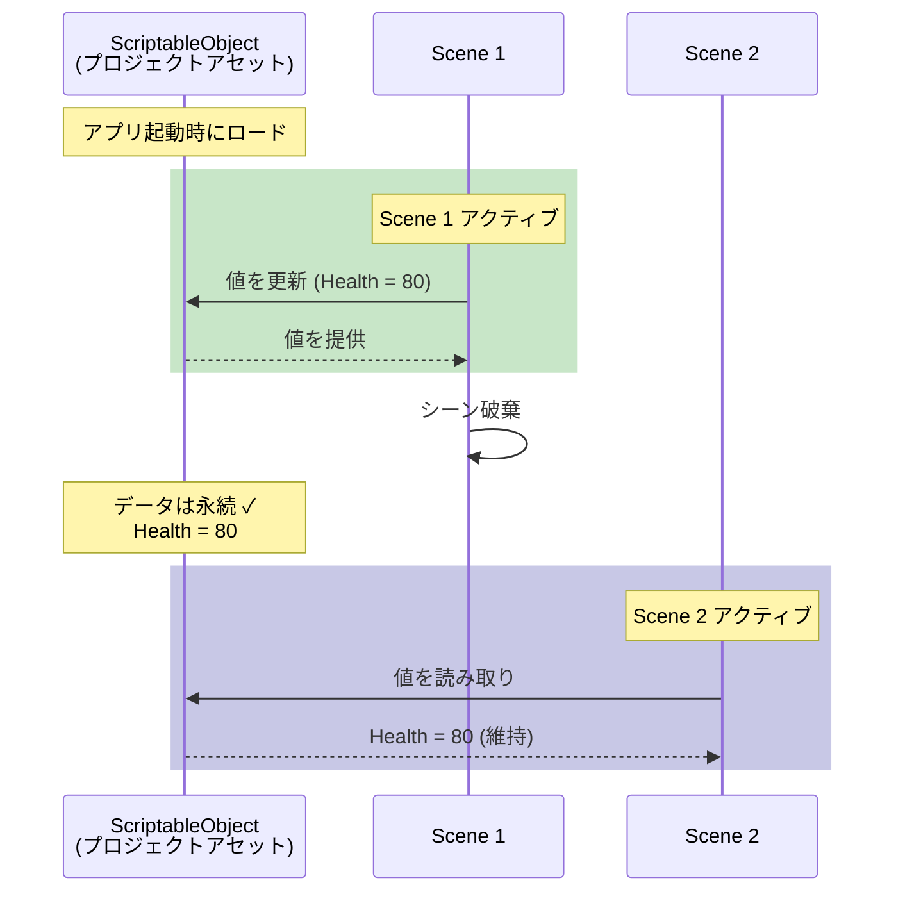
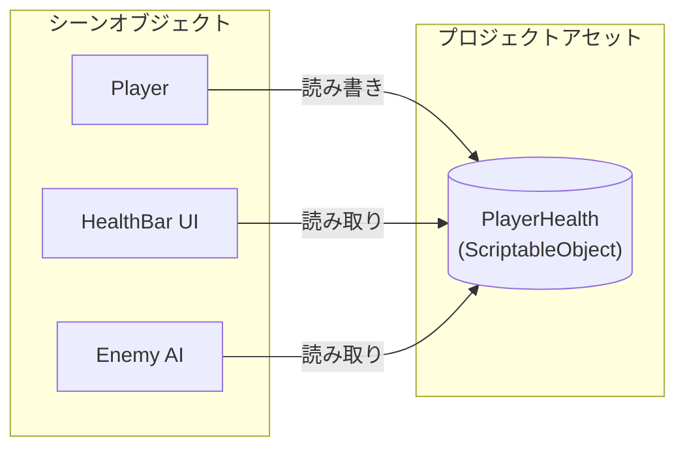

# ScriptableObjectの基礎

---

## 目的

このページでは、UnityにおけるScriptableObjectの基礎概念を説明します。これらの概念を理解することで、Reactive SOがなぜこのように設計されているかがわかります。

---

## ScriptableObjectとは

ScriptableObjectは、プロジェクト内のアセットとして存在するUnityのデータコンテナです。GameObjectにアタッチされるMonoBehaviourとは異なり、ScriptableObjectはシーンから独立して存在します。

```csharp
[CreateAssetMenu(fileName = "PlayerStats", menuName = "Game/Player Stats")]
public class PlayerStats : ScriptableObject
{
    public int maxHealth = 100;
    public float moveSpeed = 5f;
}
```

| 特性 | 説明 |
|------|------|
| **アセットベース** | Projectウィンドウで作成、`.asset`ファイルとして保存 |
| **永続的** | シーンの外に存在し、シーンロードで破棄されない |
| **共有** | 複数のスクリプトが同じアセットを参照可能 |
| **シリアライズ可能** | データがInspectorで保存・表示される |

---

## なぜScriptableObjectを使うのか

### 1. メモリ効率

ScriptableObjectを使用すると、すべての参照が同じインスタンスを指します。MonoBehaviourのデータと比較してみましょう。

```
従来方式: 100体の敵 × 10 KBのデータ = 1 MBのメモリ
ScriptableObject: 100体の敵 × 1つの共有アセット = 10 KBのメモリ
```

### 2. シーン非依存

ScriptableObjectのデータはシーンロードを跨いで永続します。

| コンポーネント | シーンロード時の動作 |
|----------------|----------------------|
| GameObject | 破棄（DontDestroyOnLoad以外） |
| MonoBehaviour | GameObjectと共に破棄 |
| **ScriptableObjectデータ** | **永続** |



### 3. 疎結合アーキテクチャ

システムは直接参照ではなく、ScriptableObjectアセットを通じて通信します。



Playerスクリプトが`PlayerHealth.Value`を変更すると、HealthBar UIとEnemy AIは即座に新しい値を参照できます。互いへの直接参照は不要です。

---

## 原点：Unite Austin 2017

Reactive SOは、Ryan Hippleが**Unite Austin 2017**で発表した講演「**Game Architecture with Scriptable Objects**」に着想を得ています。

### 講演で示された核心原則

| 原則 | 説明 |
|------|------|
| **モジュール性** | システムが互いに直接依存しない |
| **編集容易性** | デザイナーがランタイムで値を調整可能 |
| **デバッグ容易性** | 各部品を独立してテスト可能 |

### 導入されたパターン

この講演では、Reactive SOの基盤となるいくつかのパターンが紹介されました。

- **Variables** - ScriptableObjectアセットとしての共有データ（FloatVariable、IntVariableなど）
- **Events** - GameEventアセットによる疎結合通信
- **Runtime Sets** - シングルトンを使わないオブジェクト追跡

{: .note }
> この講演は、UnityのYouTubeチャンネルで最も視聴されたUniteカンファレンス動画です。

### リソース

- [サンプルプロジェクト（GitHub）](https://github.com/roboryantron/Unite2017)
- [スライド（SlideShare）](https://www.slideshare.net/RyanHipple/game-architecture-with-scriptable-objects)

---

## ScriptableObjectのライフサイクル

### エディタ内

| 操作 | ディスクに保存されるか |
|------|------------------------|
| Inspectorでの変更 | はい（自動） |
| スクリプトでの変更 | いいえ（`EditorUtility.SetDirty()`の呼び出しが必要） |
| Play Mode中の変更 | エディタ再起動まで永続 |

### ビルド内

ScriptableObjectアセットはランタイムでは**読み取り専用**です。ゲームプレイ中の変更はアプリケーション終了時に失われます。

{: .warning }
> 永続的なデータ保存には、PlayerPrefs、JSONファイル、またはデータベースへのシリアライズを使用してください。

---

## Unity公式リソース

### ドキュメント

- [Unityマニュアル：ScriptableObject](https://docs.unity3d.com/6000.2/Documentation/Manual/class-ScriptableObject.html)
- [スクリプトリファレンス：ScriptableObject](https://docs.unity3d.com/6000.2/Documentation/ScriptReference/ScriptableObject.html)

### チュートリアル

- [Unity Learn：Introduction to Scriptable Objects](https://learn.unity.com/tutorial/introduction-to-scriptable-objects)（65分）
- [Three ways to architect your game with ScriptableObjects](https://unity.com/how-to/architect-game-code-scriptable-objects)
- [Separate Game Data and Logic with ScriptableObjects](https://unity.com/how-to/separate-game-data-logic-scriptable-objects)

---

## 関連オープンソースプロジェクト

| プロジェクト | 説明 |
|--------------|------|
| [Unity Atoms](https://github.com/unity-atoms/unity-atoms) | Variables、Eventsなどを含むScriptableObjectアーキテクチャのフル実装 |
| [ScriptableObject-Architecture](https://github.com/DanielEverland/ScriptableObject-Architecture) | Ryan Hippleのパターンに基づく別の実装 |

---

## まとめ

| 概念 | ポイント |
|------|----------|
| ScriptableObject | プロジェクトアセットとして存在するデータコンテナ |
| 共有インスタンス | すべての参照が同じオブジェクトを指す |
| シーン永続性 | データがシーンロードを跨いで残る |
| 疎結合 | システムがアセットを通じて通信、直接参照不要 |

---

## 次のステップ

- [アーキテクチャパターン](architecture-patterns) - 各Reactive SOツールの使い分けを学ぶ
- [Event Channelsガイド]({{ '/ja/guides/event-channels' | relative_url }}) - イベントの使用を開始
- [Variablesガイド]({{ '/ja/guides/variables' | relative_url }}) - システム間で状態を共有
