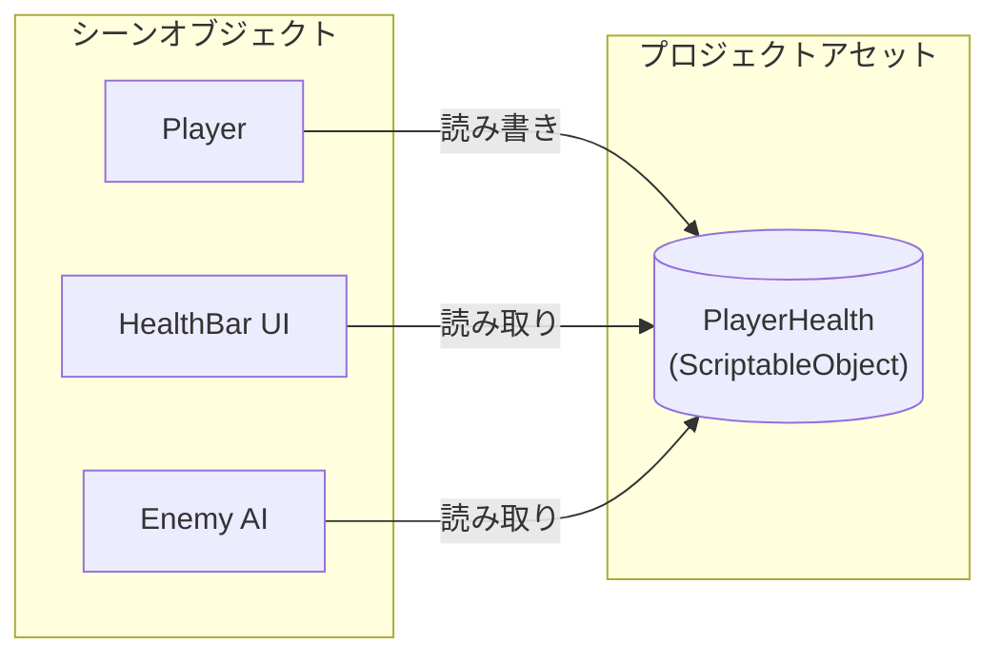
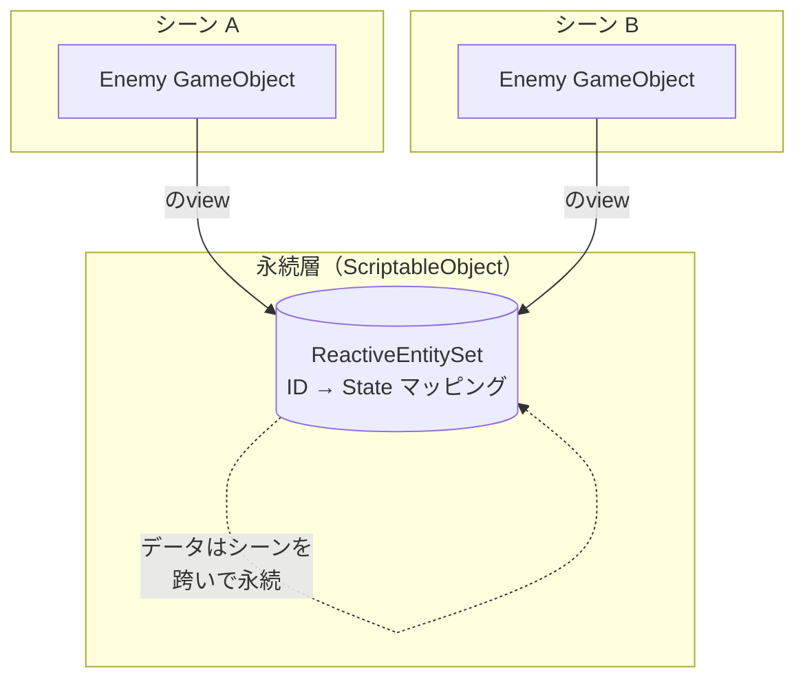

# ScriptableObjectの基礎

---

## 目的

このページでは、Reactive SOを支える基盤となる概念を説明します。これらの概念を理解することで、よくある落とし穴を避け、より良いシステムを設計できるようになります。

---

## ScriptableObjectとは？

ScriptableObjectは、プロジェクト内のアセットとして存在するUnityのデータコンテナです。GameObjectにアタッチされるMonoBehaviourとは異なり、ScriptableObjectはシーンから独立して存在します。

主な特徴：

- **アセットベース**：Projectウィンドウで作成、`.asset`ファイルとして保存
- **永続的**：シーンの外に存在し、シーンロードで破棄されない
- **共有**：複数のスクリプトが同じアセットを参照可能

---

## グローバル共有リソース

これがReactive SOの核心原則です：

> 同じScriptableObjectアセットを参照するすべてのスクリプトは、同じインスタンスを共有する。



Playerスクリプトが`PlayerHealth.Value`を変更すると、HealthBar UIとEnemy AIは即座に新しい値を参照できます。単純な読み取りにはイベントは不要です。

### 意味するもの

| 特性 | メリット |
|------|----------|
| 共有状態 | 複数のシステムが直接参照なしで同じデータにアクセス |
| シーン永続性 | データがシーン遷移を跨いで残る |
| Inspector可視性 | Play Mode中にエディタで現在の値を確認可能 |
| ゼロ結合 | システムがアセットを通じて通信、直接参照不要 |

---

## Entity vs Object

Reactive Entity Setsを使用する際、この区別を理解することが重要です。

### 定義

| 概念 | 説明 | ライフサイクル |
|------|------|----------------|
| **Entity** | IDと状態を持つ論理的な単位 | セットへの登録で定義 |
| **Object** | ランタイム表現（GameObject） | Unityのインスタンス化で定義 |

### 重要な洞察

エンティティの存在はReactiveEntitySet内の存在によって決定され、Unityオブジェクトの存在には**依存しません**。

```
ReactiveEntitySetにエンティティが存在  →  エンティティは「生存」
シーンにGameObjectが存在            →  オブジェクトは「可視」
```

これらは独立できます：

- Objectなしのエンティティ：データは永続、視覚的表現なし
- エンティティなしのObject：視覚は存在するがセットで追跡されない

### メリット

この分離により以下が可能になります：

- **クロスシーン永続性**：エンティティ状態がシーンロードを跨いで残る
- **ネットワーク同期**：視覚がスポーンする前にエンティティが存在
- **プーリング**：エンティティのアイデンティティを維持しながらObjectを再利用

---

## ViewsとしてのGameObjects

Reactive SOは従来のUnityパターンを逆転させます。

### 従来のパターン

```
GameObjectがデータを所有
  └── MonoBehaviourが状態を保持
      └── GameObjectと共に破棄
```

### Reactive SOパターン

```
ScriptableObjectがデータを所有（永続的）
  └── GameObjectがデータを表示（view）
      └── 状態を失わずに破棄可能
```



### 実践例

```csharp
// 従来：GameObjectが破棄されると状態が失われる
public class Enemy : MonoBehaviour
{
    private int health = 100;  // Destroy(gameObject)で消失
}

// Reactive SO：状態はScriptableObjectに永続
public class Enemy : ReactiveEntity<EnemyState>
{
    // 状態はReactiveEntitySetに存在
    // GameObjectは単なる「view」
}
```

---

## シーン非依存データ

ScriptableObjectのデータはシーンロードを跨いで永続します。

| コンポーネント | シーンロード時の動作 |
|----------------|----------------------|
| GameObject | 破棄（DontDestroyOnLoad以外） |
| MonoBehaviour | GameObjectと共に破棄 |
| **ScriptableObjectデータ** | **永続** |

### ユースケース

- **クロスシーン状態**：プレイヤーステータス、インベントリ、進行状況
- **グローバルイベント**：どのシーンにいるシステムにも通知
- **設定**：どこでも適用される設定

### 重要な注意

ScriptableObjectデータはプレイセッション中は永続しますが、Play Modeを終了（エディタ内）またはアプリケーションを再起動するとリセットされます。永続的な保存にはPlayerPrefsやファイルへのシリアライズを使用してください。

---

## リアクティブビュー（将来機能）

{: .note }
> ビューは将来のリリースで予定されています。このセクションでは概念を説明します。

ビューは、エンティティデータが変更されると自動的に更新されるReactiveEntitySetのフィルタリングされたサブセットです。

### 静的ビュー（コンテキスト不要）

エンティティデータのみに基づいてフィルタ：

```csharp
// 体力が30%未満のすべての敵
var lowHealthView = enemies.CreateView(state => state.HealthPercent < 0.3f);
```

特性：

- 作成時に述語が固定
- エンティティ状態が変更されるとビューのメンバーシップが自動更新
- 外部コンテキスト不要

### 動的ビュー（コンテキスト依存）

エンティティデータと外部コンテキストに基づいてフィルタ：

```csharp
// 位置から一定範囲内のすべての敵
var nearbyView = enemies.CreateView<Vector3>(
    (state, position) => Vector3.Distance(state.Position, position) < 10f
);

// 特定のコンテキストで評価
var nearbyEnemies = nearbyView.Evaluate(playerPosition);
```

特性：

- 述語の評価にコンテキストが必要
- エンティティデータが変更されるとメンバーシップが更新
- コンテキスト変更時は再評価が必要

### パフォーマンスの考慮

ビューは毎フレームのイテレーションを回避します：

| アプローチ | コスト |
|------------|--------|
| 毎フレーム `FindObjectsOfType` + フィルタ | O(n) / フレーム |
| リアクティブビュー | O(v) / 状態変更 |

ビューがより効率的なのは：

```
変更頻度 × ビュー数 < エンティティ数 × クエリ頻度
```

---

## まとめ

| 概念 | ポイント |
|------|----------|
| グローバル共有リソース | すべての参照が同じインスタンスを共有 |
| Entity vs Object | Entity = データID、Object = 視覚的表現 |
| ViewsとしてのGameObjects | データが状態を所有、GameObjectsが表示 |
| シーン非依存 | ScriptableObjectデータはシーンを跨いで永続 |
| リアクティブビュー | 自動更新されるフィルタサブセット（将来機能） |

---

## 次のステップ

- [アーキテクチャパターン](architecture-patterns) - 各ツールの使い分けを学ぶ
- [Event Channelsガイド]({{ '/ja/guides/event-channels' | relative_url }}) - イベントの使用を開始
- [Reactive Entity Setsガイド]({{ '/ja/guides/reactive-entity-sets' | relative_url }}) - Entity vs Objectの概念を適用
