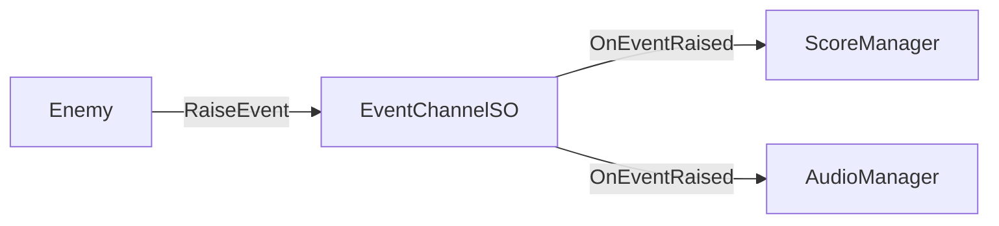

# テスト容易性

---

## 目的

このページでは、Reactive SOアーキテクチャがなぜ自然にテストしやすいかを説明します。最小限のセットアップでユニットテストが可能な設計について学びます。

---

## テスト容易性の優位点

従来のUnityコードは密結合になりがちで、テストが困難です。

```csharp
// テスト困難：シングルトンへの直接依存
public class Enemy : MonoBehaviour
{
    void Die()
    {
        GameManager.Instance.AddScore(100);  // モック不可
        AudioManager.Instance.PlaySound("death");  // 分離不可
    }
}
```

Reactive SOでは、依存関係がInspector経由で注入可能です。

```csharp
// テスト容易：注入可能な依存関係
public class Enemy : MonoBehaviour
{
    [SerializeField] private IntEventChannelSO onScoreAdded;
    [SerializeField] private StringEventChannelSO onAudioRequest;

    void Die()
    {
        onScoreAdded?.RaiseEvent(100);  // テスト用SOを注入可能
        onAudioRequest?.RaiseEvent("death");  // 完全に分離
    }
}
```

---

## テスト可能なコードの3つの柱

Reactive SOはRyan Hippleの[Unite 2017](https://www.youtube.com/watch?v=raQ3iHhE_Kk)の原則に従っています。

### Modular（モジュラー）

システムが互いに直接依存しません。ScriptableObjectが仲介者として機能します。



テスト用のEventChannelを作成することで、各システムを分離してテストできます。

### Editable（編集可能）

データはスクリプトにハードコードされず、ScriptableObjectアセットに存在します。

- デザイナーがコード変更なしで値を調整可能
- テスト用の設定を別のアセットとして作成可能
- ランタイムの値がInspectorで確認可能

### Debuggable（デバッグ可能）

組み込みのモニタリングツール（[Event Monitor]({{ '/ja/debugging/monitor' | relative_url }})、[Variable Monitor]({{ '/ja/debugging/monitor' | relative_url }})）により、システムの動作をリアルタイムで観察できます。

---

## Reactive SOによるテストの実現

### 「ノンコーディングDIコンテナ」としてのInspector

Reactive SOの最も強力な機能の一つは、**UnityのInspector自体が依存性注入（DI）コンテナになる**ことです。疎結合を実現するためにVContainerやZenjectのようなサードパーティのフレームワークを導入する必要はありません。

- **セットアップ不要** - Inspectorでアセットをドラッグ＆ドロップするだけで依存関係を割り当てられます。
- **視覚的なモッキング** - コードを1行も書き換えることなく、本番用データセットを「テスト用データセット」アセットに差し替えられます。
- **デザイナーフレンドリー** - デザイナーはカスタム値を持つ新しいScriptableObjectアセットを作成するだけで、特定のテストシナリオを作成できます。

### ステート・インジェクション（状態の直接注入）

「残りHP10%で怒り状態のボス」のような複雑なゲーム状態をテストするには、通常、そこまでプレイするかデバッグコマンドを使用する必要があります。Reactive Entity Sets（RES）では、**ステート・インジェクション**が可能です。

```csharp
[Test]
public void BossBattle_Enraged_Test()
{
    // 1. 新しいセットインスタンスを作成
    var set = ScriptableObject.CreateInstance<EnemyEntitySetSO>();
    
    // 2. 複雑な状態を瞬時に注入
    set.Register(bossId, new EnemyState { Health = 10, IsEnraged = true });
    
    // 3. ロジックを実行して結果を検証
    damageSystem.ApplyDamage(bossId, 15);
    Assert.IsTrue(set[bossId].IsDead);
}
```

この「ステート・インジェクション」は、数時間のデバッグ作業を数ミリ秒の自動テストに変換します。

### テストケースとしてのスナップショット

[Snapshot API]({{ '/ja/advanced/reactive-entity-sets' | relative_url }})は、テスト容易性を究極のレベルに引き上げます。RESのデータはロジックから厳密に分離されているため、以下のことが可能です。

1.  本番環境でバグが発生した際にスナップショットを**キャプチャ**する。
2.  そのスナップショットをアセットまたはバイナリファイルとして**保存**する。
3.  ユニットテストでそのスナップショットを**ロード**し、正確な状態を再現する。
4.  ロードされたスナップショットに対してロジックを実行し、修正を**検証**する。

これにより、失敗したゲーム状態を永続的な回帰テスト（リグレッションテスト）に変換できます。

### 可観測性（Observability）による検証

従来のユニットテストは、しばしば「副作用」の確認（例：プライベート変数が書き換わったか？）に依存しがちです。Reactive SOでは、**可観測性**を優先します。

テストは、UIや他のシステムが使用するのと同じ**Event Channel**や**Variable**を購読することでロジックを検証します。これは、テストがユーザーやデバッガーと同じようにシステムを「観察」していることを意味し、より堅牢で意味のあるアサーション（検証）につながります。

---

## モックライブラリなしでのテスト

Moq、NSubstitute、その他のモッキングフレームワークは不要です。

### 手動モックで十分な理由

1. **ScriptableObjectはシンプルなデータコンテナ** - モックすべき複雑な動作がない
2. **イベントは検証が容易** - サブスクライブして呼び出されたか確認するだけ
3. **状態に直接アクセス可能** - モックのセットアップ不要

### インターフェースベースのモッキング（必要な場合）

外部依存（ファイルI/O、ダイアログ）には、シンプルなインターフェースを使用します。

```csharp
// インターフェース
public interface IFileService
{
    void WriteAllText(string path, string content);
}

// 本番実装
public class FileService : IFileService
{
    public void WriteAllText(string path, string content)
        => File.WriteAllText(path, content);
}

// テスト用モック
public class MockFileService : IFileService
{
    public string LastWrittenPath { get; private set; }
    public string LastWrittenContent { get; private set; }

    public void WriteAllText(string path, string content)
    {
        LastWrittenPath = path;
        LastWrittenContent = content;
    }
}
```

このパターンはReactive SO自体のテスト（`EventMonitorExporterRefactoredTests`参照）で使用されています。

---

## テストを容易にする機能

| 機能 | テストへのメリット |
|------|-------------------|
| **ScriptableObject.CreateInstance** | アセットなしでテストインスタンスを作成 |
| **イベントサブスクリプション** | 正しい値でイベントが発火したか検証 |
| **値プロパティ** | 状態を直接アサート |
| **シーン不要** | Edit Modeテストで高速実行 |
| **Inspector注入** | シリアライゼーション経由で依存関係を差し替え |

---

## まとめ

Reactive SOは以下によりテスト可能なアーキテクチャを実現します。

1. **疎結合システム** - ScriptableObjectが仲介者として機能
2. **Inspector注入** - Unityのシリアライゼーション経由で依存関係を割り当て
3. **シンプルなモッキング** - SOはCreateInstance、外部はインターフェース
4. **組み込みの可観測性** - デバッグ用モニターツール

---

## 参照

- [テストガイド]({{ '/ja/guides/testing' | relative_url }}) - 実践的なテストパターンとコード例
- [Ryan Hipple's Unite 2017 Talk](https://www.youtube.com/watch?v=raQ3iHhE_Kk) - ScriptableObjectアーキテクチャのオリジナル講演
- [Unity: Architect with ScriptableObjects](https://unity.com/how-to/architect-game-code-scriptable-objects) - 公式Unityガイド
