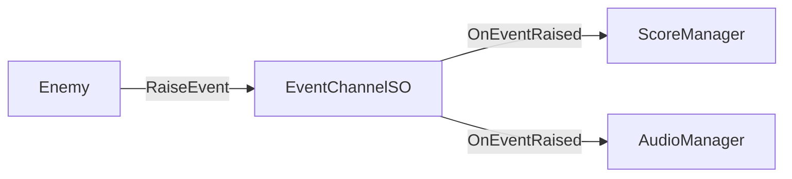

# テスト容易性

---

## 目的

このページでは、Reactive SOアーキテクチャがなぜ自然にテストしやすいかを説明します。最小限のセットアップでユニットテストが可能な設計について学びます。

---

## テスト容易性の優位点

従来のUnityコードは密結合になりがちで、テストが困難です：

```csharp
// テスト困難：シングルトンへの直接依存
public class Enemy : MonoBehaviour
{
    void Die()
    {
        GameManager.Instance.AddScore(100);  // モック不可
        AudioManager.Instance.PlaySound("death");  // 分離不可
    }
}
```

Reactive SOでは、依存関係がInspector経由で注入可能です：

```csharp
// テスト容易：注入可能な依存関係
public class Enemy : MonoBehaviour
{
    [SerializeField] private IntEventChannelSO onScoreAdded;
    [SerializeField] private StringEventChannelSO onAudioRequest;

    void Die()
    {
        onScoreAdded?.RaiseEvent(100);  // テスト用SOを注入可能
        onAudioRequest?.RaiseEvent("death");  // 完全に分離
    }
}
```

---

## テスト可能なコードの3つの柱

Reactive SOはRyan Hippleの[Unite 2017](https://www.youtube.com/watch?v=raQ3iHhE_Kk)の原則に従っています：

### Modular（モジュラー）

システムが互いに直接依存しません。ScriptableObjectが仲介者として機能します：



テスト用のEventChannelを作成することで、各システムを分離してテストできます。

### Editable（編集可能）

データはスクリプトにハードコードされず、ScriptableObjectアセットに存在します：

- デザイナーがコード変更なしで値を調整可能
- テスト用の設定を別のアセットとして作成可能
- ランタイムの値がInspectorで確認可能

### Debuggable（デバッグ可能）

組み込みのモニタリングツール（[Event Monitor]({{ '/ja/debugging/event-monitor' | relative_url }})、[Variable Monitor]({{ '/ja/debugging/variable-monitor' | relative_url }})）により、システムの動作をリアルタイムで観察できます。

---

## Reactive SOによるテストの実現

依存関係はUnityのシリアライゼーションシステム経由で注入されます：

```csharp
public class Enemy : MonoBehaviour
{
    [SerializeField] private IntEventChannelSO onScoreAdded;
    // Inspectorで割り当て
}
```

テストでは、アセットファイルなしでScriptableObjectを直接作成できます：

```csharp
[SetUp]
public void Setup()
{
    channel = ScriptableObject.CreateInstance<IntEventChannelSO>();
}
```

このアプローチの特徴：

- **追加セットアップ不要** - Unityの組み込みシリアライゼーションを使用
- **Inspectorベースの設定** - デザイナーフレンドリーな依存関係の割り当て
- **シンプルなテストインスタンス** - CreateInstanceがEdit Modeで動作

---

## モックライブラリなしでのテスト

Moq、NSubstitute、その他のモッキングフレームワークは不要です。

### 手動モックで十分な理由

1. **ScriptableObjectはシンプルなデータコンテナ** - モックすべき複雑な動作がない
2. **イベントは検証が容易** - サブスクライブして呼び出されたか確認するだけ
3. **状態に直接アクセス可能** - モックのセットアップ不要

### インターフェースベースのモッキング（必要な場合）

外部依存（ファイルI/O、ダイアログ）には、シンプルなインターフェースを使用します：

```csharp
// インターフェース
public interface IFileService
{
    void WriteAllText(string path, string content);
}

// 本番実装
public class FileService : IFileService
{
    public void WriteAllText(string path, string content)
        => File.WriteAllText(path, content);
}

// テスト用モック
public class MockFileService : IFileService
{
    public string LastWrittenPath { get; private set; }
    public string LastWrittenContent { get; private set; }

    public void WriteAllText(string path, string content)
    {
        LastWrittenPath = path;
        LastWrittenContent = content;
    }
}
```

このパターンはReactive SO自体のテスト（`EventMonitorExporterRefactoredTests`参照）で使用されています。

---

## テストを容易にする機能

| 機能 | テストへのメリット |
|------|-------------------|
| **ScriptableObject.CreateInstance** | アセットなしでテストインスタンスを作成 |
| **イベントサブスクリプション** | 正しい値でイベントが発火したか検証 |
| **値プロパティ** | 状態を直接アサート |
| **シーン不要** | Edit Modeテストで高速実行 |
| **Inspector注入** | シリアライゼーション経由で依存関係を差し替え |

---

## まとめ

Reactive SOは以下によりテスト可能なアーキテクチャを実現します：

1. **疎結合システム** - ScriptableObjectが仲介者として機能
2. **Inspector注入** - Unityのシリアライゼーション経由で依存関係を割り当て
3. **シンプルなモッキング** - SOはCreateInstance、外部はインターフェース
4. **組み込みの可観測性** - デバッグ用モニターツール

---

## 参照

- [テストガイド]({{ '/ja/guides/testing' | relative_url }}) - 実践的なテストパターンとコード例
- [Ryan Hipple's Unite 2017 Talk](https://www.youtube.com/watch?v=raQ3iHhE_Kk) - ScriptableObjectアーキテクチャのオリジナル講演
- [Unity: Architect with ScriptableObjects](https://unity.com/how-to/architect-game-code-scriptable-objects) - 公式Unityガイド
