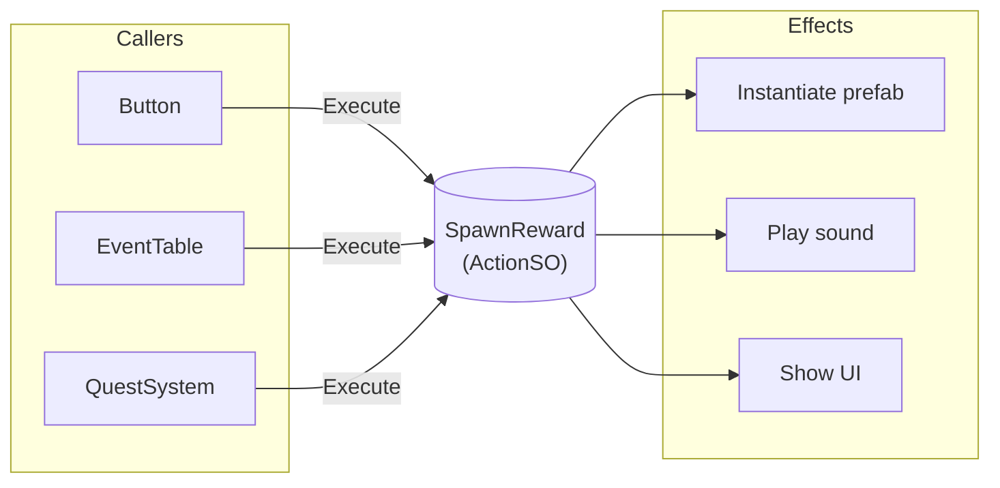

# Actions

{: .note }
> Actionsはv2.1.0から利用可能です。この機能はScriptableObjectを使用したCommandパターンを実装しています。

---

## 目的

このガイドでは、Actions（ActionSO）を使用して再利用可能なデータ駆動コマンドを定義する方法を説明します。使用すべきタイミング、セットアップ方法、一般的なシナリオでのベストプラクティスを学びます。

---

## Actionsとは？

ActionsはScriptableObjectアセットとして実行可能なコマンドをカプセル化します。Commandパターンを実装しており、Inspectorで設定可能なアセットとして再利用可能な動作を定義し、コードからトリガーできます。



このパターンには複数のメリットがあります。

- コード変更なしでInspectorでアクションを設定可能
- 同じアクションを複数のシステムで再利用可能
- デバッグ用に呼び出し元情報を自動追跡
- リアルタイム可視化のためにMonitor Windowと統合

---

## Actionsを使うタイミング

Actionsは以下のような場合に使用します。

- **データ駆動システム** - クエスト報酬、イベントテーブル、ダイアログ応答
- **設定可能な動作** - エフェクト生成、サウンド再生、UI表示
- **再利用可能なコマンド** - 複数の場所からトリガーする必要があるアクション
- **Inspector設定可能なロジック** - デザイナーがコードなしで動作を調整する必要がある場合

以下の場合にはActionsは適していません。

- **単純なメソッド呼び出し** - 1箇所からのみ呼び出す場合
- **状態クエリ** - Actionsは実行用であり、値を返すためのものではない
- **高頻度の操作** - Actionsには追跡のためのわずかなオーバーヘッドがある

単純な通知には、代わりに[Event Channels](event-channels)を検討してください。

---

## 基本的な使い方

### ステップ1: アクションクラスを作成

`ActionSO`を継承した新しいクラスを作成します。

```csharp
using Tang3cko.ReactiveSO;
using UnityEngine;

[CreateAssetMenu(
    fileName = "SpawnEffect",
    menuName = "Game/Actions/Spawn Effect"
)]
public class SpawnEffectAction : ActionSO
{
    [Header("Settings")]
    [SerializeField] private GameObject effectPrefab;
    [SerializeField] private Vector3 offset;
    [SerializeField] private float duration = 2f;

    public override void Execute(
        string callerMember = "",
        string callerFile = "",
        int callerLine = 0)
    {
        var instance = Object.Instantiate(effectPrefab);
        instance.transform.position += offset;
        Object.Destroy(instance, duration);

#if UNITY_EDITOR
        var callerInfo = new CallerInfo(callerMember, callerFile, callerLine);
        NotifyActionExecuted(callerInfo);
        LogAction($"Spawned {effectPrefab.name}");
#endif
    }
}
```

### ステップ2: アクションアセットを作成

Projectウィンドウで右クリックし、定義したメニューパスを選択します。

```text
Create > Game > Actions > Spawn Effect
```

Inspectorでアクションのパラメータを設定します。

### ステップ3: アクションを実行

アクションアセットを参照し、`Execute()`を呼び出します。

```csharp
using Tang3cko.ReactiveSO;
using UnityEngine;

public class RewardSystem : MonoBehaviour
{
    [SerializeField] private ActionSO rewardAction;

    public void GiveReward()
    {
        // NullReferenceExceptionを避けるため常にnull条件演算子を使用
        rewardAction?.Execute();
    }
}
```

---

## ジェネリックアクション

実行時にパラメータを受け取る必要がある場合は`ActionSO<T>`を使用します。

```csharp
using Tang3cko.ReactiveSO;
using UnityEngine;

[CreateAssetMenu(
    fileName = "DamageAction",
    menuName = "Game/Actions/Damage"
)]
public class DamageAction : ActionSO<int>
{
    [Header("Settings")]
    [SerializeField] private GameObject damageVFX;
    [SerializeField] private AudioClip damageSound;

    public override void Execute(int damage,
        string callerMember = "",
        string callerFile = "",
        int callerLine = 0)
    {
        Debug.Log($"Dealing {damage} damage");
        // ダメージロジックをここに実装

#if UNITY_EDITOR
        var callerInfo = new CallerInfo(callerMember, callerFile, callerLine);
        NotifyActionExecuted(callerInfo);
        LogAction($"Damage: {damage}");
#endif
    }
}
```

パラメータ付きで実行します。

```csharp
[SerializeField] private ActionSO<int> damageAction;

public void Attack()
{
    int damage = CalculateDamage();
    damageAction?.Execute(damage);
}
```

---

## ユースケース

### クエスト報酬システム

```csharp
[CreateAssetMenu(menuName = "Game/Actions/Give Item")]
public class GiveItemAction : ActionSO
{
    [SerializeField] private ItemData item;
    [SerializeField] private int quantity = 1;

    public override void Execute(
        string callerMember = "",
        string callerFile = "",
        int callerLine = 0)
    {
        InventoryManager.Instance.AddItem(item, quantity);

#if UNITY_EDITOR
        NotifyActionExecuted(new CallerInfo(callerMember, callerFile, callerLine));
#endif
    }
}
```

```csharp
// 設定可能な報酬付きクエスト定義
public class Quest : ScriptableObject
{
    public string questName;
    public ActionSO[] rewardActions;

    public void Complete()
    {
        foreach (var action in rewardActions)
        {
            action?.Execute();
        }
    }
}
```

### イベントテーブル

```csharp
[CreateAssetMenu(menuName = "Game/Event Table")]
public class EventTableSO : ScriptableObject
{
    [System.Serializable]
    public class EventEntry
    {
        public string eventId;
        public ActionSO[] actions;
    }

    [SerializeField] private EventEntry[] entries;

    public void TriggerEvent(string eventId)
    {
        var entry = System.Array.Find(entries, e => e.eventId == eventId);
        if (entry != null)
        {
            foreach (var action in entry.actions)
            {
                action?.Execute();
            }
        }
    }
}
```

### ダイアログ応答

```csharp
[System.Serializable]
public class DialogueChoice
{
    public string text;
    public ActionSO[] onChosenActions;
}

public class DialogueUI : MonoBehaviour
{
    public void OnChoiceSelected(DialogueChoice choice)
    {
        foreach (var action in choice.onChosenActions)
        {
            action?.Execute();
        }
    }
}
```

---

## ベストプラクティス

### null条件演算子を使用

アクションが割り当てられていない場合のエラーを防止しましょう。

```csharp
// 良い例：未割り当てでも安全
rewardAction?.Execute();

// 悪い例：未割り当て時にNullReferenceException
rewardAction.Execute();
```

### アクションを単一責任に保つ

各アクションは1つのことをうまく行うべきです。

```csharp
// 良い例：単一責任
[CreateAssetMenu(menuName = "Game/Actions/Play Sound")]
public class PlaySoundAction : ActionSO { ... }

[CreateAssetMenu(menuName = "Game/Actions/Spawn VFX")]
public class SpawnVFXAction : ActionSO { ... }

// 悪い例：多くのことをしすぎ
[CreateAssetMenu(menuName = "Game/Actions/Play Sound And Spawn VFX And Update Score")]
public class DoEverythingAction : ActionSO { ... }
```

### descriptionフィールドを使用

Inspectorでアクションの動作を文書化しましょう。

```csharp
public class MyAction : ActionSO
{
    // 基底クラスはdescriptionフィールドを提供
    // Inspectorで設定してアクションを文書化
}
```

### アクションアセットを整理

アクションアセット用のフォルダ構造を作成しましょう。

```text
Assets/
└── ScriptableObjects/
    └── Actions/
        ├── Rewards/
        │   ├── GiveGold.asset
        │   └── GiveItem.asset
        ├── Effects/
        │   ├── SpawnExplosion.asset
        │   └── PlayFanfare.asset
        └── UI/
            └── ShowNotification.asset
```

---

## デバッグ

Reactive SOにはアクション実行を追跡するためのデバッグツールが含まれています。

- **Monitor Window** - Play Mode中にリアルタイムでアクション実行を確認
- **Console Logging** - Inspectorで`showInConsole`を有効にして実行をログ
- **Caller Information** - どのコードがアクションをトリガーしたかを自動追跡

詳細なデバッグ手順は[デバッグ概要]({{ '/ja/debugging/' | relative_url }})を参照してください。

---

## よくある問題

### アクションが実行されない

1. Inspectorでアクションアセットが割り当てられているか確認
2. アクションの`Execute`メソッドにロジックが含まれているか確認
3. アクションを参照するだけでなく`Execute()`を呼び出しているか確認
4. Monitor Windowで実行ログを確認

### 実行時のNullReferenceException

1. null条件演算子を使用（`?.Execute()`）
2. Inspectorでアクションアセットが割り当てられているか確認

### 呼び出し元情報が表示されない

1. callerパラメータに明示的な値を渡さない
2. `Execute`メソッドで`NotifyActionExecuted`を呼び出しているか確認
3. アクションのInspectorで`showInMonitor`が有効になっているか確認

---

## 参照

- [Action Typesリファレンス]({{ '/ja/reference/action-types' | relative_url }})
- [Event Channelsガイド](event-channels) - 通知スタイルの通信用
- [デバッグ概要]({{ '/ja/debugging/' | relative_url }})
