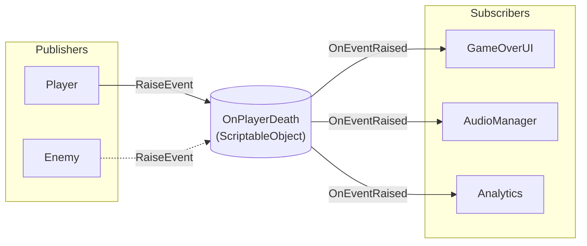

# Event Channels

{: .note }
> Event Channelsはv1.0.0（安定版リリース）から利用可能です。Long、Double、Quaternion、Colorイベントタイプはv1.1.0で追加されました。

---

## 目的

このガイドでは、Event Channelsを使用してゲームシステム間の通信を疎結合化する方法を説明します。使用すべきタイミング、セットアップ方法、一般的なシナリオでのベストプラクティスを学びます。

---

## Event Channelsとは？

Event Channelsはパブリッシャーとサブスクライバーのメッセージブローカーとして機能するScriptableObjectアセットです。パブリッシャーは誰がリッスンしているかを知らずにイベントを発火します。サブスクライバーは誰がイベントを発火したかを知らずに応答します。



この疎結合には複数のメリットがあります。

- システムを独立して開発・テスト可能
- イベントフローがUnity Inspectorで可視化
- コンポーネント間の直接参照が不要
- パブリッシャーを変更せずにサブスクライバーの追加・削除が容易

---

## Event Channelsを使うタイミング

Event Channelsは以下のような場合に使用します。

- **ゲーム全体の通知** - プレイヤー死亡、レベル完了、ゲーム一時停止
- **システム間通信** - ゲームプレイイベントに応答するUI
- **ファイア・アンド・フォーゲットメッセージ** - 戻り値が不要なイベント

以下の場合にはEvent Channelsは適していません。

- **インスタンス単位の状態** - 個々の敵の体力、特定オブジェクトのプロパティ
- **リクエスト-レスポンスパターン** - 即座に戻り値が必要な場合
- **高頻度の更新** - 毎フレーム発火するイベント

インスタンス単位の状態には、代わりに[Reactive Entity Sets](reactive-entity-sets)を検討してください。

---

## 基本的な使い方

### ステップ1：Event Channelアセットを作成

Projectウィンドウで右クリックし、以下のメニューパスを選択します。

```text
Create > Reactive SO > Channels > Void Event
```

`OnPlayerDeath`や`OnLevelCompleted`のような説明的な名前を付けます。

### ステップ2：パブリッシャーを作成

パブリッシャーは何かが起きたときにイベントを発火します。

```csharp
using Tang3cko.ReactiveSO;
using UnityEngine;

public class Player : MonoBehaviour
{
    [SerializeField] private VoidEventChannelSO onPlayerDeath;

    public void Die()
    {
        // NullReferenceExceptionを避けるため常にnull条件演算子を使用
        onPlayerDeath?.RaiseEvent();
    }
}
```

### ステップ3：サブスクライバーを作成

サブスクライバーはイベントをリッスンして応答します。

```csharp
using Tang3cko.ReactiveSO;
using UnityEngine;

public class GameOverUI : MonoBehaviour
{
    [SerializeField] private VoidEventChannelSO onPlayerDeath;
    [SerializeField] private GameObject gameOverPanel;

    private void OnEnable()
    {
        onPlayerDeath.OnEventRaised += ShowGameOver;
    }

    private void OnDisable()
    {
        onPlayerDeath.OnEventRaised -= ShowGameOver;
    }

    private void ShowGameOver()
    {
        gameOverPanel.SetActive(true);
    }
}
```

### ステップ4：Inspectorで接続

1. Player GameObjectを選択
2. `OnPlayerDeath`アセットをシリアライズフィールドにドラッグ
3. GameOverUIにも同様に設定

両コンポーネントは互いを参照せずにアセットを通じて通信します。

---

## イベントタイプ

Reactive SOは12種類の組み込みイベントタイプを提供しています。

| タイプ | パラメータ | 使用例 |
|--------|-----------|--------|
| Void | なし | OnGameStart, OnPlayerDeath |
| Int | `int` | OnScoreChanged, OnLevelUp |
| Long | `long` | OnTimestamp |
| Float | `float` | OnHealthChanged, OnProgress |
| Double | `double` | OnPreciseValue |
| Bool | `bool` | OnPaused, OnMuted |
| String | `string` | OnDialogue, OnNotification |
| Vector2 | `Vector2` | OnInputAxis, OnTouchPosition |
| Vector3 | `Vector3` | OnSpawnPosition, OnTargetPosition |
| Quaternion | `Quaternion` | OnCameraRotation |
| Color | `Color` | OnThemeChanged |
| GameObject | `GameObject` | OnEnemySpawned, OnTargetChanged |

各タイプの詳細は[Event Typesリファレンス]({{ '/ja/reference/event-types' | relative_url }})を参照してください。

---

## イベントでデータを渡す

パラメータ付きイベントでは、発火時にデータを渡します。

```csharp
// Publisher
[SerializeField] private IntEventChannelSO onScoreChanged;

public void AddScore(int points)
{
    currentScore += points;
    onScoreChanged?.RaiseEvent(currentScore);
}
```

```csharp
// Subscriber
[SerializeField] private IntEventChannelSO onScoreChanged;

private void OnEnable()
{
    onScoreChanged.OnEventRaised += UpdateScoreUI;
}

private void OnDisable()
{
    onScoreChanged.OnEventRaised -= UpdateScoreUI;
}

private void UpdateScoreUI(int newScore)
{
    scoreText.text = $"Score: {newScore}";
}
```

---

## 複数のサブスクライバー

1つのEvent Channelに複数のサブスクライバーを持たせることができます。全サブスクライバーがイベントを受信します。

```csharp
// これらすべてが同じOnPlayerDeathイベントに応答
// - GameOverUI：ゲームオーバー画面を表示
// - AudioManager：死亡サウンドを再生
// - AnalyticsManager：死亡をログ
// - AchievementManager：死亡関連の実績をチェック
```

サブスクライバーは購読順に実行されます。ゲームロジックで実行順序に依存しないでください。

---

## ベストプラクティス

### 必ず購読解除する

購読解除を忘れるとメモリリークとエラーの原因になります。

```csharp
// ✅ 良い例：購読と解除のバランス
private void OnEnable()
{
    eventChannel.OnEventRaised += HandleEvent;
}

private void OnDisable()
{
    eventChannel.OnEventRaised -= HandleEvent;
}
```

```csharp
// ❌ 悪い例：購読解除なし
private void Start()
{
    eventChannel.OnEventRaised += HandleEvent;
}
// オブジェクトは破棄されてもコールバックは登録されたまま
```

### null条件演算子を使用

Event Channelが割り当てられていない場合のエラーを防止しましょう。

```csharp
// ✅ 良い例：未割り当てでも安全
onPlayerDeath?.RaiseEvent();

// ❌ 悪い例：未割り当て時にNullReferenceException
onPlayerDeath.RaiseEvent();
```

### イベントに明確な名前を付ける

何が起きたかを示す説明的な名前を使用しましょう。

```csharp
// ✅ 良い例：何が起きたか明確
OnPlayerDeath
OnLevelCompleted
OnScoreChanged

// ❌ 悪い例：不明確またはアクションベース
PlayerEvent
DoSomething
UpdateScore
```

### イベントアセットを整理

Event Channel用のフォルダ構造を作成しましょう。

```text
Assets/
└── ScriptableObjects/
    └── Events/
        ├── Player/
        │   ├── OnPlayerDeath.asset
        │   └── OnPlayerDamaged.asset
        ├── Game/
        │   ├── OnGameStart.asset
        │   └── OnGameOver.asset
        └── UI/
            └── OnMenuOpened.asset
```

---

## デバッグ

Reactive SOにはイベントフローを理解するためのデバッグツールが含まれています。

- **Event Monitor Window** - Play Mode中にリアルタイムでイベントを確認
- **Subscribers List** - Inspector上で現在のサブスクライバーを全て表示
- **Manual Trigger** - テスト用にInspectorからイベントを発火

<!-- TODO: Add screenshot of Event Channel Inspector showing Debug section with Subscribers List -->

詳細なデバッグ手順は[デバッグ概要]({{ '/ja/debugging/' | relative_url }})を参照してください。

---

## よくある問題

### イベントが受信されない

1. サブスクライバーがアクティブか確認（`enabled`と`gameObject.activeInHierarchy`）
2. 同じアセットがパブリッシャーとサブスクライバーの両方に割り当てられているか確認
3. `OnEnable`での購読がイベント発火前に行われているか確認
4. Event ChannelのInspectorでSubscribers Listを確認

### 複数回イベントを受信

1. `OnDisable`で購読解除しているか確認
2. 重複購読がないか確認（`Start`と`OnEnable`の両方で購読など）

### 発火時のNullReferenceException

1. null条件演算子を使用（`?.RaiseEvent()`）
2. InspectorでEvent Channelが割り当てられているか確認

---

## 参照

- [Event Typesリファレンス]({{ '/ja/reference/event-types' | relative_url }})
- [Variablesガイド](variables) - 永続的な共有状態用
- [デバッグ概要]({{ '/ja/debugging/' | relative_url }})
