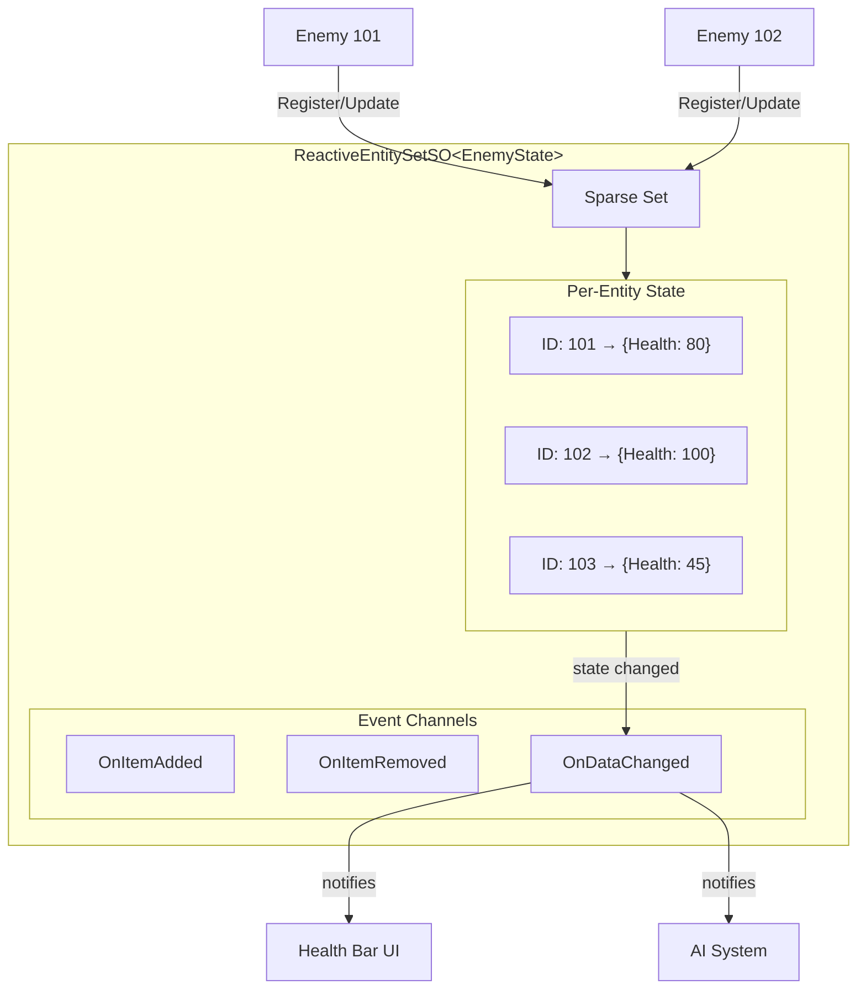

# Reactive Entity Set

{: .warning }
> **実験的機能** - Reactive Entity Setはv2.1.0（未リリース）で利用可能です。APIは将来のバージョンで変更される可能性があります。本番環境での使用は自己責任でお願いします。

---

## 目的

このガイドでは、中央集約型のエンティティ状態管理のためのReactive Entity Setの使い方を説明します。Runtime Setとの違い、エンティティデータの定義方法、エンティティごとの状態変更の購読方法を学びます。

---

## Reactive Entity Setとは

Reactive Entity SetはScriptableObjectベースの状態コンテナで、エンティティごとのデータを自動変更通知とともに保存します。オブジェクト参照のみを追跡するRuntime Setとは異なり、Reactive Entity Setは各エンティティの実際の状態（体力、スコア、状態異常など）を保存します。

```csharp
// Store state by entity ID
entitySet.Register(this, new EnemyState { Health = 100 });

// Read state anywhere
var state = entitySet.GetData(entityId);

// Update state with automatic events
entitySet.UpdateData(this, state => {
    state.Health -= 10;
    return state;
});
```

このアーキテクチャにより以下が実現されます。

- **シーン永続化** - エンティティの状態はシーン読み込みを超えて存続
- **グローバルアクセス** - IDによる任意のエンティティ状態へのアクセス
- **O(1)パフォーマンス** - Sparse Setを使用した定数時間操作
- **エンティティごとのイベント** - 特定のエンティティの変更を購読

---

## Reactive Entity Setを使用するタイミング

### Reactive Entity Setを使用する場合

- **エンティティごとの状態**が必要な場合（体力、マナ、状態異常）
- オブジェクトを探さずに**IDベースの検索**が必要な場合
- 状態が**シーンをまたいで永続化**する必要がある場合
- 外部システムが**エンティティデータを読み取る**必要がある場合（UI、AI、ネットワーキング）

### Runtime Setを使用する場合

- **アクティブなオブジェクトの追跡**のみが必要な場合（エンティティごとの状態不要）
- 個別のデータを必要とせずに**すべてのオブジェクトを反復**する場合
- **IDベースの検索**が不要な場合

### 比較

| 機能 | Runtime Set | Reactive Entity Set |
|---------|--------------|----------------------|
| 保存対象 | オブジェクト参照 | エンティティごとのデータ構造体 |
| 検索 | 反復のみ | IDによるO(1)検索 |
| イベント | コレクション変更 | エンティティごと + コレクション |
| 永続化 | シーンライフサイクル | ScriptableObject |
| 用途 | オブジェクト追跡 | 状態管理 |

### クイック判断ガイド

| シナリオ | 使用するもの |
|----------|-----|
| レベル内のすべての敵を追跡 | Runtime Set |
| 各敵の体力と状態を保存 | Reactive Entity Set |
| ミニマップアイコンを表示 | Runtime Set |
| 個別の体力バーを表示 | Reactive Entity Set |

---

## アーキテクチャ概要



データフローは3つの段階で構成されています。

1. **エンティティ生成** → `ReactiveEntity.OnEnable()` → EntitySetに登録
2. **状態更新** → `UpdateData()` → エンティティごとのコールバックが発火
3. **エンティティ破棄** → `ReactiveEntity.OnDisable()` → EntitySetから登録解除

---

## 基本的な使い方

### ステップ1: 状態構造体の定義

エンティティデータを保持する構造体を作成します。`[System.Serializable]`である必要があります。

```csharp
using System;

[Serializable]
public struct EnemyState
{
    public int Health;
    public int MaxHealth;
    public bool IsStunned;

    public float HealthPercent => MaxHealth > 0 ? (float)Health / MaxHealth : 0f;
    public bool IsDead => Health <= 0;
}
```

### ステップ2: Reactive Entity Setアセットの作成

`ReactiveEntitySetSO<T>`を継承したクラスを作成します:

```csharp
using Tang3cko.ReactiveSO;
using UnityEngine;

[CreateAssetMenu(
    fileName = "EnemyEntitySet",
    menuName = "Reactive SO/Entity Sets/Enemy"
)]
public class EnemyEntitySetSO : ReactiveEntitySetSO<EnemyState>
{
    // Base class provides all functionality
}
```

次に、Projectウィンドウでアセットを作成します:

```text
Create > Reactive SO > Entity Sets > Enemy
```

### ステップ3: Event Channelの作成（オプション）

セットレベルの変更通知が必要な場合は、Event Channelを作成します。

```text
Create > Reactive SO > Channels > Int Event
```

Entity Setのフィールドに割り当てます。利用可能なイベントフィールドを以下に説明します。

- **On Item Added** - エンティティ登録時に発火
- **On Item Removed** - エンティティ登録解除時に発火
- **On Data Changed** - 任意のエンティティのデータ変更時に発火
- **On Set Changed** - 任意の変更時に発火

### ステップ4: エンティティコンポーネントの作成

自動ライフサイクル管理のために`ReactiveEntity<T>`基底クラスを使用します:

```csharp
using Tang3cko.ReactiveSO;
using UnityEngine;

public class Enemy : ReactiveEntity<EnemyState>
{
    [SerializeField] private EnemyEntitySetSO entitySet;
    [SerializeField] private int maxHealth = 100;

    // Required: specify which set to use
    protected override ReactiveEntitySetSO<EnemyState> Set => entitySet;

    // Required: specify initial state
    protected override EnemyState InitialState => new EnemyState
    {
        Health = maxHealth,
        MaxHealth = maxHealth,
        IsStunned = false
    };

    public void TakeDamage(int damage)
    {
        var state = State;
        state.Health = Mathf.Max(0, state.Health - damage);
        State = state;  // Automatically triggers events

        if (state.IsDead)
        {
            Destroy(gameObject);  // OnDisable unregisters automatically
        }
    }
}
```

### ステップ5: エンティティデータのクエリ

任意のスクリプトからエンティティデータにアクセスします:

```csharp
public class EnemyManager : MonoBehaviour
{
    [SerializeField] private EnemyEntitySetSO entitySet;

    public int GetTotalEnemyHealth()
    {
        int total = 0;
        entitySet.ForEach((id, state) => {
            total += state.Health;
        });
        return total;
    }
}
```

<!-- TODO: Add screenshot of Reactive Entity Set Inspector showing registered entities and their state during Play Mode -->

---

## APIリファレンス

### プロパティ

| プロパティ | 型 | 説明 |
|----------|------|-------------|
| `Count` | `int` | 登録されているエンティティの数 |
| `EntityIds` | `ArraySegment<int>` | 登録されているすべてのエンティティID |
| `Data` | `ArraySegment<TData>` | すべてのエンティティデータ |

### メソッド

| メソッド | 説明 |
|--------|-------------|
| `Register(owner, data)` | 初期状態とともにエンティティを登録 |
| `Unregister(owner)` | セットからエンティティを削除 |
| `GetData(owner)` | エンティティの現在の状態を取得 |
| `TryGetData(owner, out data)` | 安全にエンティティの状態を取得 |
| `SetData(owner, data)` | エンティティの状態を更新 |
| `UpdateData(owner, func)` | 関数を使用して状態を更新 |
| `GetDataRef(id)` | 直接変更のための状態への参照を取得 |
| `NotifyDataChanged(owner)` | GetDataRef変更後に手動で通知 |
| `Contains(owner)` | エンティティが存在するか確認 |
| `Clear()` | すべてのエンティティを削除 |
| `ForEach(action)` | すべてのエンティティを反復 |
| `SubscribeToEntity(id, callback)` | エンティティの変更を購読 |
| `UnsubscribeFromEntity(id, callback)` | エンティティから購読解除 |

---

## 変更の購読

### エンティティごとの購読

特定のエンティティの変更を追跡します。

```csharp
public class EnemyHealthBar : MonoBehaviour
{
    [SerializeField] private EnemyEntitySetSO entitySet;
    [SerializeField] private Image fillImage;

    private int trackedEntityId;

    public void TrackEnemy(int entityId)
    {
        // Unsubscribe from previous
        if (trackedEntityId != 0)
        {
            entitySet.UnsubscribeFromEntity(trackedEntityId, OnStateChanged);
        }

        trackedEntityId = entityId;
        entitySet.SubscribeToEntity(entityId, OnStateChanged);

        // Update immediately
        if (entitySet.TryGetData(entityId, out var state))
        {
            UpdateBar(state);
        }
    }

    private void OnDisable()
    {
        if (trackedEntityId != 0)
        {
            entitySet.UnsubscribeFromEntity(trackedEntityId, OnStateChanged);
        }
    }

    private void OnStateChanged(EnemyState oldState, EnemyState newState)
    {
        UpdateBar(newState);

        // Can compare old and new state
        if (newState.Health < oldState.Health)
        {
            PlayDamageEffect();
        }
    }

    private void UpdateBar(EnemyState state)
    {
        fillImage.fillAmount = state.HealthPercent;
    }
}
```

### ReactiveEntity.OnStateChangedの使用

`ReactiveEntity<T>`基底クラスを使用する場合:

```csharp
public class EnemyStatusUI : MonoBehaviour
{
    [SerializeField] private Enemy trackedEnemy;
    [SerializeField] private Image healthFill;

    private void OnEnable()
    {
        if (trackedEnemy != null)
        {
            trackedEnemy.OnStateChanged += HandleStateChanged;
        }
    }

    private void OnDisable()
    {
        if (trackedEnemy != null)
        {
            trackedEnemy.OnStateChanged -= HandleStateChanged;
        }
    }

    private void HandleStateChanged(EnemyState oldState, EnemyState newState)
    {
        healthFill.fillAmount = newState.HealthPercent;
    }
}
```

### セットレベルのEvent Channel

Event Channelを介してセットレベルの変更を購読します。

```csharp
public class EnemyCounter : MonoBehaviour
{
    [SerializeField] private IntEventChannelSO onEnemyAdded;
    [SerializeField] private IntEventChannelSO onEnemyRemoved;
    [SerializeField] private Text countText;

    private int enemyCount;

    private void OnEnable()
    {
        onEnemyAdded.OnEventRaised += HandleEnemyAdded;
        onEnemyRemoved.OnEventRaised += HandleEnemyRemoved;
    }

    private void OnDisable()
    {
        onEnemyAdded.OnEventRaised -= HandleEnemyAdded;
        onEnemyRemoved.OnEventRaised -= HandleEnemyRemoved;
    }

    private void HandleEnemyAdded(int entityId)
    {
        enemyCount++;
        UpdateDisplay();
    }

    private void HandleEnemyRemoved(int entityId)
    {
        enemyCount--;
        UpdateDisplay();
    }

    private void UpdateDisplay()
    {
        countText.text = $"Enemies: {enemyCount}";
    }
}
```

---

## 一般的なパターン

### パターン1: ボスの体力バー

特定のボスエンティティの体力を追跡します。

```csharp
public class BossHealthBar : MonoBehaviour
{
    [SerializeField] private BossEntitySetSO bossSet;
    [SerializeField] private Slider healthSlider;
    [SerializeField] private Text healthText;

    private int bossId;

    public void SetBoss(int entityId)
    {
        bossId = entityId;
        bossSet.SubscribeToEntity(bossId, OnBossStateChanged);

        if (bossSet.TryGetData(bossId, out var state))
        {
            UpdateUI(state);
        }
    }

    private void OnBossStateChanged(BossState oldState, BossState newState)
    {
        UpdateUI(newState);

        if (newState.IsDead)
        {
            gameObject.SetActive(false);
        }
    }

    private void UpdateUI(BossState state)
    {
        healthSlider.value = state.HealthPercent;
        healthText.text = $"{state.Health} / {state.MaxHealth}";
    }
}
```

### パターン2: 状態異常システム

状態異常を適用して追跡します。

```csharp
[Serializable]
public struct EntityStatus
{
    public bool IsPoisoned;
    public float PoisonEndTime;
    public bool IsSlowed;
    public float SlowEndTime;
}

public class StatusEffectManager : MonoBehaviour
{
    [SerializeField] private StatusEntitySetSO statusSet;

    public void ApplyPoison(int entityId, float duration)
    {
        statusSet.UpdateData(entityId, status => {
            status.IsPoisoned = true;
            status.PoisonEndTime = Time.time + duration;
            return status;
        });
    }

    private void Update()
    {
        // Check expired effects
        statusSet.ForEach((id, status) => {
            if (status.IsPoisoned && Time.time >= status.PoisonEndTime)
            {
                statusSet.UpdateData(id, s => {
                    s.IsPoisoned = false;
                    return s;
                });
            }
        });
    }
}
```

### パターン3: 保存と読み込み

セッションをまたいでエンティティの状態を永続化します。

```csharp
public class SaveSystem : MonoBehaviour
{
    [SerializeField] private PlayerEntitySetSO playerSet;

    public void SaveGame()
    {
        foreach (var entityId in playerSet.EntityIds)
        {
            if (playerSet.TryGetData(entityId, out var state))
            {
                PlayerPrefs.SetInt($"Player_{entityId}_Health", state.Health);
                PlayerPrefs.SetInt($"Player_{entityId}_Level", state.Level);
            }
        }
    }

    public void LoadEntityState(int entityId)
    {
        if (PlayerPrefs.HasKey($"Player_{entityId}_Health"))
        {
            var state = new PlayerState
            {
                Health = PlayerPrefs.GetInt($"Player_{entityId}_Health"),
                Level = PlayerPrefs.GetInt($"Player_{entityId}_Level")
            };
            playerSet.SetData(entityId, state);
        }
    }
}
```

---

## ベストプラクティス

### 状態構造体をシンプルに保つ

最高のパフォーマンスのためにプリミティブ型を使用しましょう。

```csharp
// Good: Simple value types
[Serializable]
public struct EntityState
{
    public int Health;
    public float Speed;
    public Vector3 LastPosition;
}
```

```csharp
// Bad: Reference types cause allocation
[Serializable]
public struct EntityState
{
    public List<int> Modifiers;  // Avoid
    public string Name;           // Avoid if possible
}
```

### アトミックな変更にはUpdateDataを使用

```csharp
// Good: Atomic update
entitySet.UpdateData(this, state => {
    state.Health -= damage;
    state.IsStunned = damage > 50;
    return state;
});
```

```csharp
// Bad: Non-atomic, state may change between get and set
var state = entitySet.GetData(this);
state.Health -= damage;
entitySet.SetData(this, state);
```

### 必ず購読解除する

```csharp
// Good: Balanced subscription
private void OnEnable()
{
    entitySet.SubscribeToEntity(entityId, OnStateChanged);
}

private void OnDisable()
{
    entitySet.UnsubscribeFromEntity(entityId, OnStateChanged);
}
```

```csharp
// Bad: Memory leak
private void Start()
{
    entitySet.SubscribeToEntity(entityId, OnStateChanged);
}
// Missing unsubscribe in OnDisable
```

### 状態を直接変更しない

```csharp
// Bad: Direct mutation doesn't trigger events
var state = entitySet.GetData(entityId);
state.Health -= 10;  // Set is NOT updated!
```

```csharp
// Good: Use SetData or UpdateData
entitySet.UpdateData(entityId, state => {
    state.Health -= 10;
    return state;
});
```

---

## パフォーマンス

### O(1)操作

Reactive Entity SetはSparse Setデータ構造を使用します:

| 操作 | 時間計算量 |
|-----------|-----------------|
| Register | O(1) |
| Unregister | O(1) |
| GetData | O(1) |
| SetData | O(1) |
| Iteration | O(n) |

### メモリ効率

Sparse Setはページ単位でメモリを割り当て、使用されているID範囲のページのみを作成します。これはまばらなID分布に対して効率的です。

---

## シーンの永続化

### 状態はシーン変更を超えて存続

エンティティデータはScriptableObjectに保存され、シーン読み込みをまたいで永続化されます。

```csharp
// Scene A: Enemy registers
entitySet.Register(enemyId, initialState);

// Scene B loads
// State is still accessible
if (entitySet.TryGetData(enemyId, out var state))
{
    // State persists
}
```

### シーンアンロード時のクリア

シーン変更時にクリーンアップしましょう。

```csharp
public class SceneCleanup : MonoBehaviour
{
    [SerializeField] private EnemyEntitySetSO entitySet;

    private void OnDestroy()
    {
        entitySet.Clear();
    }
}
```

---

## トラブルシューティング

### 状態が更新されない

`SetData`または`UpdateData`を使用していることを確認してください。構造体の直接変更はセットを更新しません。

```csharp
// Wrong
var state = entitySet.GetData(id);
state.Health = 50;  // Set not updated!

// Correct
entitySet.SetData(id, new EnemyState { Health = 50 });
```

### イベントが発火しない

1. エンティティが`Contains()`で登録されていることを確認
2. 状態変更の前に購読していることを確認
3. InspectorでEvent Channelが割り当てられていることを確認

### エンティティが見つからない

1. エンティティをクエリする前に`OnEnable`が実行されているか確認
2. エンティティIDが正しいことを確認（`GetInstanceID()`は各プレイセッションで変更されます）
3. 安全なアクセスのために`GetData`の代わりに`TryGetData`を使用

### メモリリーク

常に`OnDisable`で購読解除してください:

```csharp
private void OnDisable()
{
    entitySet.UnsubscribeFromEntity(entityId, OnStateChanged);
}
```

---

## リファレンス

- [Event Channelガイド](event-channels) - ファイア・アンド・フォーゲット通知用
- [Variableガイド](variables) - 共有グローバル状態用
- [Runtime Setガイド](runtime-sets) - シンプルなオブジェクト追跡用
