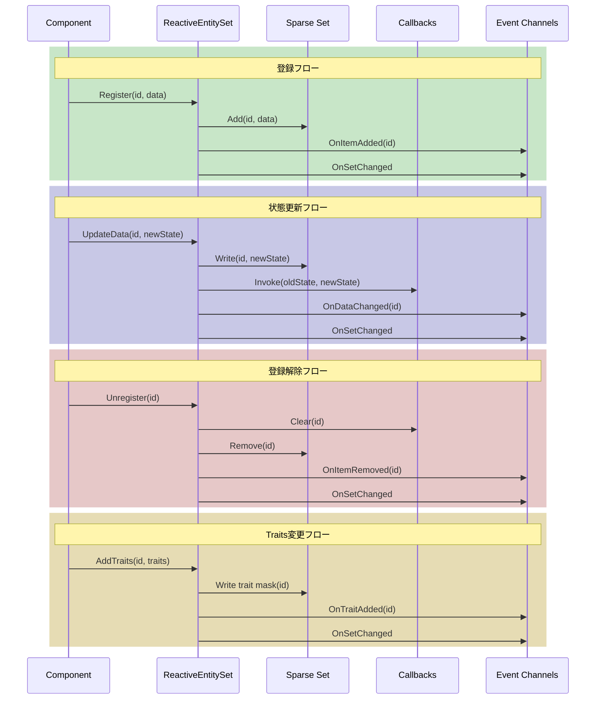

# イベント

---

## 目的

このページでは、エンティティの状態変更をサブスクライブする方法を説明します。エンティティごとのサブスクリプション、ReactiveEntityベースクラスのイベント、セットレベルのイベントチャンネルを取り上げます。

---

## エンティティごとのサブスクリプション

IDで特定のエンティティの変更を追跡します。

```csharp
public class EnemyHealthBar : MonoBehaviour
{
    [SerializeField] private EnemyEntitySetSO entitySet;
    [SerializeField] private Image fillImage;

    private int trackedEntityId;

    public void TrackEnemy(int entityId)
    {
        // 以前のサブスクリプションを解除
        if (trackedEntityId != 0)
        {
            entitySet.UnsubscribeFromEntity(trackedEntityId, OnStateChanged);
        }

        trackedEntityId = entityId;
        entitySet.SubscribeToEntity(entityId, OnStateChanged);

        // 即座に更新
        if (entitySet.TryGetData(entityId, out var state))
        {
            UpdateBar(state);
        }
    }

    private void OnDisable()
    {
        if (trackedEntityId != 0)
        {
            entitySet.UnsubscribeFromEntity(trackedEntityId, OnStateChanged);
        }
    }

    private void OnStateChanged(EnemyState oldState, EnemyState newState)
    {
        UpdateBar(newState);

        // 古い状態と新しい状態を比較可能
        if (newState.Health < oldState.Health)
        {
            PlayDamageEffect();
        }
    }

    private void UpdateBar(EnemyState state)
    {
        fillImage.fillAmount = state.HealthPercent;
    }
}
```

### サブスクリプションAPI

| メソッド | 説明 |
|---------|------|
| `SubscribeToEntity(id, callback)` | 特定のエンティティの状態変更をサブスクライブ |
| `UnsubscribeFromEntity(id, callback)` | 特定のエンティティからサブスクライブ解除 |

### コールバックシグネチャ

コールバックは古い状態と新しい状態の両方を受け取ります。

```csharp
void OnStateChanged(TData oldState, TData newState)
```

これにより、何が変更されたかを検出して適切に反応できます。

---

## ReactiveEntity.OnStateChangedの使用

エンティティが`ReactiveEntity<T>`を継承している場合、`OnStateChanged`イベントが公開されます。

```csharp
public class EnemyStatusUI : MonoBehaviour
{
    [SerializeField] private Enemy trackedEnemy;
    [SerializeField] private Image healthFill;

    private void OnEnable()
    {
        if (trackedEnemy != null)
        {
            trackedEnemy.OnStateChanged += HandleStateChanged;
        }
    }

    private void OnDisable()
    {
        if (trackedEnemy != null)
        {
            trackedEnemy.OnStateChanged -= HandleStateChanged;
        }
    }

    private void HandleStateChanged(EnemyState oldState, EnemyState newState)
    {
        healthFill.fillAmount = newState.HealthPercent;
    }
}
```

### 各アプローチの使い分け

| アプローチ | 使用する場合 |
|-----------|-------------|
| `SubscribeToEntity(id, callback)` | エンティティIDはあるがオブジェクトへの参照がない場合 |
| `ReactiveEntity.OnStateChanged` | エンティティコンポーネントへの直接参照がある場合 |

---

## セットレベルのイベントチャンネル

イベントチャンネル経由でセットレベルの変更をサブスクライブします。セット内のいずれかのエンティティが変更されると発火します。

### イベントフィールド

| フィールド | 発火タイミング |
|-----------|---------------|
| On Item Added | エンティティが登録されたとき |
| On Item Removed | エンティティが登録解除されたとき |
| On Data Changed | いずれかのエンティティのデータが変更されたとき |
| On Set Changed | 任意の変更が発生したとき |
| On Trait Added | エンティティにTraitsが追加されたとき |
| On Trait Removed | エンティティからTraitsが削除されたとき |

### 敵カウンターの例

```csharp
public class EnemyCounter : MonoBehaviour
{
    [SerializeField] private IntEventChannelSO onEnemyAdded;
    [SerializeField] private IntEventChannelSO onEnemyRemoved;
    [SerializeField] private Text countText;

    private int enemyCount;

    private void OnEnable()
    {
        onEnemyAdded.OnEventRaised += HandleEnemyAdded;
        onEnemyRemoved.OnEventRaised += HandleEnemyRemoved;
    }

    private void OnDisable()
    {
        onEnemyAdded.OnEventRaised -= HandleEnemyAdded;
        onEnemyRemoved.OnEventRaised -= HandleEnemyRemoved;
    }

    private void HandleEnemyAdded(int entityId)
    {
        enemyCount++;
        UpdateDisplay();
    }

    private void HandleEnemyRemoved(int entityId)
    {
        enemyCount--;
        UpdateDisplay();
    }

    private void UpdateDisplay()
    {
        countText.text = $"敵: {enemyCount}";
    }
}
```

### イベントチャンネルの作成と割り当て

1. Projectウィンドウでイベントチャンネルを作成

   ```text
   Create > Reactive SO > Channels > Int Event
   ```

2. InspectorでReactiveEntitySetSOアセットに割り当て

3. スクリプトからイベントチャンネルをサブスクライブ

---

## イベントタイミング

イベントがいつ発火するかを理解することで、コードを正しく構造化できます。



### 状態更新フロー

```
UpdateData() または State = newState
  → 状態がSparse Setに書き込まれる
  → エンティティごとのコールバックが呼び出される
  → OnDataChangedイベントチャンネルが発火（割り当てられている場合）
  → OnSetChangedイベントチャンネルが発火（割り当てられている場合）
```

### 登録フロー

```
Register() または ReactiveEntity.OnEnable()
  → エンティティがSparse Setに追加
  → OnItemAddedイベントチャンネルが発火（割り当てられている場合）
  → OnSetChangedイベントチャンネルが発火（割り当てられている場合）
```

### 登録解除フロー

```
Unregister() または ReactiveEntity.OnDisable()
  → エンティティごとのコールバックがクリア
  → エンティティがSparse Setから削除
  → OnItemRemovedイベントチャンネルが発火（割り当てられている場合）
  → OnSetChangedイベントチャンネルが発火（割り当てられている場合）
```

---

## Traitsイベント

`AddTraits`、`RemoveTraits`、`SetTraits`、`ClearTraits` を呼び出すとTraitsイベントが発火します。`OnItemAdded` と同様にエンティティIDを渡します。

```csharp
public class AggroUI : MonoBehaviour
{
    [SerializeField] private IntEventChannelSO onTraitAdded;
    [SerializeField] private IntEventChannelSO onTraitRemoved;
    [SerializeField] private EnemyEntitySetSO enemySet;

    private void OnEnable()
    {
        onTraitAdded.OnEventRaised += HandleTraitAdded;
        onTraitRemoved.OnEventRaised += HandleTraitRemoved;
    }

    private void OnDisable()
    {
        onTraitAdded.OnEventRaised -= HandleTraitAdded;
        onTraitRemoved.OnEventRaised -= HandleTraitRemoved;
    }

    private void HandleTraitAdded(int entityId)
    {
        if (enemySet.HasTraits<EnemyTraits>(entityId, EnemyTraits.IsAggro))
        {
            ShowAggroIndicator(entityId);
        }
    }

    private void HandleTraitRemoved(int entityId)
    {
        if (!enemySet.HasTraits<EnemyTraits>(entityId, EnemyTraits.IsAggro))
        {
            HideAggroIndicator(entityId);
        }
    }
}
```

Traits APIの詳細は[Traits](traits)を参照してください。

---

## サブスクリプションのライフサイクル

サブスクライバーが無効化または破棄されるときは、サブスクライブを解除してください。

```csharp
// 良い: バランスの取れたサブスクリプション
private void OnEnable()
{
    entitySet.SubscribeToEntity(entityId, OnStateChanged);
}

private void OnDisable()
{
    entitySet.UnsubscribeFromEntity(entityId, OnStateChanged);
}
```

```csharp
// 悪い: メモリリーク
private void Start()
{
    entitySet.SubscribeToEntity(entityId, OnStateChanged);
}
// OnDisableでのサブスクライブ解除が欠落
```

---

## 次のステップ

- [Traits](traits) — Traitsの追加、照会、イテレート
- [パターン](patterns) — 一般的な使用パターン
- [ベストプラクティス](best-practices) — パフォーマンスとトラブルシューティング
