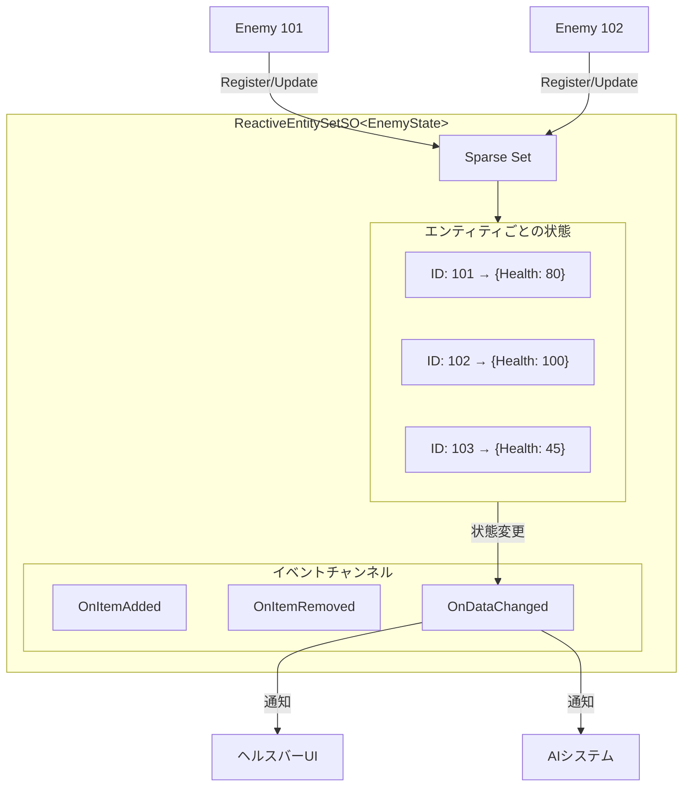

# Reactive Entity Setsガイド

{: .warning }
> **実験的機能** - Reactive Entity Setsはv2.1.0（未リリース）で利用可能です。APIは将来のバージョンで変更される可能性があります。本番環境での使用は自己責任で行ってください。

{: .warning }
> **重要な注意: ランタイムデータの永続性について**
> ScriptableObjectはシーンを跨いでデータを保持できますが、**シーン遷移中にどのオブジェクトからも参照されなくなると、Unityによってメモリからアンロードされ、ランタイムデータが消失する可能性があります**。これを防ぐには、常にロードされているオブジェクト（DontDestroyOnLoadなマネージャーなど）からアセットへの参照を維持する必要があります。詳細は [トラブルシューティング: シーン遷移時のデータ消失]({{ '/ja/troubleshooting' | relative_url }}#data-loss) を参照してください。

---

## 目的

このガイドでは、集中化されたエンティティ状態管理のためのReactive Entity Setsの使い方を説明します。Runtime Setsとの違い、エンティティデータの定義方法、エンティティごとの状態変更のサブスクライブ方法を学びます。

---

## Reactive Entity Setsとは？

Reactive Entity Setsは、自動変更通知付きでエンティティごとのデータを格納するScriptableObjectベースの状態コンテナです。オブジェクト参照のみを追跡するRuntime Setsとは異なり、Reactive Entity Setsは各エンティティの実際の状態（体力、スコア、ステータスエフェクト）を格納します。

```csharp
// エンティティIDで状態を格納
entitySet.Register(this, new EnemyState { Health = 100 });

// どこからでも状態を読み取り
var state = entitySet.GetData(entityId);

// 自動イベント付きで状態を更新
entitySet.UpdateData(this, state => {
    state.Health -= 10;
    return state;
});
```

このアーキテクチャは以下を可能にします。

- **シーン永続化** - エンティティ状態がシーンロードを生き残る
- **グローバルアクセス** - IDで任意のエンティティの状態にアクセス
- **O(1)パフォーマンス** - Sparse Setを使用した定数時間操作
- **エンティティごとのイベント** - 特定のエンティティの変更をサブスクライブ

---

## いつReactive Entity Setsを使うか

### Reactive Entity Setsを使う場合

- **エンティティごとの状態**が必要（体力、マナ、ステータスエフェクト）
- オブジェクトを見つけずに**IDベースのルックアップ**が必要
- 状態が**シーン間で永続化**する必要がある
- 外部システムが**エンティティデータを読み取る**必要がある（UI、AI、ネットワーク）

### Runtime Setsを使う場合

- **アクティブなオブジェクトの追跡**のみが必要（エンティティごとの状態なし）
- 個別データを必要とせず**すべてのオブジェクト**を反復
- **IDベースのルックアップ**が不要

### 比較

| 機能 | Runtime Sets | Reactive Entity Sets |
|------|--------------|----------------------|
| 格納 | オブジェクト参照 | エンティティごとのデータ構造体 |
| ルックアップ | 反復のみ | IDでO(1) |
| イベント | コレクション変更 | エンティティごと + コレクション |
| 永続化 | シーンライフサイクル | ScriptableObject |
| ユースケース | オブジェクト追跡 | 状態管理 |

### クイック判断ガイド

| シナリオ | 使用 |
|----------|------|
| レベル内のすべての敵を追跡 | Runtime Set |
| 各敵の体力とステータスを格納 | Reactive Entity Set |
| ミニマップアイコンを表示 | Runtime Set |
| 個別のヘルスバーを表示 | Reactive Entity Set |

---

## アーキテクチャ概要



データは3つのステージでシステムを流れます。

1. **エンティティスポーン** → `ReactiveEntity.OnEnable()` → EntitySetに登録
2. **状態更新** → `UpdateData()` → エンティティごとのコールバックが発火
3. **エンティティ破棄** → `ReactiveEntity.OnDisable()` → EntitySetから登録解除

---

## ガイドセクション

| ページ | 説明 |
|--------|------|
| [基本的な使い方](basic-usage) | state構造体の定義、アセット作成、エンティティ登録 |
| [イベント](events) | エンティティごとのサブスクリプション、セットレベルの通知 |
| [パターン](patterns) | ボスヘルスバー、ステータスエフェクト、セーブ/ロード |
| [ベストプラクティス](best-practices) | パフォーマンスのヒント、トラブルシューティング |

---

## 関連ドキュメント

設計思想と理論的基礎については、[RES設計]({{ '/ja/design-philosophy/reactive-entity-sets/' | relative_url }})を参照してください。
