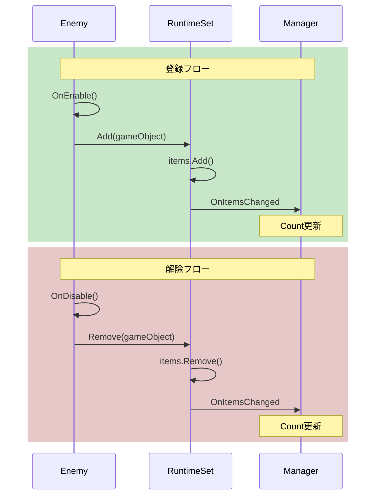

# Runtime Sets

{: .note }
> Runtime Setsはv1.1.0から利用可能です。

---

## 目的

このガイドでは、シングルトンマネージャーなしでオブジェクトコレクションを追跡するRuntime Setsの使い方を説明します。登録パターン、アクティブオブジェクトのクエリ方法、代替手段よりRuntime Setsを選ぶタイミングを学びます。

---

## Runtime Setsとは？

Runtime Setsはランタイムで作成・破棄されるオブジェクトを追跡するScriptableObjectベースのコレクションです。オブジェクトは有効化時に登録し、無効化時に登録解除します。

```csharp
// オブジェクトが自身を登録
private void OnEnable() => activeEnemies?.Add(gameObject);
private void OnDisable() => activeEnemies?.Remove(gameObject);

// どこからでもアクティブオブジェクトをクエリ
int count = activeEnemies.Count;
foreach (var enemy in activeEnemies.Items) { ... }
```

これにより`EnemyManager.Instance`のようなシングルトンマネージャーが不要になります。

### ライフサイクル

オブジェクトの登録/解除は以下のように行われます：



---

## Runtime Setsを使うタイミング

### Runtime Setsを使う場合

- **動的にスポーンされるオブジェクト**を追跡する必要がある（敵、ピックアップ、発射物）
- **シングルトンマネージャーを避けたい**
- 複数のシステムが**同じコレクションをクエリ**する必要がある
- `FindObjectsOfType`なしで「全アクティブX」を確認する必要がある

### C# List<T>を使う場合

- コレクションが**1つのGameObjectだけに属する**
- **毎フレームアクセス**する（パフォーマンス重視）
- **システム間の可視性**が不要
- **イベント通知**が不要

### 判断ガイド

| シナリオ | 使用するもの |
|----------|-------------|
| レベル内の全敵を追跡 | Runtime Set |
| 敵の個人的なウェイポイントリスト | C# List<T> |
| ミニマップ用の全ピックアップを追跡 | Runtime Set |
| プレイヤーのインベントリアイテム | C# List<T> |

---

## 利用可能なタイプ

| タイプ | 追跡対象 | ユースケース |
|--------|----------|--------------|
| GameObject Runtime Set | `GameObject` | 最も一般的、スポーンされたエンティティ |
| Transform Runtime Set | `Transform` | 位置ベースのクエリ、ウェイポイント |

---

## 基本的な使い方

### ステップ1：Runtime Setアセットを作成

Projectウィンドウで右クリックし、以下のメニューパスを選択します。

```text
Create > Reactive SO > Runtime Sets > GameObject Runtime Set
```

`ActiveEnemies`や`SpawnedPickups`のような説明的な名前を付けます。

### ステップ2：Event Channelを作成（オプション）

コレクション変更時の通知が必要な場合は、Event Channelを作成します。

```text
Create > Reactive SO > Channels > Void Event
```

Runtime Setの**On Items Changed**フィールドに割り当てます。

### ステップ3：オブジェクトが自身を登録

OnEnable/OnDisableパターンを使用します。

```csharp
using Tang3cko.ReactiveSO;
using UnityEngine;

public class Enemy : MonoBehaviour
{
    [SerializeField] private GameObjectRuntimeSetSO activeEnemies;

    private void OnEnable()
    {
        activeEnemies?.Add(gameObject);
    }

    private void OnDisable()
    {
        activeEnemies?.Remove(gameObject);
    }
}
```

### ステップ4：コレクションをクエリ

どこからでもアクティブオブジェクトにアクセスできます。

```csharp
public class WaveManager : MonoBehaviour
{
    [SerializeField] private GameObjectRuntimeSetSO activeEnemies;
    [SerializeField] private VoidEventChannelSO onWaveComplete;

    private void Update()
    {
        if (activeEnemies.Count == 0)
        {
            onWaveComplete?.RaiseEvent();
        }
    }
}
```

---

## APIリファレンス

### プロパティ

| プロパティ | 型 | 説明 |
|------------|-----|------|
| `Count` | `int` | セット内のアイテム数 |
| `Items` | `IReadOnlyList<T>` | 全アイテムへの読み取り専用アクセス |

### メソッド

| メソッド | 説明 |
|----------|------|
| `Add(T item)` | アイテムを追加（重複防止） |
| `Remove(T item)` | アイテムを削除 |
| `Contains(T item)` | アイテムが存在するか確認 |
| `Clear()` | 全アイテムを削除 |
| `DestroyItems()` | 全GameObjectを破棄してクリア（GameObjectセットのみ） |

---

## 一般的なパターン

### パターン1：ウェーブベースのスポーン

敵を追跡してウェーブ完了を検出します。

```csharp
public class WaveSpawner : MonoBehaviour
{
    [SerializeField] private GameObject enemyPrefab;
    [SerializeField] private GameObjectRuntimeSetSO activeEnemies;
    [SerializeField] private VoidEventChannelSO onWaveComplete;

    public void SpawnWave(int count)
    {
        for (int i = 0; i < count; i++)
        {
            // 敵はOnEnableで自身を登録
            Instantiate(enemyPrefab, GetSpawnPosition(), Quaternion.identity);
        }
    }

    private void Update()
    {
        if (activeEnemies.Count == 0)
        {
            onWaveComplete?.RaiseEvent();
        }
    }
}
```

### パターン2：最も近いオブジェクトを検索

`FindObjectsOfType`なしでクエリできます。

```csharp
public GameObject GetNearestEnemy(Vector3 position)
{
    GameObject nearest = null;
    float minDistance = float.MaxValue;

    foreach (var enemy in activeEnemies.Items)
    {
        if (enemy == null) continue;

        float distance = Vector3.Distance(position, enemy.transform.position);
        if (distance < minDistance)
        {
            minDistance = distance;
            nearest = enemy;
        }
    }

    return nearest;
}
```

### パターン3：ピックアップコレクション

収集可能アイテムを追跡します。

```csharp
public class Pickup : MonoBehaviour
{
    [SerializeField] private GameObjectRuntimeSetSO activePickups;

    private void OnEnable()
    {
        activePickups?.Add(gameObject);
    }

    private void OnDisable()
    {
        activePickups?.Remove(gameObject);
    }

    public void Collect()
    {
        // ポイント付与、サウンド再生など
        Destroy(gameObject);  // OnDisableでセットから削除
    }
}
```

### パターン4：レベルクリーンアップ

スポーンされた全オブジェクトを一度に破棄できます。

```csharp
public class LevelManager : MonoBehaviour
{
    [SerializeField] private GameObjectRuntimeSetSO spawnedEnemies;
    [SerializeField] private GameObjectRuntimeSetSO spawnedPickups;

    public void EndLevel()
    {
        // 追跡中の全オブジェクトを破棄
        spawnedEnemies.DestroyItems();
        spawnedPickups.DestroyItems();
    }
}
```

---

## 変更を購読

アイテムの追加・削除時に反応できます。

```csharp
public class EnemyCounter : MonoBehaviour
{
    [SerializeField] private GameObjectRuntimeSetSO activeEnemies;
    [SerializeField] private VoidEventChannelSO onEnemiesChanged;
    [SerializeField] private Text countText;

    private void OnEnable()
    {
        onEnemiesChanged.OnEventRaised += UpdateDisplay;
        UpdateDisplay();
    }

    private void OnDisable()
    {
        onEnemiesChanged.OnEventRaised -= UpdateDisplay;
    }

    private void UpdateDisplay()
    {
        countText.text = $"Enemies: {activeEnemies.Count}";
    }
}
```

---

## Inspectorの機能

Play Mode中にRuntime Setアセットを選択すると以下が表示されます。

- **ライブアイテムリスト** - 現在登録されている全オブジェクト
- **クリックでピング** - アイテムをクリックしてHierarchyでハイライト
- **カウント表示** - 現在のアイテム数

<!-- TODO: Add screenshot of Runtime Set Inspector during Play Mode showing live item list -->

Play Mode終了時にアイテムは自動的にクリアされます。

---

## ベストプラクティス

### 常にOnEnable/OnDisableを使用

これにより自動的な登録とクリーンアップが保証されます。

```csharp
// ✅ 良い例：バランスの取れた登録
private void OnEnable()
{
    runtimeSet?.Add(gameObject);
}

private void OnDisable()
{
    runtimeSet?.Remove(gameObject);
}
```

```csharp
// ❌ 悪い例：登録のみで解除なし
private void Start()
{
    runtimeSet?.Add(gameObject);
}
```

### イテレーション時にnullチェック

アイテムはチェック間に破棄される可能性があります：

```csharp
foreach (var enemy in activeEnemies.Items)
{
    if (enemy == null) continue;  // 重要！
    // enemyを使用
}
```

### シーン遷移時にクリア

シーン変更前に`Clear()`または`DestroyItems()`を呼び出しましょう。

```csharp
public void LoadNextLevel()
{
    activeEnemies.Clear();  // 古い参照を防止
    SceneManager.LoadScene("NextLevel");
}
```

### 説明的な名前を使用

```csharp
// ✅ 良い例：何を追跡しているか明確
ActiveEnemies
SpawnedPickups
RegisteredWaypoints

// ❌ 悪い例：曖昧
Enemies
Items
Set1
```

---

## 代替手段との比較

| 機能 | Runtime Sets | シングルトンマネージャー | MonoBehaviour内のList |
|------|--------------|-------------------------|----------------------|
| Inspectorの可視性 | あり | なし | 限定的 |
| イベント通知 | 自動 | 手動 | 手動 |
| テスト容易性 | 高 | 低 | 中 |
| シーン間永続化 | あり | あり | なし |
| 結合度 | 低 | 高 | 中 |

---

## カスタムRuntime Setの作成

カスタム型には、`RuntimeSetSO<T>`を継承：

```csharp
[CreateAssetMenu(
    fileName = "EnemyRuntimeSet",
    menuName = "Reactive SO/Runtime Sets/Enemy Runtime Set"
)]
public class EnemyRuntimeSetSO : RuntimeSetSO<Enemy>
{
    // 必要に応じてカスタムメソッドを追加
    public Enemy GetStrongestEnemy()
    {
        return Items
            .Where(e => e != null)
            .OrderByDescending(e => e.Health)
            .FirstOrDefault();
    }
}
```

コンポーネントで使用：

```csharp
public class Enemy : MonoBehaviour
{
    [SerializeField] private EnemyRuntimeSetSO activeEnemies;
    public int Health { get; private set; } = 100;

    private void OnEnable() => activeEnemies?.Add(this);
    private void OnDisable() => activeEnemies?.Remove(this);
}
```

---

## トラブルシューティング

### アイテムがInspectorに表示されない

Runtime Setの内容はPlay Mode中のみ表示されます。

### オブジェクトが登録されない

`OnEnable`で`Add()`を呼び出していること、Runtime SetがInspectorで割り当てられていることを確認。

### シーン変更後のnull参照

シーン変更前に`Clear()`を呼び出して古い参照を削除。

### UIでカウントが更新されない

毎フレームポーリングではなく**On Items Changed** Event Channelを購読。

---

## 参照

- [Event Channelsガイド](event-channels) - 通知用
- [Variablesガイド](variables) - 共有状態用
- [Reactive Entity Setsガイド](reactive-entity-sets) - IDを持つエンティティデータ用
