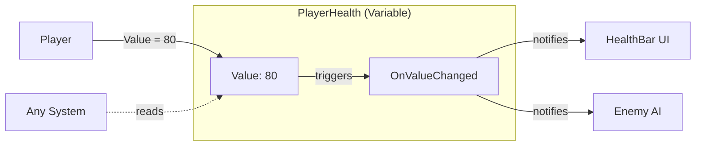

# Variables

{: .note }
> Variablesはv1.1.0から利用可能です。GPU Syncはv2.0.0で追加されました。

---

## 目的

このガイドでは、Variablesを使用してゲーム内のリアクティブな共有状態を作成する方法を説明します。Event Channelsよりもいつ選ぶべきか、セットアップ方法、GPU Syncを使用してシェーダーを駆動する方法を学びます。

---

## Variablesとは？

Variablesは単一の型付き値を保存し、その値が変更されたときに自動的にイベントを発火するScriptableObjectアセットです。Event Channelsのメリットと永続的な状態を組み合わせています。



```csharp
// 値を設定 - 変更があれば自動的にイベントを発火
playerHealth.Value = 80;

// 値を読み取り - イベント購読不要
int currentHealth = playerHealth.Value;
```

---

## Variablesを使うタイミング

### Variablesを使う場合

- 複数のシステムが読み取れる**共有状態**が必要
- **自動変更検出**が欲しい（値が実際に変更されたときのみイベント発火）
- UIがイベントを待たずに**現在の値を表示**する必要がある
- イベント間で**状態を永続化**する必要がある

### Event Channelsを使う場合

- アクションについて**通知**するだけで良い（永続的な状態不要）
- データが**一時的**（ボタンクリック、衝突）
- 現在の値をクエリする必要がない

### 判断ガイド

| シナリオ | 使用するもの |
|----------|-------------|
| プレイヤー死亡（通知） | Event Channel |
| プレイヤー体力変更（状態＋通知） | Variable |
| スコア変更（状態＋通知） | Variable |
| ボタンクリック（通知） | Event Channel |
| ゲーム一時停止（状態） | Variable |

---

## 利用可能なタイプ

| タイプ | 使用例 |
|--------|--------|
| Int | スコア、体力、通貨、レベル |
| Long | タイムスタンプ、大きな数値 |
| Float | タイマー、音量、進捗（0-1） |
| Double | 高精度の値 |
| Bool | ゲーム一時停止、プレイヤー生存、機能有効化 |
| String | プレイヤー名、レベル名、ステータスメッセージ |
| Vector2 | 2D位置、ジョイスティック入力 |
| Vector3 | 3D位置、速度、スポーンポイント |
| Quaternion | 回転、向き |
| Color | UIの色、マテリアルのティント |
| GameObject | 現在のターゲット、選択オブジェクト |

---

## 基本的な使い方

### ステップ1：Variableアセットを作成

Projectウィンドウで右クリックし、以下のメニューパスを選択します。

```text
Create > Reactive SO > Variables > Int Variable
```

`PlayerHealth`や`CurrentScore`のような説明的な名前を付けます。

### ステップ2：Variableを設定

アセットを選択し、Inspectorで以下を設定します。

- **Initial Value** - 開始値（例：体力なら100）
- **Description** - このVariableが表すもの

### ステップ3：Event Channelを作成（オプション）

変更の通知が必要な場合は、対応するEvent Channelを作成します。

```text
Create > Reactive SO > Channels > Int Event
```

Variableの**On Value Changed**フィールドに割り当てます。

### ステップ4：スクリプトで使用

```csharp
using Tang3cko.ReactiveSO;
using UnityEngine;

public class Player : MonoBehaviour
{
    [SerializeField] private IntVariableSO playerHealth;

    public void TakeDamage(int damage)
    {
        // Valueを設定すると変更時に自動的にイベントを発火
        playerHealth.Value -= damage;
    }

    public void Heal(int amount)
    {
        playerHealth.Value += amount;
    }
}
```

```csharp
public class HealthBar : MonoBehaviour
{
    [SerializeField] private IntVariableSO playerHealth;
    [SerializeField] private Image fillImage;

    private void Update()
    {
        // 現在の値を直接読み取り
        fillImage.fillAmount = playerHealth.Value / 100f;
    }
}
```

---

## 変更を購読

イベント駆動の更新には、Event Channelを購読します。

```csharp
public class HealthDisplay : MonoBehaviour
{
    [SerializeField] private IntVariableSO playerHealth;
    [SerializeField] private IntEventChannelSO onHealthChanged;
    [SerializeField] private Text healthText;

    private void OnEnable()
    {
        onHealthChanged.OnEventRaised += UpdateDisplay;
        // 初期値をすぐに表示
        UpdateDisplay(playerHealth.Value);
    }

    private void OnDisable()
    {
        onHealthChanged.OnEventRaised -= UpdateDisplay;
    }

    private void UpdateDisplay(int health)
    {
        healthText.text = $"HP: {health}";
    }
}
```

---

## 変更検出

Variablesは`EqualityComparer<T>`を使用して変更を検出します。イベントは値が実際に変更されたときのみ発火します。

```csharp
playerHealth.Value = 100;  // イベント発火（初期設定）
playerHealth.Value = 80;   // イベント発火（100 != 80）
playerHealth.Value = 80;   // イベントなし（80 == 80）
```

これにより、同じ値を設定したときの不要な更新を防止します。

---

## 初期値とリセット

### 初期値

Inspectorで**Initial Value**を設定します。この値は以下の場合に使用されます。

- Play Mode開始時
- Inspectorで**Reset to Initial**をクリックしたとき

### ゲームプレイ中のリセット

Play Mode中にInspectorの**Reset to Initial**ボタンを使用して、テスト用に値を素早くリセットできます。

### ベストプラクティス

コードではなくInspectorで意味のある初期値を設定しましょう。

```csharp
// ❌ 悪い例：ハードコードされた初期値
private void Start()
{
    playerHealth.Value = 100;  // これはしない
}

// ✅ 良い例：InspectorのInitial Valueを使用
// VariableはすでにInitial Valueの100で開始
```

---

## GPU Sync

GPU SyncはVariable値をシェーダーのグローバルプロパティに自動的に同期します。これにより、シェーダー、VFX Graph、Compute Shaderがゲームプレイの状態に反応できます。

### サポートされるタイプ

| Variableタイプ | Shaderメソッド | HLSLタイプ |
|----------------|----------------|------------|
| Int | `SetGlobalInteger` | `int` |
| Float | `SetGlobalFloat` | `float` |
| Vector2 | `SetGlobalVector` | `float4` (xy) |
| Vector3 | `SetGlobalVector` | `float4` (xyz) |
| Quaternion | `SetGlobalVector` | `float4` (xyzw) |
| Color | `SetGlobalColor` | `float4` |
| Bool | `SetGlobalInteger` | `int` (0 or 1) |

String、GameObject、Long、DoubleはGPU Syncをサポートしていません。

### GPU Syncを有効化

1. Variableアセットを選択
2. **GPU Sync Enabled**を有効化
3. **GPU Property Name**を設定（例：`_PlayerHealth`）

<!-- TODO: Add screenshot of Variable Inspector showing GPU Sync settings -->

### シェーダーでの使用

値はグローバルプロパティとして自動的に利用可能になります。

```hlsl
// C#のブリッジコード不要
float health = _PlayerHealth;
float3 playerPos = _PlayerPosition.xyz;

// ゲームプレイ状態に反応
float healthFactor = saturate(health / 100.0);
```

### ユースケース

- **低体力ビネット** - 体力が低いとき画面端を暗くするシェーダー
- **プレイヤー近接エフェクト** - プレイヤー位置に反応するVFX
- **ゲーム状態ビジュアル** - 危険レベルがライティング色に影響
- **Compute Shader入力** - ゲームプレイデータを使用した物理シミュレーション

---

## 一般的なパターン

### パターン1：複数のリーダー

複数のシステムが同じVariableを読み取ることができます。

```csharp
// ScoreManagerが書き込み
currentScore.Value += 10;

// ScoreTextが読み取り
scoreText.text = $"Score: {currentScore.Value}";

// HighScoreCheckerがイベントをリッスン
onScoreChanged.OnEventRaised += CheckHighScore;
```

### パターン2：セーブデータからロード

```csharp
public void LoadGame(SaveData save)
{
    // 値を設定すると全リスナーに通知
    playerHealth.Value = save.health;
    playerLevel.Value = save.level;
    playerGold.Value = save.gold;
}
```

### パターン3：AIがプレイヤー状態を読み取り

```csharp
public class EnemyAI : MonoBehaviour
{
    [SerializeField] private IntVariableSO playerHealth;

    private void Update()
    {
        // 結合なしでプレイヤー状態を読み取り
        if (playerHealth.Value < 30)
        {
            BecomeAggressive();
        }
    }
}
```

---

## ベストプラクティス

### 説明的な名前を付ける

```csharp
// ✅ 良い例：明確な所有者と目的
PlayerHealth
CurrentScore
IsPaused

// ❌ 悪い例：曖昧
Health
Score
Paused
```

### 設定にはInspectorを使用

スクリプトにハードコードせず、InspectorでInitial ValueとDescriptionを設定。

### イベントを使いすぎない

システムが現在の値だけを必要とする場合、イベントを購読せずに直接読み取り。

### Inspectorでドキュメント化

各Variableが表すものをDescriptionフィールドで説明。

---

## 制限事項

### 組み込みの履歴なし

Variablesは現在の値のみを保存。履歴が必要な場合はサブスクライバーで実装：

```csharp
private List<int> scoreHistory = new();

private void OnScoreChanged(int score)
{
    scoreHistory.Add(score);
}
```

### 参照型の変更は検出されない

GameObjectのVariableでは、プロパティの変更はイベントをトリガーしません：

```csharp
// ❌ イベントなし（参照は変わっていない）
target.Value.GetComponent<Enemy>().health = 50;

// ✅ イベント発火（参照が変わった）
target.Value = newEnemy;
```

---

## カスタムVariableタイプの作成

カスタムデータ型には、`VariableSO<T>`を継承：

```csharp
[CreateAssetMenu(
    fileName = "WeaponVariable",
    menuName = "Reactive SO/Variables/Weapon Variable"
)]
public class WeaponVariableSO : VariableSO<Weapon>
{
    // 全機能を継承
}
```

対応するEvent Channelを作成：

```csharp
[CreateAssetMenu(
    fileName = "WeaponEvent",
    menuName = "Reactive SO/Channels/Weapon Event"
)]
public class WeaponEventChannelSO : EventChannelSO<Weapon>
{
}
```

### シリアライズ要件

カスタム型は完全にシリアライズ可能である必要があります。Unityは特定の型をシリアライズしません。

**サポートされる型**

- プリミティブ（`int`, `float`, `bool`, `string`）
- Unity型（`Vector3`, `Color`, `Quaternion`）
- シリアライズ可能な型の`List<T>`
- シリアライズ可能な型の配列
- 他の`[Serializable]`構造体/クラス

**サポートされない型**

- `Dictionary<K,V>`
- 多次元配列（`int[,]`）
- `HashSet<T>`, `Queue<T>`, `Stack<T>`
- インターフェース
- デリゲート

**例**

```csharp
// 安全：全フィールドがシリアライズ可能
[System.Serializable]
public struct WeaponData
{
    public string name;
    public int damage;
    public List<string> tags;
}

// 危険：Dictionaryはシリアライズされない
[System.Serializable]
public struct InventoryData
{
    public Dictionary<string, int> items;  // リロード後は空になる！
}
```

カスタム型にシリアライズ不可なフィールドが含まれている場合、UnityがScriptableObjectをアンロードして再ロードしたとき（例：シーン遷移時）にそれらのフィールドは失われます。詳細は[トラブルシューティング]({{ '/ja/troubleshooting' | relative_url }})を参照。

---

## 参照

- [Event Channelsガイド](event-channels) - ファイア・アンド・フォーゲット通知用
- [Event Typesリファレンス]({{ '/ja/reference/event-types' | relative_url }}) - 全利用可能タイプ
- [Runtime Setsガイド](runtime-sets) - オブジェクトコレクションの追跡用
