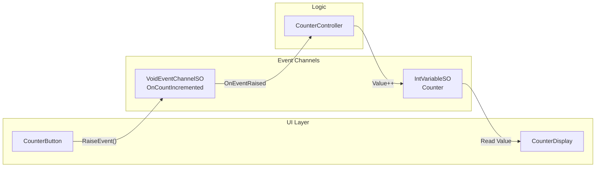

# 基本デモ (Counter)

## 概要

シンプルなカウンターUIを使用して、基本的な **Event Channels** と **Variables** のパターンを実演します。このデモでは、コンポーネントがScriptableObjectベースのイベントを通じて通信し、Variablesを通じて状態を共有することで、完全な疎結合を実現する方法を示します。

カウンターUIは以下の要素で構成されています。

- イベントを発火させるインクリメントボタン
- カウンターの値を読み取るディスプレイ
- 初期値を復元するリセットボタン

## 使用している機能

| 機能 | アセット | 説明 |
|------|----------|------|
| Event Channel | `OnCountIncremented` (VoidEventChannelSO) | ボタンクリックイベント |
| Variable | `Counter` (IntVariableSO) | 共有カウンター状態 |

## アーキテクチャ

**重要なポイント**: `CounterButton`、`CounterController`、`CounterDisplay` は互いに直接依存していません。すべての通信は Event Channels と Variables を介して行われるため、各コンポーネントは独立してテストおよび再利用が可能です。

## 主要ファイル

| ファイル | 説明 |
|----------|------|
| `Scripts/CounterButton.cs` | ボタンクリック時に `VoidEventChannelSO` を発火 |
| `Scripts/CounterController.cs` | イベントを購読し、`IntVariableSO` をインクリメント |
| `Scripts/CounterDisplay.cs` | `IntVariableSO.Value` を読み取って表示 |
| `ScriptableObjects/Events/OnCountIncremented.asset` | ボタンクリック用 VoidEventChannelSO |
| `ScriptableObjects/Variables/Counter.asset` | カウンター値を格納する IntVariableSO |

## ユースケース

このパターンは、コンポーネント間の通信を疎結合にする必要があるあらゆるシナリオに適用できます。

- **スコアシステム**: 共有スコアを表示する複数のUI要素
- **インベントリ更新**: アイテム取得イベント、アイテム数変数
- **ゲーム状態**: 一時停止/再開イベント、体力/マナ変数
- **設定**: トグルイベント、設定値変数
