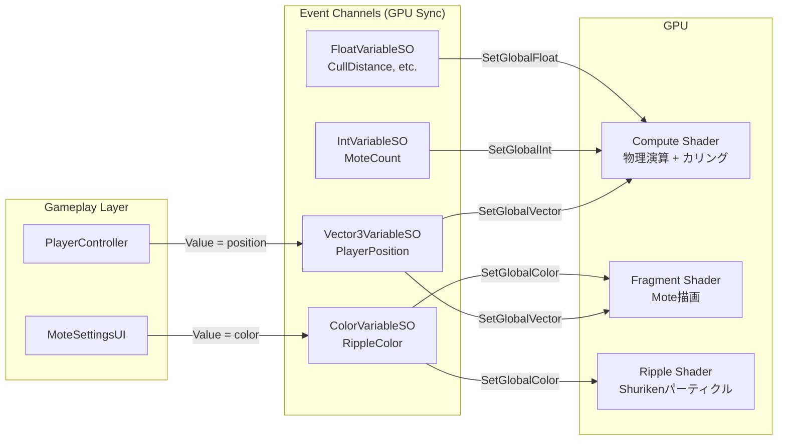

# Mote Demo (GPU Sync)

## 概要

Event Channelsの **GPU Sync** 機能のデモです。このデモでは、VariableSO型が `Shader.SetGlobal~()` を介して値をシェーダーに自動的に同期させる方法を示します。これにより、スクリプトとシェーダーを直接結合することなく、GPUベースのレンダリングをゲームプレイの状態に反応させることができます。

**主な実演内容**: GPU Syncは、グローバルプロパティを参照するカスタムシェーダーを通じて、**Compute Shader** と **Shuriken Particle Systems** の両方で機能します。

10,000個のMote（粒子）がプレイヤーの接近に反応します。

- プレイヤーが近づくとMoteがより明るく輝く
- 触れると反発して浮き上がる
- バネ・ダンパー物理を使用して滑らかに元の位置に戻る
- 距離カリングにより、近くのMoteのみを描画

足跡の波紋（Ripple）がMoteを補完します。

- プレイヤーが歩くと波紋パーティクルが発生
- 波紋はGPU Sync（`_RippleColor`）を介してMoteと同じ色を共有
- UIでの色変更はMoteと波紋の両方に同時に影響

<!-- TODO: Add video showing motes reacting to player proximity with glow and repulsion effects -->

## 使用している機能

| 機能 | アセット | シェーダープロパティ | 説明 |
| :--- | :--- | :--- | :--- |
| GPU Sync (Vector3) | `PlayerPosition` | `_PlayerPosition` | 近接効果用のプレイヤー位置 |
| GPU Sync (Color) | `RippleColor` | `_RippleColor` | Moteと波紋の共有色 |
| GPU Sync (Int) | `MoteCount` | `_MoteCount` | シミュレートするMoteの数 |
| GPU Sync (Float) | `CullDistance` | `_CullDistance` | プレイヤーからの最大描画距離 |
| GPU Sync (Float) | `RepulsionRadius` | `_RepulsionRadius` | プレイヤーからの反発範囲 |
| GPU Sync (Float) | `RepulsionStrength` | `_RepulsionStrength` | 反発力の強さ |
| GPU Sync (Float) | `LiftStrength` | `_LiftStrength` | 反発時の上昇力 |
| GPU Sync (Float) | `SpringStiffness` | `_SpringStiffness` | 元の位置に戻るバネの強さ |
| GPU Sync (Float) | `Damping` | `_Damping` | 速度の減衰係数 |

## アーキテクチャ



**重要なポイント**: `PlayerController` と `MoteSimulation` の間、または `MoteSettingsUI` とパーティクルシステムの間に直接的な依存関係はありません。VariableSOが疎結合なブリッジとして機能し、結合なしでGPUがゲームプレイの状態にアクセスできるようにします。

**なぜShuriken？** GPU Syncは `Shader.SetGlobal~()` を使用して値を同期します。Shurikenパーティクルはグローバルプロパティを参照するカスタムシェーダーを使用できます。VFX Graphは `Shader.SetGlobal~()` にアクセスできません（代わりに `VisualEffect.SetXXX()` APIが必要です）。

## 技術詳細

### GPUパイプライン

1. **Compute Shader** (`Mote.compute`)
   - インプレース物理シミュレーション（バネ・ダンパー + 反発）
   - AppendBufferによる距離カリング
   - `_CullDistance` 内のMoteのみが出力される

2. **Fragment Shader** (`Mote.shader`)
   - ビルボード矩形描画
   - `_RippleColor` を使用した近接ベースの発光効果
   - URP互換

3. **Shuriken Particles** (`Ripple.shader`)
   - 足跡用のリング状波紋エフェクト
   - グローバルプロパティ `_RippleColor` を参照
   - 標準パーティクルシステムでのGPU Syncの実演

### バッファ戦略

- **シングルバッファ**: インプレースGPU更新（CPU-GPU同期なし）
- **AppendBuffer**: 距離カリング出力
- **DrawMeshInstancedIndirect**: カリング結果からの動的インスタンス数描画

## 主要ファイル

| ファイル | 説明 |
| :--- | :--- |
| `Scripts/PlayerController.cs` | Vector3VariableSOをプレイヤー位置で更新 |
| `Scripts/MoteSimulation.cs` | GPUバッファを管理しCompute Shaderをディスパッチ |
| `Scripts/FootstepRippleEmitter.cs` | プレイヤー移動時に波紋パーティクルを発生 |
| `Scripts/MoteSettingsUI.cs` | VariableSOパラメータへのUIバインディング |
| `Scripts/TPSCameraFollow.cs` | Vector3VariableSOを使用した三人称カメラ |
| `Shaders/Mote.compute` | 物理シミュレーション + 距離カリング |
| `Shaders/Mote.shader` | 近接発光付きビルボード描画 |
| `Shaders/Ripple.shader` | Shurikenパーティクル用のリング状波紋 |
| `ScriptableObjects/Variables/*.asset` | GPU Syncが有効化されたVariableSOアセット |
| `UI/MoteSettings.uxml` | 設定パネルレイアウト |

## ユースケース

このパターンは、GPUエフェクトがゲームプレイに反応する必要があるシナリオに適用できます。

- **パーティクル / Mote**: プレイヤーが近づくと光って散らばる
- **魔法のオーラ**: プレイヤー位置に追従または反応する視覚効果
- **環境エフェクト**: ゲームプレイ状態に反応するGPUシミュレーションエフェクト
- **シェーダーパラメータ**: ゲーム変数に反応する必要がある任意のシェーダープロパティ

## GPU Syncの使い方

プロジェクトでGPU Syncを使用するには

1. VariableSOアセット（Int、Float、Vector3など）を作成する
2. Inspectorで **GPU Sync** を有効にする
3. **Property Name** を設定する（例：`_PlayerHealth`）
4. シェーダーでグローバルプロパティを参照する

```hlsl
// シェーダーは自動的に値を受け取ります
float3 playerPos = _PlayerPosition.xyz;
float cullDist = _CullDistance;
```

ブリッジコードは不要です。VariableSOが自動的に同期を処理します。
