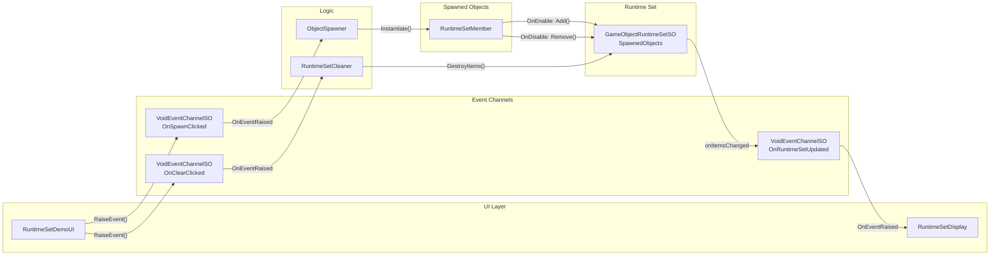

# Runtime Sets Demo

## 概要

**Runtime Sets** パターンのデモです。これは、シングルトンを使用せずに動的なオブジェクトコレクションを管理するScriptableObjectベースのアプローチです。

このデモでは以下を示します。

- 自動コレクション追跡を伴うオブジェクトのスポーンと破棄
- コレクション変更時のイベント駆動UI更新
- Inspectorでのアクティブオブジェクトのリアルタイム可視化

## 使用している機能

| 機能 | アセット | 説明 |
| :--- | :--- | :--- |
| Runtime Set | `SpawnedObjects` (GameObjectRuntimeSetSO) | すべてのスポーンされたオブジェクトを追跡 |
| Event Channel | `OnSpawnClicked` (VoidEventChannelSO) | スポーンボタンイベント |
| Event Channel | `OnClearClicked` (VoidEventChannelSO) | クリアボタンイベント |
| Event Channel | `OnRuntimeSetUpdated` (VoidEventChannelSO) | コレクション変更通知 |

## アーキテクチャ

**重要なポイント**: Runtime Setsはマネージャーシングルトンの必要性を排除します。オブジェクトは`RuntimeSetMember.OnEnable()`で自身を登録し、`OnDisable()`で解除します。これにより適切なライフサイクル管理が保証され、破棄や無効化時に自動的にコレクションから削除されます。

## 主要ファイル

| ファイル | 説明 |
| :--- | :--- |
| `Scripts/RuntimeSetDemoUI.cs` | UIボタンをEventChannelsに接続 |
| `Scripts/ObjectSpawner.cs` | オブジェクトをスポーン（prefabにはRuntimeSetMemberが必要） |
| `Scripts/RuntimeSetMember.cs` | prefab用の自己登録コンポーネント |
| `Scripts/ObjectDestroyer.cs` | 衝突時にオブジェクトを破棄 |
| `Scripts/RuntimeSetDisplay.cs` | 現在のオブジェクト数を表示 |
| `Scripts/RuntimeSetCleaner.cs` | RuntimeSetからすべてのオブジェクトをクリア |
| `ScriptableObjects/RuntimeSets/SpawnedObjects.asset` | GameObjectRuntimeSetSO |

## 使い方

1. `RuntimeSetsDemo` シーンを開く
2. Play Modeに入る
3. **Spawn Object** をクリックしてランダムなキューブ/球体を生成
4. Projectウィンドウで `SpawnedObjects` アセットを選択し、リアルタイムの追跡を確認
5. スポーンされたオブジェクト同士を衝突させて破棄
6. **Clear All** をクリックしてすべてのオブジェクトを一度に削除

## ユースケース

このパターンは、動的なオブジェクトコレクション管理が必要なシナリオに適用できます。

- **敵の管理**: マネージャーシングルトンなしですべてのアクティブな敵を追跡
- **スポーンオブジェクト**: 動的に作成されたピックアップ、発射物、エフェクトの管理
- **UI要素**: 一括操作（すべて閉じる、すべて最小化）のためにアクティブなパネルを追跡
- **レベルクリーンアップ**: シーン変更時にすべてのスポーンオブジェクトを破棄
