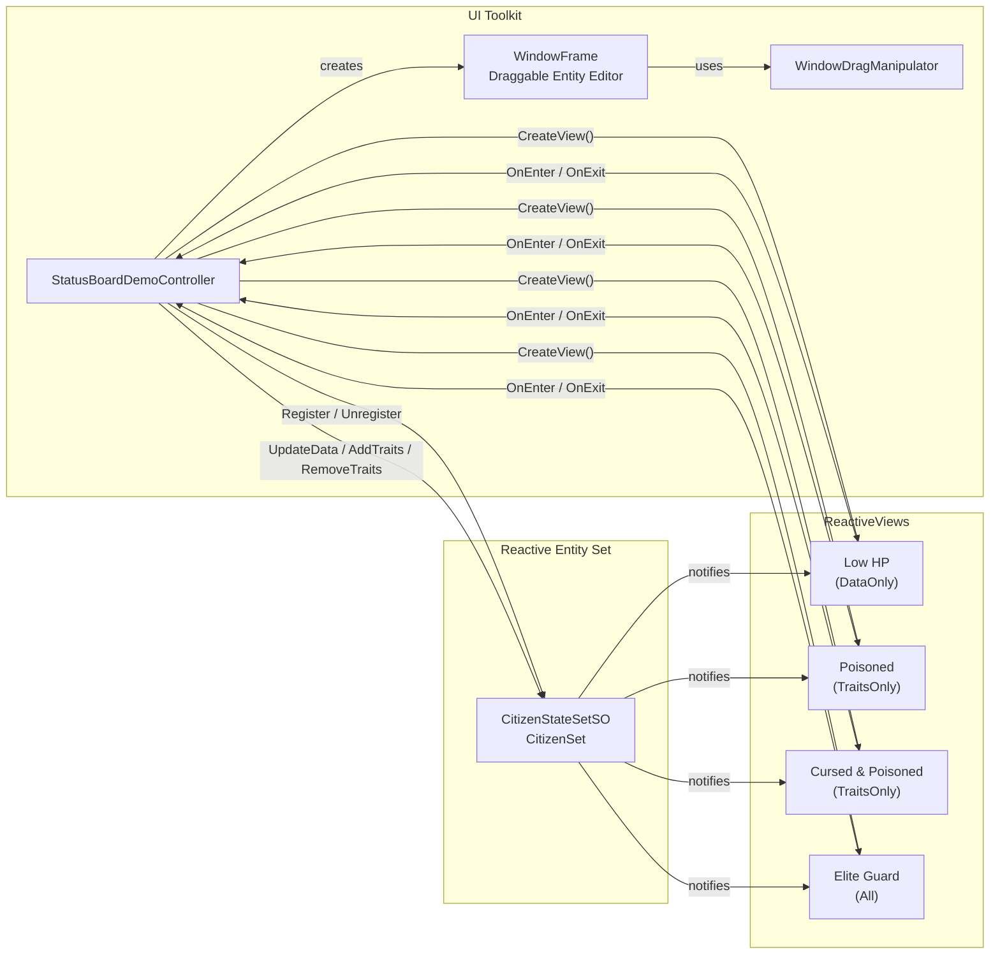

# Status Board Demo

{: .warning }
> **実験的機能** - このデモはv2.2.0（未リリース）のTraitsとViewsを使用しています。APIは将来のバージョンで変更される可能性があります。本番環境での使用は自己責任で行ってください。

## 概要

**Traits**と**ReactiveViews**を手を動かして体験するデモです。エンティティ行をクリックしてエディタウィンドウを開き、HPを動かしたりトレイトをトグルしたりしながら、右パネルがリアルタイムに変わるのを確認できます。

`ViewTrigger`の3モードすべてを使用しています。

- **DataOnly** -- データ変更のみに反応するビュー（HP閾値）
- **TraitsOnly** -- トレイト変更のみに反応するビュー（単一トレイトおよび複数トレイトのANDマスク）
- **All** -- データとトレイトの両方の変更に反応するビュー（HP + トレイトの複合条件）

## 使用している機能

| 機能 | アセット / クラス | 説明 |
| :--- | :--- | :--- |
| Reactive Entity Set | `CitizenSet` (CitizenStateSetSO) | `CitizenState`データを持つすべての市民エンティティを格納 |
| Traits | `CitizenTrait` ([Flags] enum) | エンティティごとのビットマスクフラグ: Cursed, Poisoned, Shielded |
| ReactiveView (DataOnly) | Low HPビュー | HP < 30%のエンティティにマッチ |
| ReactiveView (TraitsOnly) | Poisonedビュー | Poisonedトレイトを持つエンティティにマッチ |
| ReactiveView (TraitsOnly) | Cursed & Poisonedビュー | CursedとPoisonedの両方のトレイトを持つエンティティにマッチ |
| ReactiveView (All) | Elite Guardビュー | HP > 80%かつShieldedトレイトを持つエンティティにマッチ |

詳細は[Traits]({{ '/ja/guides/reactive-entity-sets/traits' | relative_url }})と[Views]({{ '/ja/guides/reactive-entity-sets/views' | relative_url }})のガイドを参照してください。

## アーキテクチャ

**重要なポイント**: ScriptableObjectのイベントチャンネルは不要です。コントローラーはエンティティセットから直接`ReactiveView`インスタンスを作成し、`OnEnter` / `OnExit`イベントを購読します。エンティティのデータやトレイトが変更されると、ビューは自動的に述語を再評価し、UIが更新されます。

## 主要ファイル

| ファイル | 説明 |
| :--- | :--- |
| `Scripts/Data/CitizenState.cs` | エンティティデータ構造体: `Hp`, `MaxHp` |
| `Scripts/Data/CitizenTrait.cs` | `[Flags]` enum: Cursed, Poisoned, Shielded |
| `Scripts/Sets/CitizenStateSetSO.cs` | `ReactiveEntitySetSO<CitizenState>`アセットタイプ |
| `Scripts/UI/StatusBoardDemoController.cs` | メインコントローラー -- エンティティ、ビュー、UIを管理 |
| `Scripts/UI/Elements/WindowFrame.cs` | タイトルバーと閉じるボタンを持つドラッグ可能なウィンドウVisualElement |
| `Scripts/UI/Elements/WindowDragManipulator.cs` | タイトルバードラッグ用のPointerManipulator |
| `UI/StatusBoardDemo.uxml` | 3カラムレイアウト（左サイドバー、中央ワークスペース、右サイドバー） |
| `UI/USS/StatusBoardDemo.uss` | ダークテーマのスタイリング |
| `ScriptableObjects/CitizenSet.asset` | CitizenStateSetSOインスタンス |

## 使い方

1. `StatusBoardDemo` シーンを開く
2. Play Modeに入る -- ランダムなHPとトレイトを持つ12体のエンティティが生成される
3. 左サイドバーの **Add** / **Remove** ボタンで5体ずつエンティティを追加・削除
4. 左サイドバーのエンティティ行をクリックして、中央ワークスペースにドラッグ可能なエディタウィンドウを開く
5. HPスライダーをドラッグしてエンティティの体力を変更 -- Low HPビューとElite Guardビューの更新を確認
6. **Cursed**、**Poisoned**、**Shielded** のトレイトボタンをトグル -- トレイトベースのビューの更新を確認
7. 右サイドバーのパネルを見て、各ReactiveViewにエンティティがリアルタイムで出入りする様子を観察

## ユースケース

エンティティが状態に応じてグループに出入りする仕組みが必要な場面で、このパターンをそのまま使えます。

| ユースケース | 具体例 |
| :--- | :--- |
| ステータスエフェクト | 視覚フィードバックやティックダメージのために、毒状態やスタン状態のユニットを追跡 |
| アラートシステム | HUDで低HPの味方や高脅威の敵をハイライト |
| 部隊編成 | ステータスとトレイトの複合条件でユニットを自動グルーピング（例: 回復可能なヒーラー） |
| フィルタダッシュボード | ゲームステートのライブフィルタリングビューを表示するデバッグ/管理パネルの構築 |
