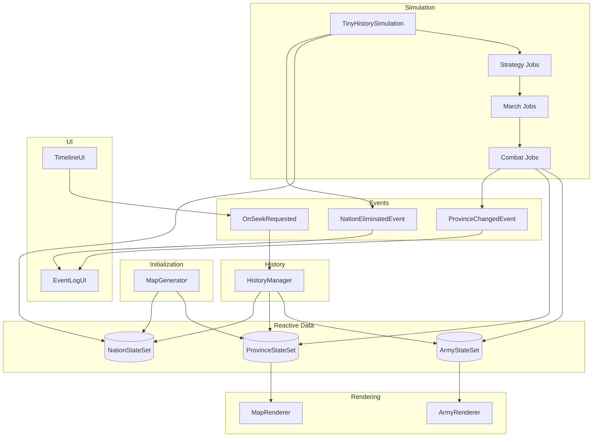
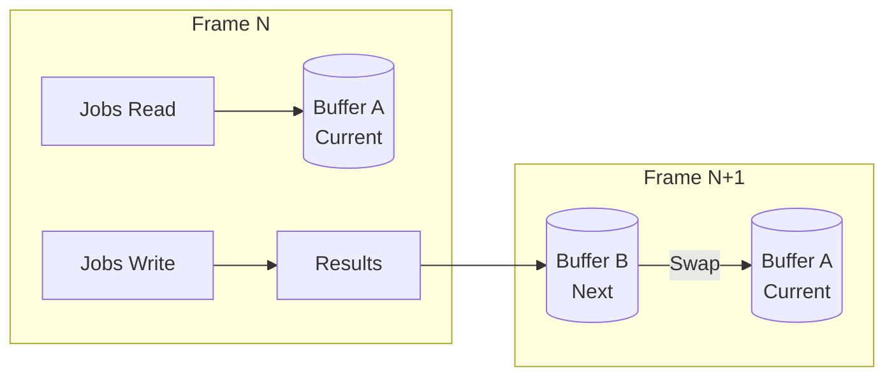
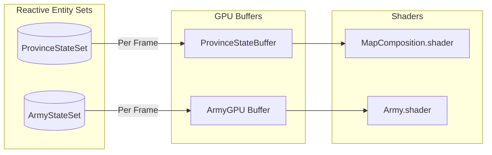
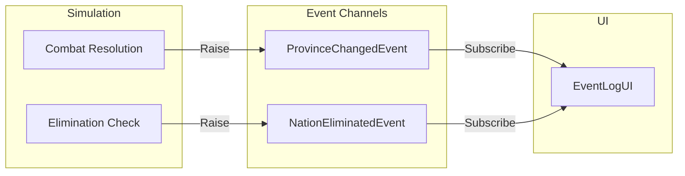

# アーキテクチャ

---

## 目的

このページでは、Tiny History デモのアーキテクチャを視覚的に概観します。システム間の接続とデータの流れを理解するためにご活用ください。

---

## システム概要



---

## シミュレーションループ

毎フレーム、シミュレーションは Unity Jobs を使用した多段階パイプラインを実行します。

```
Frame Start
     │
     ▼
┌─────────────────────┐
│  1. Strategy Job    │  国家AIの性格に基づいて
│     (Sequential)    │  軍隊の移動目標を決定
└──────────┬──────────┘
           ▼
┌─────────────────────┐
│  2. March Job       │  事前計算済みの最短経路を使用して
│     (Parallel)      │  軍隊を目標に向けて移動
└──────────┬──────────┘
           ▼
┌─────────────────────┐
│  3. Combat Job      │  異なる国家の軍隊が
│     (Sequential)    │  遭遇した際の戦闘を解決
└──────────┬──────────┘
           ▼
┌─────────────────────┐
│  4. Economy         │  領土支配に基づいて
│     (Every N frames)│  軍隊の生成/破棄
└──────────┬──────────┘
           ▼
┌─────────────────────┐
│  5. History         │  状態スナップショットを
│     (Every N frames)│  循環バッファに保存
└──────────┬──────────┘
           ▼
┌─────────────────────┐
│  6. GPU Render      │  州と軍隊のレンダリング用
│                     │  GPUバッファを更新
└──────────┬──────────┘
           ▼
      Frame End
```

---

## データフロー

### Entity Sets と Jobs

Jobs はダブルバッファリングを使用して Reactive Entity Sets から読み書きします。



### Entity Sets から GPU へ

州と軍隊のデータは手動更新により Entity Sets から GPU バッファへ流れます。



### Events から UI へ

ドメインイベントはシミュレーションから UI へ流れ、ログに記録されます。



---

## 主要コンポーネント

| コンポーネント | 役割 | 主要ファイル |
| :--- | :--- | :--- |
| TinyHistorySimulation | メインコントローラー、シミュレーションを統括 | `TinyHistorySimulation.cs` |
| MapGenerator | 州と国家を持つ手続き的マップ生成 | `MapGenerator.cs` |
| StrategyJob / MarchJob / CombatJob | シミュレーション用 Job System タスク | `Jobs/*.cs` |
| ArmyTargetAssigner | 軍隊移動の AI 意思決定 | `Strategy/ArmyTargetAssigner.cs` |
| HistoryManager | スナップショットの取得と復元 | `HistoryManager.cs` |
| MapRenderer | 所有権カラー付き GPU 州レンダリング | `MapRenderer.cs` |
| ArmyRenderer | 軍隊の GPU インスタンスレンダリング | `ArmyRenderer.cs` |
| TimelineUI | 再生コントロールとタイムラインスライダー | `UI/TimelineUI.cs` |
| EventLogUI | 歴史的イベントの年代記 | `UI/EventLogUI.cs` |

---

## 拡張ポイント

このサンプルはコアパターンを示していますが、コード内にはすでにいくつかの拡張ポイントが準備されています。ソースファイル内の `NOTE: Expansion point` コメントを探してみてください。

### すぐに使える拡張ポイント

以下のデータはすでに計算されシステムを通過していますが、まだ消費されていません。

| ファイル | 拡張ポイント | 現状 |
| :--- | :--- | :--- |
| `TerrainType.cs` | 地形による移動コスト、戦闘修正、視覚的差別化 | 生成時に割り当てられ GPU に渡されているが、ロジック/描画で未使用 |
| `PersonalityGenerator.cs` | ランタイムでの国家生成（反乱、分裂） | `GenerateSingle()` メソッドが存在するが未使用 |
| `MapGenerator.cs` | マップ情報 UI や大陸ベースのメカニクス用の大陸数 | 計算されているが消費されていない |
| `CombatResult.cs` | 戦闘統計、詳細ログ、キル追跡用の軍隊 ID | CombatJob で書き込まれているが読み取り側なし |

これらは「低いところにある果実」です。データはすでにシステムを流れているので、消費側を追加するだけで実装できます。

### 高度なパターン

アーキテクチャをさらに発展させたいユーザー向けのパターンです。

#### GPU ベースの移動管理（Texture Data Container）

さらに大規模（10万ユニット以上）を目指す場合、CPU 側の Entity Sets ではなく `RenderTexture` に位置を格納することを検討してください。

- RGBA チャンネル = X, Y, TargetX, TargetY
- Compute Shader で位置更新を完全に GPU 上で実行
- RES はロジック（国家所属、生存フラグ）の「正」として維持

```
┌─────────────────┐     ┌─────────────────┐     ┌─────────────────┐
│  RES (CPU)      │     │  Orchestrator   │     │  GPU Texture    │
│  ロジック層     │ ──► │  ID マッピング  │ ──► │  物理演算層     │
│  - 国家 ID      │     │  差分注入       │     │  - 座標         │
│  - ターゲット ID│     │                 │     │  - 速度         │
│  - 生存フラグ   │     │                 │     │  - 補間         │
└─────────────────┘     └─────────────────┘     └─────────────────┘
```

#### 歴史の「インク」蓄積

戦闘の歴史をマップ上に視覚的に蓄積します。

- 戦闘発生時に「戦闘激化度」を永続的な `HistoryTexture` に書き込む
- 州の色と歴史データをブレンドして戦禍の地域を表現
- ブラー/減衰を使用して時間経過によるグラデーション効果を作成

#### その他のアイデア

| 拡張 | 説明 |
| :--- | :--- |
| 戦場の霧 | テクスチャで国家ごとの探索済み/可視領域を追跡 |
| 交易路 | 州間の経済的つながりを視覚化 |
| マルチタイムライン | 比較用に歴史を並行タイムラインに分岐 |

> **注意** - 高度なパターンは Reactive SO の基本を超えています。アーキテクチャをさらに発展させたいユーザー向けのインスピレーションとして提示しています。
{: .note }

---

## 次のステップ

- ドメインイベントと UI 通信について [Event Channels](event-channels) で学ぶ
- Jobs と GPU 統合について [Reactive Entity Sets](reactive-entity-sets) で学ぶ
