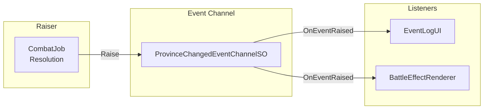
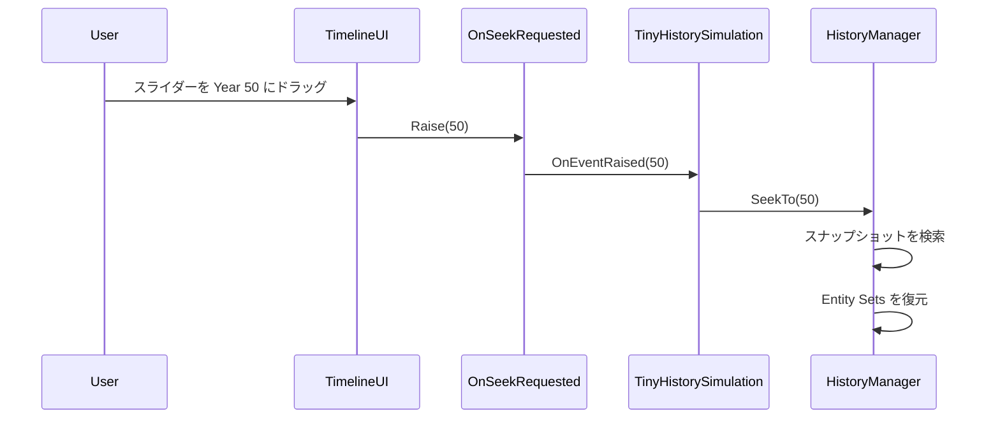
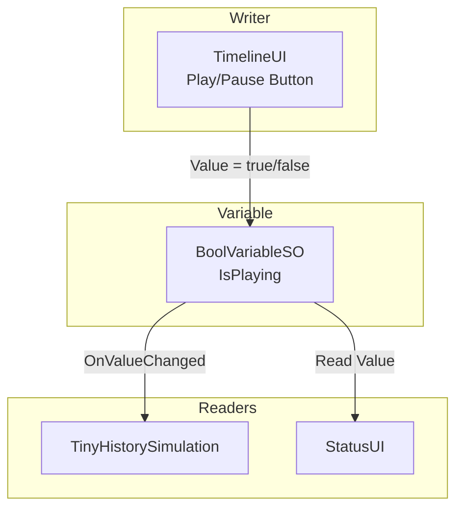

# Event Channels の統合

---

## 目的

このページでは、Tiny History デモが Event Channels をドメインイベント、UI 通信、状態同期にどのように使用しているかを説明します。

---

## 概要

このサンプルは3つの Event Channel パターンを示しています。

1. **ドメインイベント**: 重要なゲームイベント発生時に通知
2. **UI 通信**: 直接結合せずに UI がアクションを要求
3. **Reactive Variables**: 複数コンポーネント間で状態を共有

---

## 使用している Event Channels

| Event Channel | 型 | 目的 |
| :--- | :--- | :--- |
| ProvinceChangedEvent | ProvinceChangedEventChannelSO | 州の所有権変更 |
| NationEliminatedEvent | NationEliminatedEventChannelSO | 国家が全領土を失った |
| OnSeekRequested | IntEventChannelSO | UI がタイムラインシークを要求 |
| IsPlaying | BoolVariableSO | 再生/一時停止状態 |
| CurrentFrame | IntVariableSO | 現在のシミュレーションフレーム |
| SimulationSpeed | FloatVariableSO | 再生速度倍率 |

---

## パターン1: ドメインイベント

ドメインイベントは、重要なゲームイベントが発生したとき関係者に通知します。イベント発火側は誰がリッスンしているか知る必要がありません。

### ProvinceChangedEvent

戦闘が解決され、州の所有権が変更されたときに発火します。

**ペイロード**:

- 変更が発生した年
- 州 ID
- 前の所有国 ID
- 新しい所有国 ID

> **重要なポイント** - 戦闘システムは UI や視覚エフェクトについて知りません。関連データを含むイベントを発火するだけです。どのコンポーネントでも購読して反応できます。
{: .note }

### NationEliminatedEvent

国家が最後の州を失ったときに発火します。

**ペイロード**:

- 滅亡した年
- 国家 ID

**リスナー**:

- EventLogUI が年代記にエントリを追加

---

## パターン2: UI からシミュレーションへの通信

UI コンポーネントは、直接参照を持たずにシミュレーションにアクションを要求する必要があります。Event Channels がこの疎結合な通信を提供します。

### OnSeekRequested

ユーザーがタイムラインスライダーをドラッグすると、UI はシミュレーション状態を直接操作するのではなく、イベントを発火します。

> **重要なポイント** - UI はシーク処理の内部動作を知る必要がありません。「Year X に移動」と要求するだけで、シミュレーションが詳細を処理します。
{: .note }

**メリット**:

- UI を独立して開発・テスト可能
- シークロジックを変更しても UI に影響なし
- 複数の UI 要素がシークをトリガー可能

---

## パターン3: 状態同期のための Reactive Variables

Reactive Variables により、複数のコンポーネントが直接参照なしに共有状態を監視できます。

### 共有状態変数

| 変数 | 型 | 書き込み | 読み取り |
| :--- | :--- | :--- | :--- |
| IsPlaying | BoolVariableSO | TimelineUI | TinyHistorySimulation, StatusUI |
| CurrentFrame | IntVariableSO | TinyHistorySimulation | TimelineUI, StatusUI |
| TotalFrames | IntVariableSO | TinyHistorySimulation | TimelineUI |
| SimulationSpeed | FloatVariableSO | TimelineUI | TinyHistorySimulation |

### 例: 再生/一時停止状態

> **重要なポイント** - ユーザーが Play をクリックすると、UI は Variable を更新するだけです。シミュレーションは変更を購読して対応します。どちらのコンポーネントも相手を知りません。
{: .note }

---

## アーキテクチャのメリット

このサンプルで Event Channels を使用することで以下の利点が得られます。

1. **疎結合**: 戦闘は UI を知らず、UI はシミュレーション内部を知らない
2. **テスト容易性**: 各コンポーネントをモックイベントで独立してテスト可能
3. **拡張性**: 既存コードを変更せずに新しいリスナー（分析、効果音）を追加
4. **明確性**: 名前付き Event Channel アセットによりデータフローが明示的

---

## 主要ファイル

| ファイル | 説明 |
| :--- | :--- |
| `ScriptableObjects/Events/ProvinceChangedEvent.asset` | 州所有権変更イベント |
| `ScriptableObjects/Events/NationEliminatedEvent.asset` | 国家滅亡イベント |
| `ScriptableObjects/Events/OnSeekRequested.asset` | タイムラインシーク要求イベント |
| `ScriptableObjects/Variables/IsPlaying.asset` | 再生/一時停止状態変数 |
| `ScriptableObjects/Variables/CurrentFrame.asset` | 現在フレーム変数 |
| `Scripts/UI/EventLogUI.cs` | ドメインイベントを購読 |
| `Scripts/UI/TimelineUI.cs` | シークイベント発火、変数の読み書き |

---

## 次のステップ

- Jobs と GPU 統合について [Reactive Entity Sets](reactive-entity-sets) で学ぶ
- システム全体の概要は [アーキテクチャ](architecture) へ戻る

---

## さらに学ぶ

Event Channels を自分のプロジェクトで使いたいですか？

- [Event Channels ガイド]({{ '/ja/guides/event-channels' | relative_url }}) - Event Channels の作成と使用の完全ガイド
- [Variables ガイド]({{ '/ja/guides/variables' | relative_url }}) - 状態同期のための Reactive Variables の使い方
