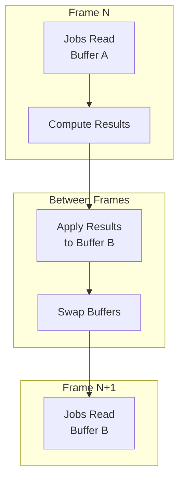
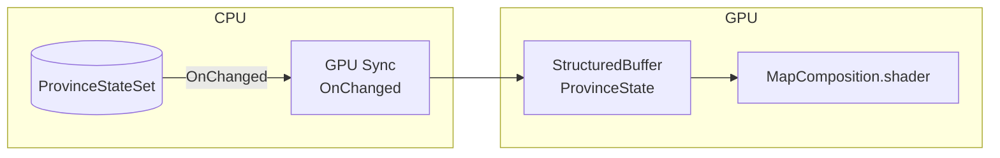
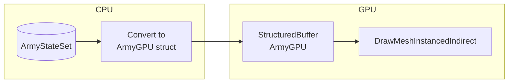
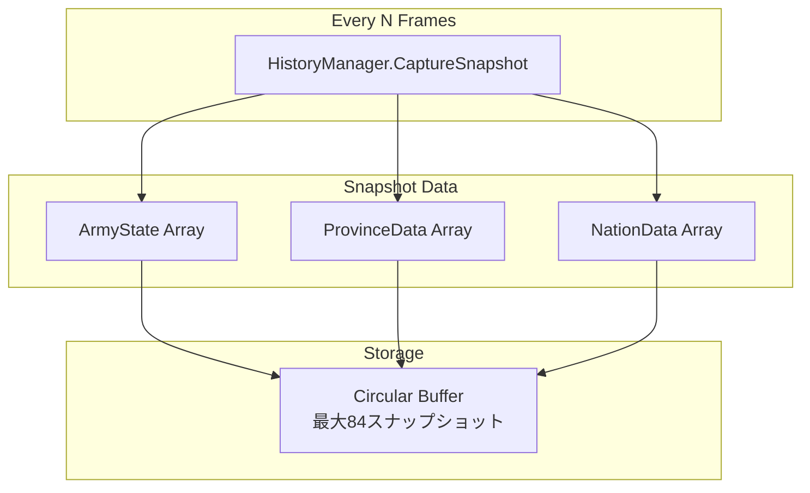
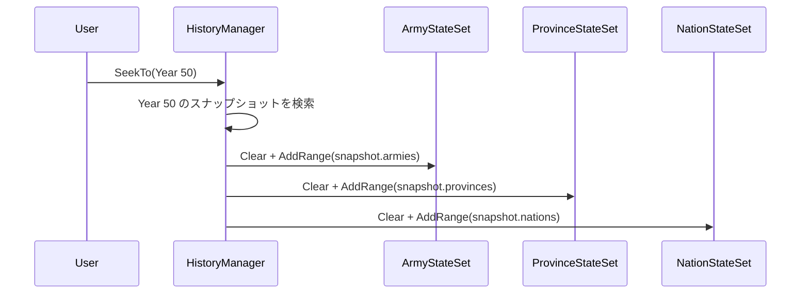

# Reactive Entity Sets の統合

---

## 目的

このページでは、Tiny History デモが Reactive Entity Sets を Jobs 統合、GPU 同期、履歴スナップショットにどのように使用しているかを説明します。

---

## 概要

このサンプルは4つの Reactive Entity Set パターンを示しています。

1. **Jobs 統合**: 安全な並列処理のためのダブルバッファリング
2. **GPU Sync**: レンダリング用の自動バッファ更新
3. **状態クエリ**: アロケーションなしの集計とフィルタリング
4. **履歴スナップショット**: タイムトラベル用のエンティティ状態の保存と復元

---

## 使用している Entity Sets

| Entity Set | エンティティ型 | 典型的な数 | 目的 |
| :--- | :--- | :--- | :--- |
| ArmyStateSet | ArmyState | 最大約20,000 | 位置、目標、強さを持つアクティブな軍隊 |
| ProvinceStateSet | ProvinceData | 約500 | 所有権と地形を持つマップの州 |
| NationStateSet | NationData | 約50 | 首都と生存状態を持つ国家 |

---

## パターン1: ダブルバッファリングによる Jobs 統合

### 課題

Unity Jobs は実行中に安定したデータを必要とします。ジョブ実行中にエンティティ状態が変更されると、競合状態やデータ破損が発生する可能性があります。

### 解決策: ReactiveEntitySetOrchestrator

このサンプルは `ReactiveEntitySetOrchestrator<T>` を使用してダブルバッファリングを自動管理します。



### 動作の仕組み

1. **スケジュールフェーズ**: Jobs が現在状態の `NativeArray` スナップショットを受け取る
2. **実行フェーズ**: Jobs がスナップショットから読み取り、別の出力に結果を書き込む
3. **完了フェーズ**: 結果が Entity Set に適用される
4. **次フレーム**: 更新された状態が次のジョブバッチで利用可能

> **重要なポイント** - Jobs は Entity Set を直接変更しません。スナップショットを使用して作業し、フレーム間でアトミックに適用される結果を生成します。
{: .note }

### Job パイプラインの例

```
ArmyStateSet (Current State)
         │
         ▼
    ┌─────────┐
    │ Strategy│ → 目標を決定
    │   Job   │
    └────┬────┘
         ▼
    ┌─────────┐
    │  March  │ → 位置を更新
    │   Job   │
    └────┬────┘
         ▼
    ┌─────────┐
    │ Combat  │ → 戦闘を解決
    │   Job   │
    └────┬────┘
         ▼
ArmyStateSet (Updated State)
```

---

## パターン2: GPU Sync

### 州のレンダリング

州の所有権データは Entity Set から GPU バッファへ流れます。



**同期される内容**:

- 所有国 ID（州の色を決定）
- 占領進捗（侵攻オーバーレイを表示）
- 地形タイプ（見た目に影響）

> **重要なポイント** - Entity Set の変更が自動的に GPU バッファ更新をトリガーします。レンダラーは変更をポーリングしません。反応するのです。
{: .note }

### 軍隊のレンダリング

軍隊の位置は毎フレーム GPU に同期され、インスタンスレンダリングに使用されます。



**ArmyGPU データ**:

- 現在位置
- 目標位置
- 行軍進捗（補間用）
- 国家 ID（色ルックアップ用）

> **重要なポイント** - シェーダーが行軍進捗を使用して軍隊の位置を補間し、軍隊ごとの CPU 更新なしにスムーズな移動を実現します。
{: .note }

---

## パターン3: 状態クエリ

Entity Sets は集計とフィルタリングのための LINQ スタイルのクエリをサポートしています。

### 国家滅亡チェック

```csharp
// この国家が所有する州があるかチェック
bool hasTerritory = provinceStateSet
    .Any(p => p.OwnerNationID == nationID);

if (!hasTerritory)
{
    // 国家滅亡
    nationEliminatedEvent.Raise(currentYear, nationID);
}
```

### 国家ごとの軍隊数

```csharp
// 各国家の軍隊をカウント
foreach (var nation in nationStateSet)
{
    int armyCount = armyStateSet
        .Count(a => a.NationID == nation.ID);

    // 経済計算に使用
}
```

> **重要なポイント** - クエリは基盤となる `NativeArray` を使用してゼロアロケーション反復を行います。ゲームプレイ中にガベージは生成されません。
{: .note }

---

## パターン4: 履歴スナップショット

### 状態のキャプチャ

このサンプルはタイムライン操作のために定期的に Entity Set のスナップショットをキャプチャします。



**スナップショットの内容**:

- すべてのエンティティ配列のコピー
- フレーム番号（年）
- 復元用メタデータ

### 状態の復元

ユーザーが過去の年にシークすると、Entity Sets がスナップショットから復元されます。



> **重要なポイント** - コレクションライクな API（`Clear`、`AddRange`）により保存/復元が簡単になります。Entity Sets は標準コレクションのように振る舞いながら、リアクティブな機能を持っています。
{: .note }

### タイムライン分岐

過去にシークして再生を再開すると、将来のスナップショットは破棄されます。

```
Timeline: [Yr10] [Yr20] [Yr30] [Yr40] [Yr50]
                              ▲
                         ユーザーがここにシーク

再開後:
Timeline: [Yr10] [Yr20] [Yr30] [Yr40] [Yr41] [Yr42] ...
                              └── 新しい歴史分岐
```

---

## メモリ効率

このサンプルはメモリアロケーションを最小化するためにいくつかの戦略を使用しています。

| 戦略 | 実装 |
| :--- | :--- |
| 事前割り当てバッファ | 初期化時に Entity Sets のサイズを設定 |
| 循環バッファ | 固定スナップショット数、最古を上書き |
| NativeArray ビュー | クエリ用のゼロコピー反復 |
| 構造体エンティティ | 値型によりヒープアロケーションを回避 |

---

## 主要ファイル

| ファイル | 説明 |
| :--- | :--- |
| `ScriptableObjects/EntitySets/ArmyStateSet.asset` | 軍隊 Entity Set |
| `ScriptableObjects/EntitySets/ProvinceStateSet.asset` | 州 Entity Set |
| `ScriptableObjects/EntitySets/NationStateSet.asset` | 国家 Entity Set |
| `Scripts/TinyHistorySimulation.cs` | Orchestrator セットアップとジョブスケジューリング |
| `Scripts/HistoryManager.cs` | スナップショットの取得と復元 |
| `Scripts/MapRenderer.cs` | 州の GPU 同期 |
| `Scripts/ArmyRenderer.cs` | 軍隊の GPU 同期 |

---

## 次のステップ

- システム全体の概要は [アーキテクチャ](architecture) へ戻る
- Event Channels について [Event Channels](event-channels) で学ぶ

---

## さらに学ぶ

Reactive Entity Sets を自分のプロジェクトで使いたいですか？

- [Reactive Entity Sets ガイド]({{ '/ja/guides/reactive-entity-sets/' | relative_url }}) - 基本的な使い方、イベント、パターン、ベストプラクティスを網羅した完全ガイド
- [Variables ガイド]({{ '/ja/guides/variables' | relative_url }}) - Variables での GPU Sync の使い方
