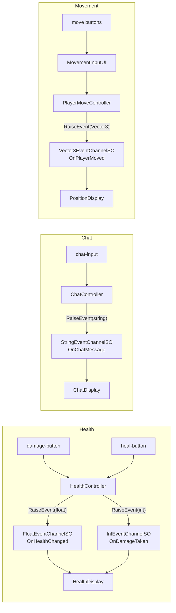

# Typed EventChannels Demo

## 概要

**型付きEventChannel**（Float, String, Vector3, Int）を、Variableを介さずに直接使う方法を示すデモです。`BasicDemo` が `IntVariableSO` を中心に据え、`IntEventChannelSO` をVariableの値変更の副作用としてのみ発火するのに対し、このサンプルでは各チャンネル型がそれぞれ独立に発火・購読される様子を示します。

デモのUIは3つの独立したセクションで構成されています。

- **Health** - 現在の体力値には `FloatEventChannelSO`、ダメージ量（離散値）には `IntEventChannelSO` を使用
- **Chat** - チャットメッセージには `StringEventChannelSO` を使用
- **Movement** - 位置更新には `Vector3EventChannelSO` を使用。移動は画面上の方向ボタンで操作します

## 使用している機能

| 機能 | アセット | 説明 |
| :--- | :--- | :--- |
| Event Channel | `OnHealthChanged` (FloatEventChannelSO) | 現在の体力値 |
| Event Channel | `OnDamageTaken` (IntEventChannelSO) | 受けたダメージ量 |
| Event Channel | `OnChatMessage` (StringEventChannelSO) | チャットメッセージのテキスト |
| Event Channel | `OnPlayerMoved` (Vector3EventChannelSO) | 更新後の位置 |

## アーキテクチャ

**重要なポイント**: このサンプルのコントローラー/表示のペアは、いずれも型付きEventChannelの`SerializeField`だけを通じて通信しています。互いを直接参照することも、Variableを経由することもありません。

## 主要ファイル

| ファイル | 説明 |
| :--- | :--- |
| `Scripts/HealthController.cs` | ダメージ/回復時に `FloatEventChannelSO` と `IntEventChannelSO` を発火 |
| `Scripts/HealthDisplay.cs` | 両方の体力チャンネルを購読し、ProgressBar/Labelを更新 |
| `Scripts/ChatController.cs` | TextFieldとButtonから `StringEventChannelSO` を発火 |
| `Scripts/ChatDisplay.cs` | `StringEventChannelSO` を購読し、ScrollViewのログに追記 |
| `Scripts/PlayerMoveController.cs` | 自身のtransformを動かし `Vector3EventChannelSO` を発火 |
| `Scripts/MovementInputUI.cs` | `PlayerMoveController.Move()` を呼ぶ方向ボタン群 |
| `Scripts/PositionDisplay.cs` | `Vector3EventChannelSO` を購読し座標を表示 |
| `ScriptableObjects/Events/OnHealthChanged.asset` | 体力値用のFloatEventChannelSO |
| `ScriptableObjects/Events/OnDamageTaken.asset` | ダメージ量用のIntEventChannelSO |
| `ScriptableObjects/Events/OnChatMessage.asset` | チャットテキスト用のStringEventChannelSO |
| `ScriptableObjects/Events/OnPlayerMoved.asset` | 位置用のVector3EventChannelSO |

## 使い方

1. `TypedEventChannelsDemo` シーンを開く
2. Play Modeに入る
3. **Damage** / **Heal** をクリックして体力チャンネルを発火させ、バーとログの更新を確認する
4. チャット欄にメッセージを入力し **Send** をクリックして `OnChatMessage` を発火させる
5. 方向ボタンをクリックしてプレイヤーを移動させ、`OnPlayerMoved` を発火させる

## ユースケース

- **体力/ステータスシステム**: HP・スタミナ・マナなど連続値にはFloatチャンネル
- **チャット/ログシステム**: 任意のテキストペイロードにはStringチャンネル
- **位置/トランスフォーム同期**: 移動・スポーン地点・ウェイポイントにはVector3チャンネル
- **離散カウンター**: ダメージ・スコア差分・アイテム数にはIntチャンネル
